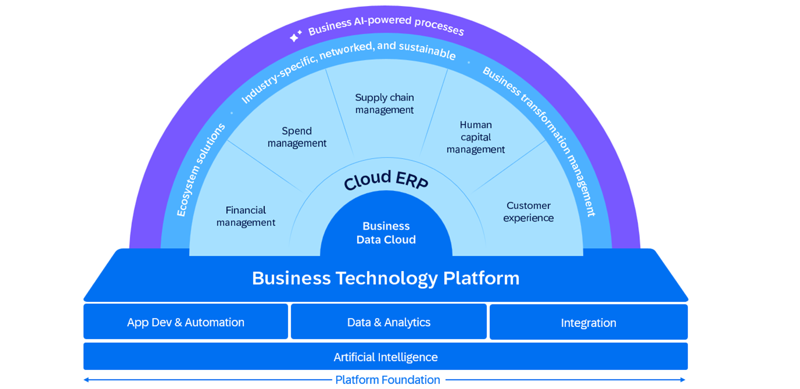
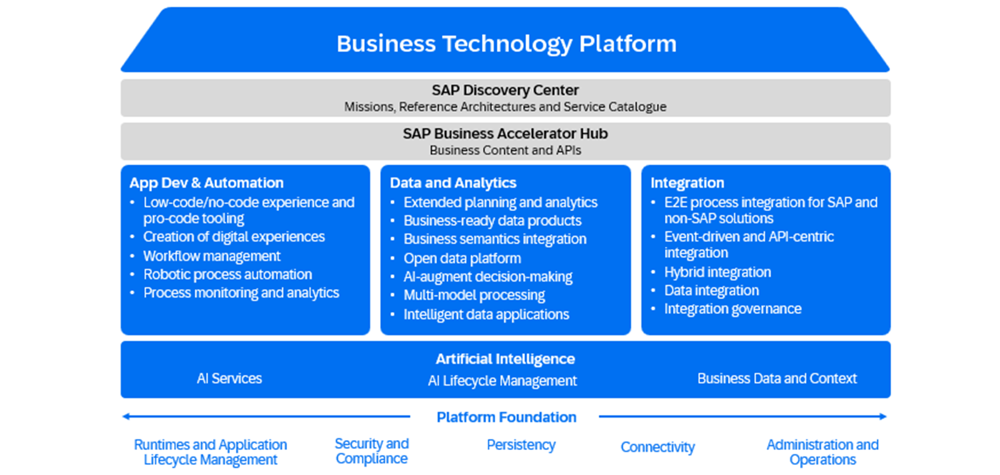

### SAP's Cloud Strategy

SAP's cloud strategy is a direct response to changing market dynamics and customer expectations.

By aligning with and anticipating market needs, SAP is not only meeting current expectations, but also positioning businesses for future success. This strategy underscores SAP's commitment to innovation, operational excellence, and customer-centric focus, driven by a cloud-first approach.

Understanding broader market trends is critical, but SAP's strategy goes deeper by focusing on the customer journey to cloud adoption. Recognizing the unique challenges and ambitions of each business, SAP tailors its cloud solutions to facilitate a seamless transition, ensuring that each step toward the cloud is aligned with the customer's strategic goals and operational needs.

Building on SAP's commitment to customer-centric innovation and strategic agility through its cloud solutions, the unique strength of SAP's offering becomes evident in the breadth and depth of its portfolio.

SAP Business Suite represents the culmination of SAP's vision, which is a comprehensive, integrated set of solutions designed to seamlessly connect and optimize every function across your enterprise. SAP's cloud portfolio spans from core enterprise resource planning (ERP) and from core solution areas as financial management, spend management, supply chain management, human capital management, and customer experience, fostering a unified ecosystem for digital transformation. It's designed to meet businesses where they are, offering specific pathways for cloud adoption, whether it's a full IT migration, innovation with cloud-native apps, or boosting efficiency. This tailored approach enables a confident transition to the cloud, guided by SAP's deep expertise.

### The Core
At the heart of SAP’s strategy is the integration of SAP Cloud ERP and SAP Business Data Cloud, supported by the SAP Business Technology Platform (SAP BTP). SAP Cloud ERP remains central as the comprehensive suite of applications that orchestrates business processes across organizations, ensuring efficient and resilient operations.

Complementing this foundational ERP layer is the SAP Business Data Cloud, which serves as a unified, harmonized data foundation. It connects and streamlines data from both SAP and third-party sources, providing a single source of truth that enhances trust and insight-driven decision-making across the enterprise.

### SAP Business Technology Platform
Underpinning the SAP Business Suite, and including SAP Business Data Cloud and SAP Business AI, lies the SAP Business Technology Platform, the unified technology foundation that allows organizations to extend, personalize, and seamlessly integrate SAP applications, promoting a cohesive approach to managing complex landscapes. SAP BTP provides foundation services, sometimes referred to as ‘shared qualities', that enable a secure, scalable platform foundation including robust identity, security and compliance, application lifecycle management, streamlined operations and administration across the stack.

In addition, SAP BTP is optimized for SAP business applications is used by organizations across all industries to extend and personalize SAP applications as well as integrate and connect applications and business processes across the entire IT landscape.

### Foundational Pillars of SAP Business Technology Platform
SAP Business Technology Platform (SAP BTP) is a unified platform consisting of interoperable technologies, including application development, automation, integration, data and analytics, and artificial intelligence. These services are designed to work seamlessly together, enabling businesses to build innovative applications, connect disparate systems, derive actionable insights from their data and infuse AI into business processes for embedded intelligence.

SAP BTP is a versatile platform that is optimized for SAP applications making it the de facto platform for businesses to innovate, integrate, and transform their operations in the digital age. With SAP BTP, organizations can:

#### Integrate and extend business applications faster
Integrate systems, reduce application development effort, and accelerate time to value with prebuilt workflows and integrations.
#### Build business-relevant apps with all your data
Leverage SAP Business Data Cloud to build smarter applications and develop reliable AI solutions grounded in full business context.
#### Innovate and accelerate with AI
Boost developer productivity with generative AI, automate complex workflows, and securely infuse latest AI models into applications.

Let’s take a closer look at each of the technology pillars that make up SAP BTP.

#### Application Development and Automation
SAP BTP offers developer tools to extend, create, and automate applications, both SAP and third-party. SAP Build is the all-in-one developer tool for any development scenario, no matter what your coding level. It is an application development and automation solution with a comprehensive suite of code-first, low-code, and generative AI tools. With SAP Build, you can accelerate time to value with generative AI and prebuilt solutions that help you stay on budget and ahead of schedule.

You can extend S/4HANA, both public and private editions, as well as all other SAP cloud applications, to customize and personalize, delivering business-relevant apps with access to all your data. Additionally, with SAP Build, you can automate business processes, from routine tasks to complex workflows, enhancing efficiency and reducing errors. You can also easily design digital workspaces and portals.

In a bike shop scenario, this could mean developing an application for inventory management that automatically triggers orders when stock levels are low, seamlessly automating the supply chain process

For more information, see https://www.sap.com/products/technology-platform/process-automation.html,https://www.sap.com/products/business-technology-platform/low-code.html

#### Integration
Integration is a critical aspect for most organizations looking for greater agility to more quickly respond to changing business conditions. SAP Integration Suite offers capabilities and services to connect and integrate your applications and processes business-wide. It allows you to quickly integrate on-premise and cloud-based processes, services, applications, events, and data. This ensures different parts of your organization and its external partners can work together to meet evolving market demands.

SAP Integration Suite provides comprehensive integration capabilities in one solution

to solve any integration challenge, including: application integration, API management, business-to-business (B2B) integration, event-driven integration and Regulatory compliance.

SAP Integration Suite offers over 3,400 prebuilt integrations and connectors for SAP and third-party solutions. Built and maintained by SAP and our partner ecosystem, these integrations help you accelerate connectivity and deliver superior time to value. Based on SAP Integration Solution Advisory Methodology, the Integration Assessment capability within SAP Integration Suite further accelerates integration projects. It enables integration architects, practitioners, and business users to collaborate while relying on trusted best practices to manage and deploy integrations more efficiently and successfully.

In our bike shop example, If our bike shop needs to connect to the system of the manufacturer, it can either check for existing APIs in SAP Business Accelerator Hub or create APIs with SAP Integration Suite.

For more information, see: https://www.sap.com/products/integration.html

#### Data and Analytics
Data and analytics capabilities on SAP BTP include SAP Business Data Cloud, SAP HANA Cloud and SAP Master Data Management. Together, they empower organizations to derive insights from their data, make informed decisions, and drive better business outcomes.

SAP Business Data Cloud is a fully managed SaaS solution that unifies and governs all SAP data and seamlessly connects with third-party data—giving line-of-business leaders context to make even more impactful decisions. With SAP BDC, you can harmonize all your mission-critical data with an open data ecosystem, leveraging a powerful semantic layer to give you unmatched knowledge of your business. And you can ensure data across applications and operations has a foundation for generative AI that is reliable, responsible, and relevant Learn more here.

SAP HANA Cloud is a multi-model database management system that empowers the architects of the future to build and deploy the next generation of intelligent data applications at scale. It is the trusted database that powers SAP’s mission-critical solutions, such as SAP Business Cloud, with multi-model engines and enterprise-grade performance and reliability.Learn more here

SAP Master Data Management improves the quality of your business-critical information with a central hub for master data management and governance. It helps you pull together master data and manage it centrally using a master data management layer based on SAP Business Technology Platform.

Learn more here.

For more information on all the data and analytic solutions for SAP BTP, see: https://www.sap.com/products/analytics.html

#### Artificial Intelligence (AI)
SAP BTP offers a comprehensive set of AI capabilities and services that enable organizations to create new AI use cases or embed AI into applications and business processes for a more intelligent enterprise. They enable organizations to harness the power of artificial intelligence to foster innovation, enhance efficiency, and provide added value to customers. The AI Foundation of SAP BTP include SAP AI Services, SAP AI Core and SAP AI Launchpad as well as the Generative AI Hub together empower businesses to build new AI scenarios, add intelligence directly to applications, deploy and run AI models at scale and manage the entire lifecycle of AI use cases across multiple instances and runtimes.

In addition, AI capabilities have been infused into BTP technologies for accelerated development and smarter outcomes, Examples include the AI developer tools in SAP Build, Joule for developers, vector and knowledge graph in SAP HANA Cloud and AI-assisted integration in SAP Integration Suite.

Turning back to our bike shop, customers can get personalized, AI-based recommendations to find the product that fits best and benefit from an enriched customer experience.

For more information, see: https://www.sap.com/products/artificial-intelligence.html