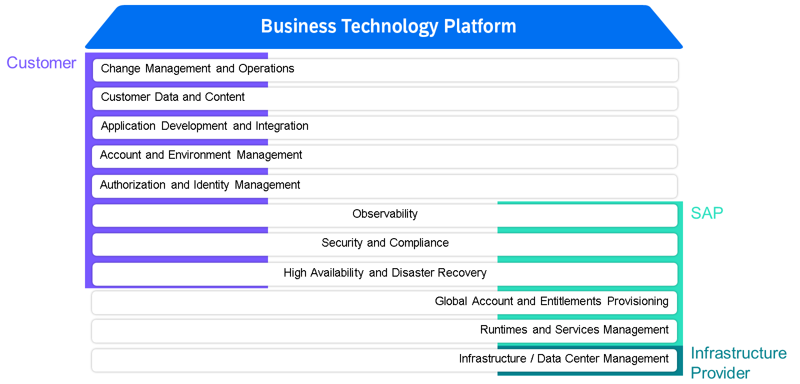
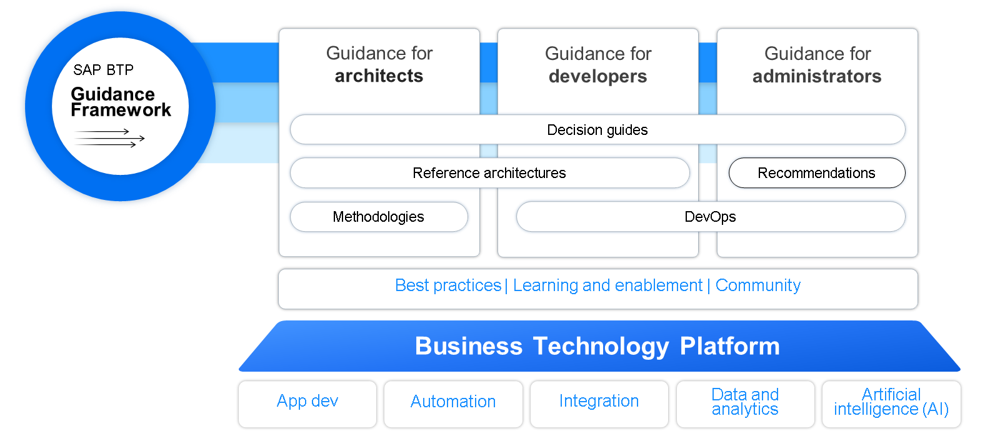

# Analyzing Responsibilities and Guidance Resources

Shared Responsibility Model
SAP BTP operates on a shared responsibility model involving the infrastructure provider, SAP, and you as the customer. SAP manages the relationship with the infrastructure provider, who is responsible for the physical data centers and network where SAP BTP runs. SAP itself is responsible for delivering and operating the platform’s core services, maintaining security and compliance, and performing regular updates. As a customer, you are responsible for organizing your account structure, managing your applications, integrations, and data, as well as assigning user authorizations.

Note

> This shared responsibility model is specifically designed for SAP BTP, Multi-Cloud Foundation. Many principles also apply to the SAP BTP Neo environment, but specific details may differ and should be evaluated on a case-by-case basis.

The responsibilities are distributed as follows:

#### Customer
Change Management and Operations
Customer Data and Content
Application Development and Integration
Account and Environment Management
#### Shared between SAP and Customers
Some responsibilities, like security or high availability, are collaborative efforts between SAP and the customer. For example, SAP ensures resilience on the platform level, but you must follow best practices when deploying and maintaining your own applications and integrations.

Observability
Security and Compliance
High Availability and Disaster Recovery (HA/DR)
#### SAP
Global Account and Entitlements Provisioning
Runtimes and Services Management
#### Infrastructure Provider
The infrastructure level is managed by either SAP or a hyperscaler, with SAP overseeing the relationship with hyperscalers. Even when using hyperscaler regions, SAP is responsible for managing this relationship. As a customer utilizing SAP BTP, you do not need to directly interact with the hyperscalers.

#### Data Center Management
Infrastructure Management
For an in-depth explanation of the SAP BTP shared responsibility model, refer to the product documentation:

https://help.sap.com/docs/btp/btp-admin-guide/shared-responsibility-model-between-you-and-sap

### SAP BTP Guidance Framework

SAP BTP Guidance Framework is your compass for architecting, implementing, and operating solutions on SAP BTP. It provides a central access point for decision guides, reference architectures, methodologies, and many best practices. The framework consists of the following elements:

Decision guides helping you to identify the technology option that best fits your needs
Reference architectures that allow you to explore how to architect solutions on SAP BTP with the help of curated solution templates
Methodologies that offer a guided approach toward increasing your cloud technology maturity level, covering both technical and organizational aspects
Recommendations for different technology domains, helping you to evaluate and choose the right implementation option
DevOps principles that enable your development and operations teams to be more efficient
Get started with exploring best practices, grow your skills with learning and enablement offerings for SAP BTP, and engage with us in the SAP Community. Make sure to bookmark the SAP BTP Guidance Framework and keep an eye on it, as it gets updated and enhanced from time to time.

You can access the SAP BTP Guidance Framework here:

SAP BTP Guidance Framework

### Guides and Recommendations
The following is a list of the most important guides and documents for administrators.

Six screenshots with a blue frame and a white title of the content. The text on each tile read: Best Practices for SAP BTP, Extension Architecture Guide, Integration Architecture Guide, SAP BTP Developer's Guide, DevOps with SAP BTP, SAP BTP Security Recommendations.
Note

> We highly recommend you to have a look at the whole SAP BTP Guidance Framework. But for the scope of this learning journey, we summarize the most important guides and documents for administrators.

#### SAP BTP Administrator's Guide
Recommendations for planning, setting up, building, and managing SAP BTP.
Starting point for setting up application lifecycle management for your specific use case, business, and IT landscape.
For Architects: Plan your organizational setup and your account and security model.
For administrators: Define the correct methodologies and tools for your projects.
For SAP Partners: Set up SAP BTP for your customers.
You can access the SAP BTP Administrator's Guide here:

https://help.sap.com/docs/btp/btp-admin-guide/btp-admin-guide

#### Extension Architecture Guide
Helps determine the appropriate SAP technology for different extension scenarios
Offers tailored recommendations for enterprise architects and solution architects
Insights about the best technical extension building blocks for presentation tier and back-ends
Helps to determine which extensions run on SAP S/4HANA as an on-stack extension and which on SAP BTP
Based on the SAP Application Extension Methodology
You can access the Extension Architecture Guide here:

https://help.sap.com/docs/sap-btp-guidance-framework/extension-architecture-guide/what-is-extension-architecture-guide

#### Integration Architecture Guide
Detailed guide to integration technologies from SAP
Guidance along Process Integration, Data integration, and Analytics integration
Guidance on how to evolve their existing integration architectures with the SAP technology offerings available today
Based on the SAP Integration Solution Advisory Methodology
You can access the Integration Architecture Guide here:

https://help.sap.com/docs/sap-btp-guidance-framework/integration-architecture-guide

#### SAP BTP Developer’s Guide
The goal of the SAP BTP Developer’s Guide is to help you implement business applications on SAP BTP. The guide includes:

Blueprints with core SAP BTP services
An automated SAP BTP Infrastructure setup
Standard technologies for smooth integrations
Guidance for delivering cloud and suite qualities
You can access the SAP BTP Developer’s Guide here:

https://help.sap.com/docs/btp/btp-developers-guide/btp-developers-guide

#### DevOps with SAP BTP
This page is a collection of resources around the topic of DevOps with SAP BTP. There are references and cross-links for the topics of planning and setting up, development and testing, delivery and change management, and for monitoring and operations.

You can access the DevOps with SAP BTP page here:

https://help.sap.com/docs/DEVOPS_OVERVIEW

Note

> Next to this, there's the whole standalone learning journey Discovering DevOps with SAP BTP. You can explore it here:

https://learning.sap.com/learning-journeys/discovering-devops-with-sap-btp

#### SAP BTP Security Recommendations
Security is a crucial topic in IT infrastructures, especially in cloud environments. SAP BTP fulfills many security standards and certifications. You can get an overview about all certifications and attestations for SAP solutions in the SAP Trust Center:

https://www.sap.com/about/trust-center.html

Besides the security and compliance topics that are SAP managed, there are a couple of topics and services to consider where administrators are in charge of operating the services and extensions in a secure and compliant manner. For these Scenarios, SAP offers a collection of recommendations. You can access them here:

https://help.sap.com/docs/btp/sap-btp-security-recommendations

