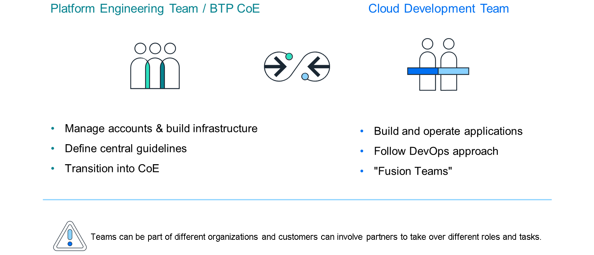
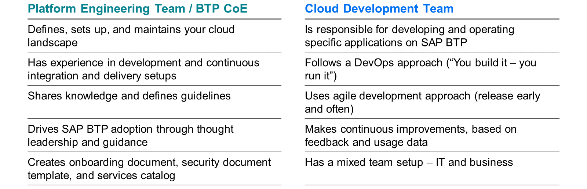
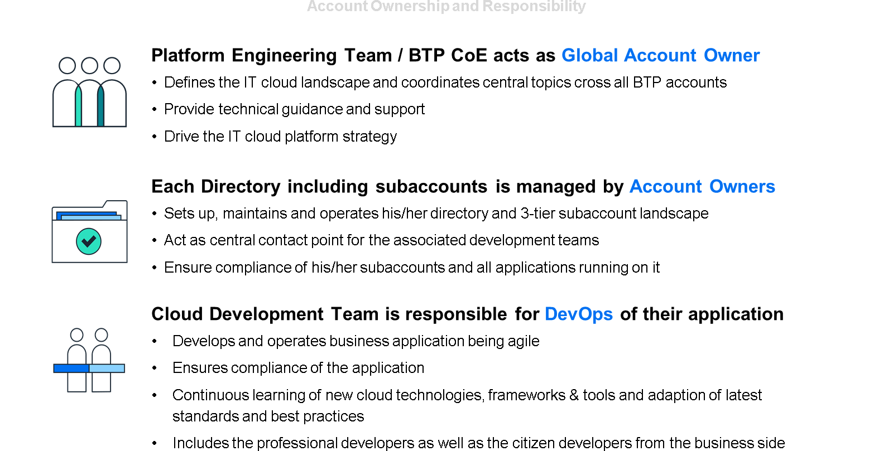

# Establishing a Governance Model

### SAP BTP Governance Model

The topic of governance along the day-to-day work with the SAP BTP is very important to avoid freely grown structures and setups across your company, which will become hard to manage over time. You need to define some rules and responsibilities for:

Managing multiple SAP BTP contracts and Global Accounts,
Define clear ownership of accounts, applications, and instances,
Managing entitlements,
Improved transparency on cost and usage,
Address security risks from unsecured apps or accounts.
Traditionally, responsibilities have been divided across development teams, the operations team, and the support team, working in silos. This model may have worked in traditional on-premise landscapes, but it's not a good working model in a modern cloud environment. Therefore, we recommend establishing an agile operating model with a centralized platform engineering team and local cloud development teams.

A good collaboration and communication between the platform engineering team and the cloud development teams is crucial to have a good operating model. Let’s have a look at the different tasks and responsibilities:

For managing SAP BTP and its account structure it is recommended to distribute the ownership and responsibilities accordingly. Central topics and guidelines are defined by the Platform Engineering Team. If wanted, you can also establish a model with Account Owners managing parts of the account structure using so-called Directories. The cloud development teams are responsible for development projects and keeping their applications up and running.

You will learn more about structuring SAP BTP accounts later. As this learning journey is focused on operating and administrating SAP BTP, let’s get in the details what additional tasks and responsibilities the Platform Engineering Team needs to fulfill. They document cloud development processes in a central Knowledge Base, providing clear guidelines for account owners and development teams to follow consistent practices. The team also defines an on-boarding process for new applications, ensuring a standardized approach from start to deployment, and maintains an inventory of all applications, capturing key details like names, descriptions, repositories, teams, and dependencies.

Another key focus is security with offering templates for documenting security aspects such as data storage, classification, connectivity, authorization, and auditing. They create a central Service Catalog to streamline repetitive tasks, reducing operational overhead and allowing development teams to focus on more strategic activities. Pre-configured BTP accounts can be provided to support DevOps principles while maintaining flexibility.

The team prioritizes knowledge sharing through documentation, training sessions, and consulting hours to support colleagues with specific challenges. They also share best practices via sample applications and reference architectures. Regular newsletters can be used to keep everyone updated on platform changes and new processes. A dedicated communication platform ensures that all team members are connected and aligned. By fulfilling these responsibilities, the Platform Engineering Team creates an environment where cloud development can thrive, supporting teams in building secure, scalable applications efficiently. You can lean more about the responsibilities and the governance model in the SAP BTP Administrator's Guide.