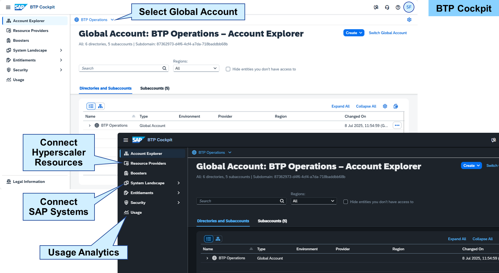
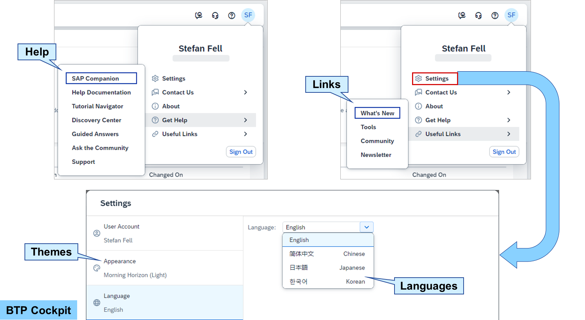
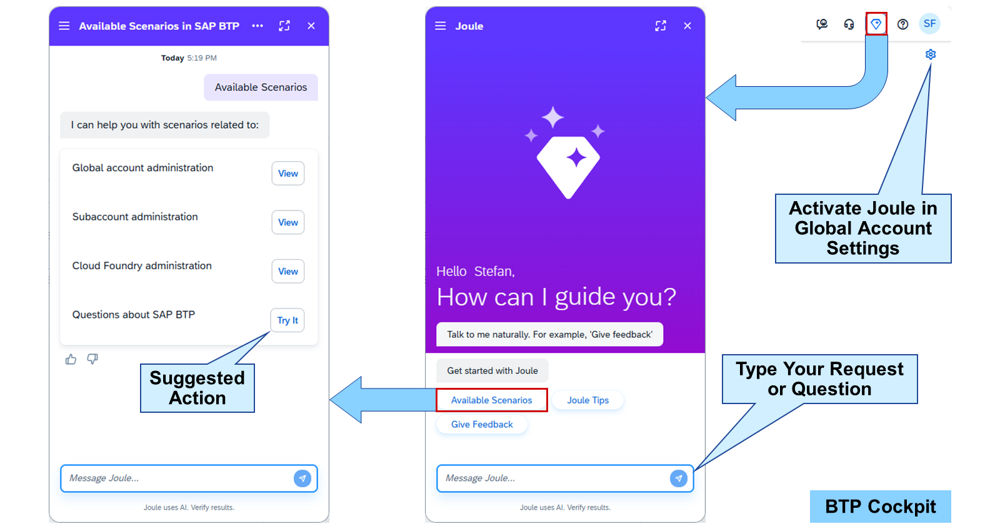
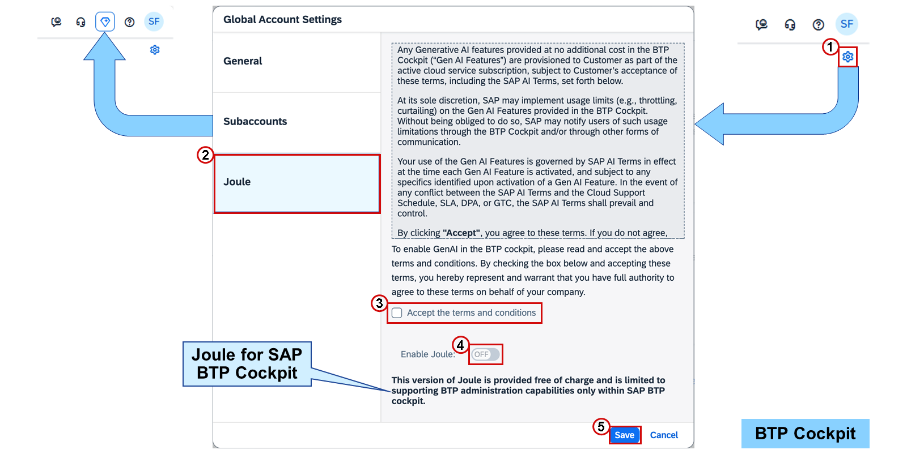
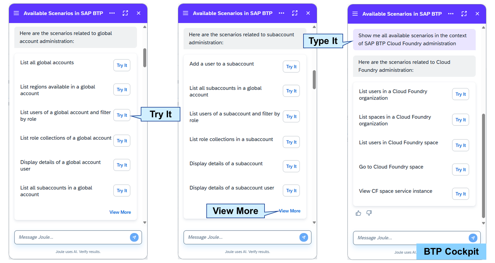
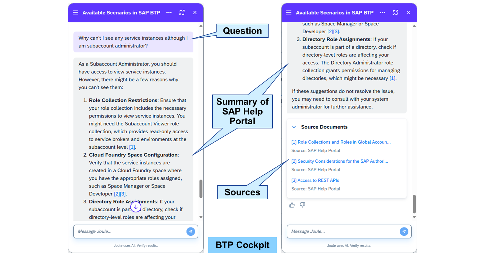

# SAP BTP Cockpit

SAP BTP cockpit (https://hana.ondemand.com/) is the central Web-based user interface for administrators, providing access to a number of functions for configuring and managing applications and connecting them to services on SAP BTP. Use the cockpit to manage resources, services, security, and perform actions on cloud applications.

The highest level displayed in the SAP BTP cockpit is a global account. Here you can connect hyperscaler resources and SAP systems or use analytics for monitoring application metrics.

### SAP BTP Cockpit Communication Gateways
Depending on your geographic location, you can choose one of the following gateways to improve the performance of the SAP BTP cockpit. These gateways only define how you access the cockpit. They don't restrict access to resources running in other regions in any way:

Americas
https://amer.cockpit.btp.cloud.sap
Asia-Pacific, Oceania
https://apac.cockpit.btp.cloud.sap
Europe, Middle-East, Africa
https://emea.cockpit.btp.cloud.sap

You can adapt the cockpit to your needs by changing the color theme and language. An SAP Universal ID is mandatory to work with the SAP BTP cockpit.

The user menu offers plenty of links to documentation and learning resources to help you with your tasks. Some of the most important ones are:

SAP BTP Community Page
https://pages.community.sap.com/topics/business-technology-platform

SAP Development Tools
https://tools.hana.ondemand.com/

SAP Discovery Center
https://discovery-center.cloud.sap/

SAP Help Documentation of SAP BTP
https://help.sap.com/docs/btp

### Joule in SAP BTP Cockpit

Joule, the generative AI copilot by SAP, is available free of charge in SAP BTP cockpit to support in the administration and operation of SAP BTP. It can perform a predefined set of administrative actions and provide information about subaccounts, services, or users. Furthermore, you can ask Joule questions about SAP BTP, the cockpit, or services originating from the SAP Help Portal (https://help.sap.com/).

Joule can be accessed via the diamond button in the toolbar after it was enabled in the global account settings.

Note

> Joule for SAP BTP cockpit currently only supports the SAP default identity provider. So, the user who wants to use Joule must be logged in via the default identity provider.

To enable Joule for all SAP BTP cockpit users in a global account, the following steps must be performed by the global account administrator:

In the Account Explorer of the global account, choose Global Account Settings (gear wheel) in the upper right.
In the Global Account Settings window, choose Joule.
Check Accept the terms and conditions.
Switch Enable Joule to ON.
Choose Save.

As a generative AI, Joule is fully interactive using natural language. You can ask Joule what it can do for you, either by typing the question or selecting a quick-start button. The main areas Joule can support you with administrative actions are:

Global account
Subaccount
Cloud Foundry
Joule can provide the information you ask for directly in the chat window for example as a list. But Joule can also support you in navigating you to the page in the SAP BTP cockpit, where you can get the information or do the task you asked for.

Hint

> Joule performs administrative actions on your behalf using the authorizations your user actually has.

You can ask Joule any question about SAP BTP and it will search the SAP Help Portal and summarize it. This summary includes tags referencing the sources, which are provided as links underneath. Use these links to jump directly to the topic in the SAP Help Portal.

You can close the chat window at any time and continue the conversation later by choosing the Joule button again. In addition, you can start new conversations manually in the Joule main menu (burger icon in the upper left). There can be up to 10 conversations in parallel. Conversations expire after 8 hours of inactivity and are then kept as read-only for 7 days until they are finally deleted.