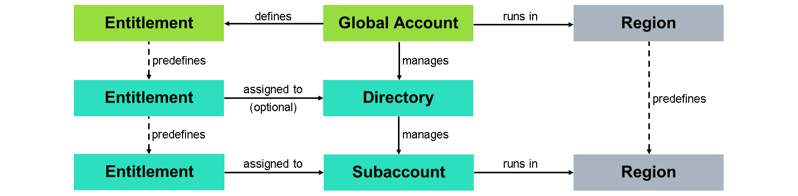
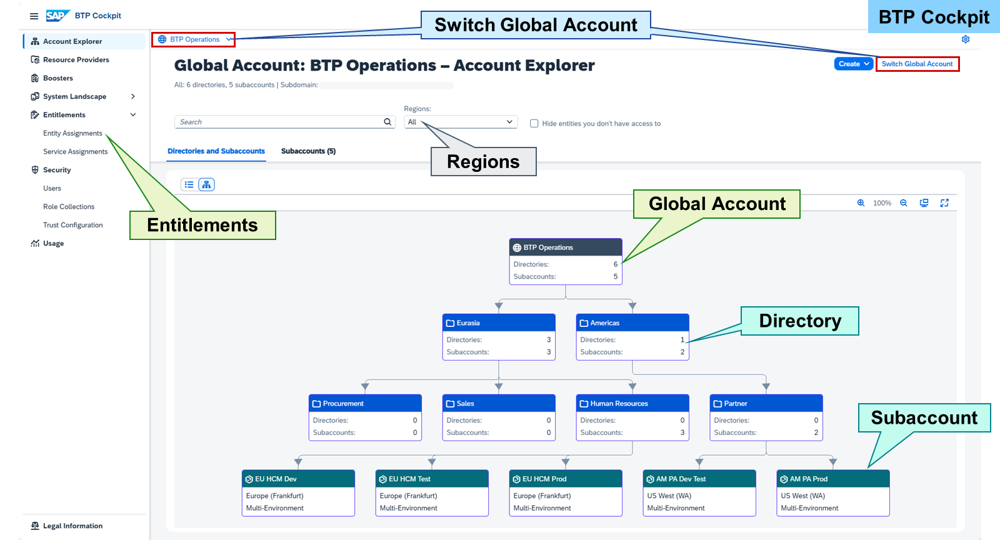
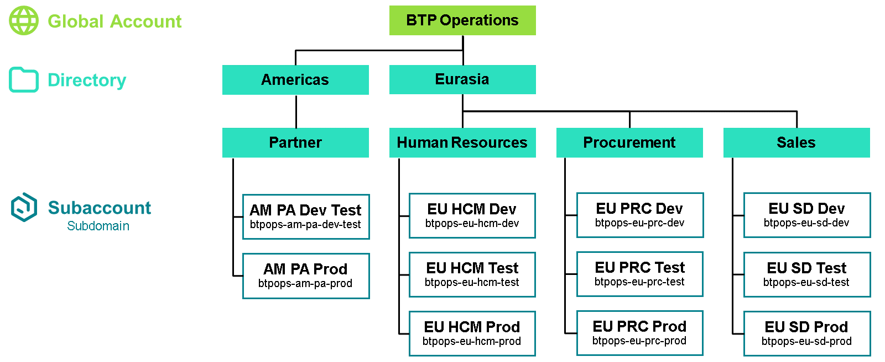
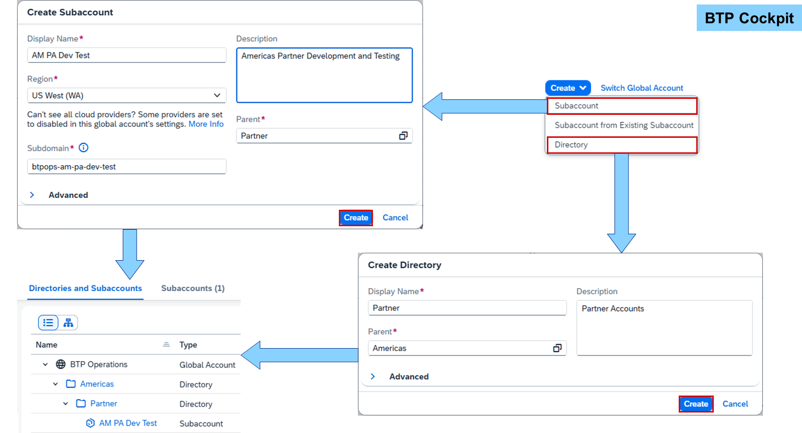
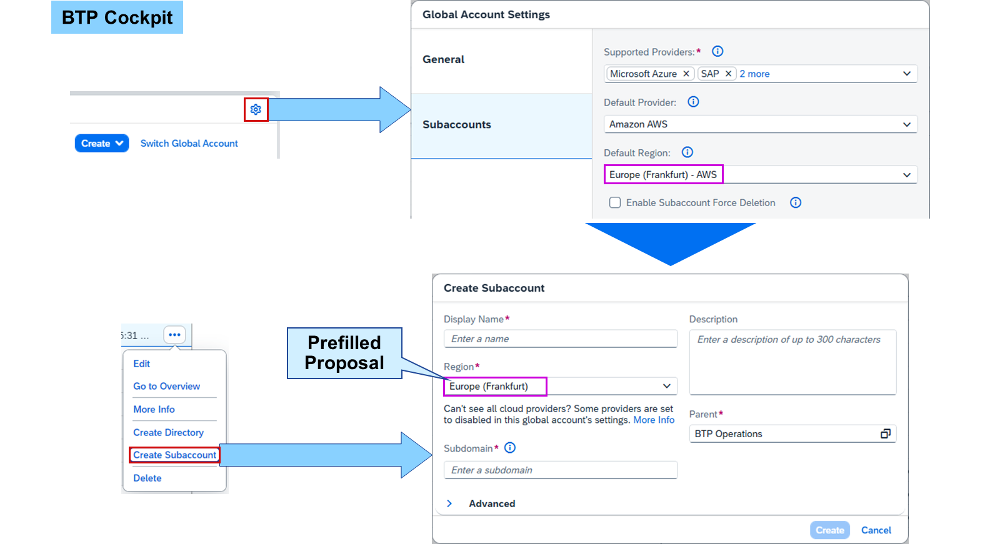
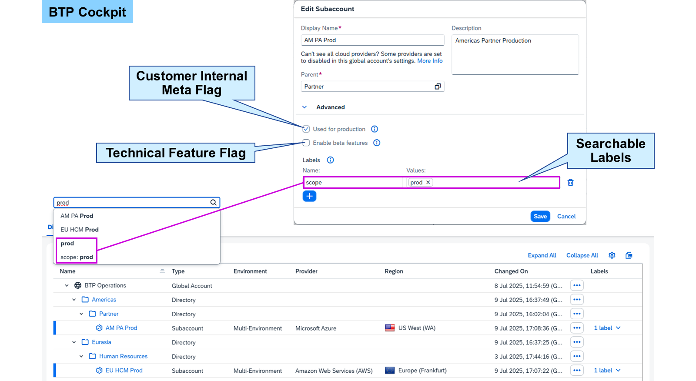

# SAP BTP Account Model

Accounts in SAP Business Technology Platform (BTP) are structured according to global accounts, directories, and subaccounts:


#### Global Account
A global account represents a contract with SAP.
#### Entitlement
The contract components result in entitlements of services.
#### Directory
Directories are used to structure a global account and may distribute entitlements.
#### Subaccount
Subaccounts provide services based on the assigned entitlements.
#### Region
Every subaccount runs in one region, which can be predefined in the global account.



The global account represents your signed contract with SAP. It's used to manage subaccounts organized in directories. The billing of this contract is based on the entitlements you order to use platform resources. These entitlements are distributed, via directories, to subaccounts for actual consumption.

Subaccounts are independent from each other and run in a certain region. The available regions for subaccounts can be predefined in the global account. A region is the physical location where applications, data, or services are hosted. The region assigned to a subaccount doesn't have to be directly related to the location of the user.



Global accounts, directories, subaccounts, and entitlements are managed in the SAP BTP cockpit. The cockpit displays the content of one global account at a time. The Switch Global Account button at the top right and breadcrumb at the top can be used to switch between global accounts.

Directories and subaccounts can be visualized as table, tree, or tiles depending on what your current task is. A search field and a filter for regions above the visualization can be used to filter the directories and subaccounts.

The entitlements can be accessed via the menu on the left for the currently opened global account, directory, or subaccount.



SAP provides as part of the SAP BTP Administrator's Guide recommendations for structuring and naming your account model to match your business and development needs. Based on your company's requirements, the account model can be as simple or as complex as needed.

### Account Structure Recommendations
The purpose of directories is to organize subaccounts including their applications, services, or data. This could be based on categories like regions or departments, services or solutions, technical aspects or business topics. The main reasons for these categories are legal requirements, user and access management, or cost and usage management.

Hint

### Directories can be nested up to five times.
If you use SAP BTP for development purposes, SAP recommends a staged development process. This means that there are usually three subaccounts for development, testing, and production. These could then be multiplied with directories for departments, for example.

Naming Conventions
The names of directories should be written in natural language to improve readability. There is no technical ID needed for them.

Note

Only directory and subaccount names support natural language with capitalization and blanks. All other fields should be written in lower-case letters using hyphens to separate name parts.
Subaccounts are often accessed directly via command line interface (CLI) tools or scripts without navigating through the account hierarchy. Therefore, their names should explain their purpose or "position" in the account model:

Template:
```
(<directory> <directory> ...) <purpose>
```
Example:
EU HCM Dev
Every subaccount has a subdomain, a technical ID used, for example, in CLI tools. The subdomain should be derived from the subaccount name in lower-case replacing blanks with hyphens and adding the company in front.

Template:
```
<company>(-<directory>-<directory>-...)-<purpose>
```
Example:
EU HCM Dev→btpops-eu-hcm-dev
Hint

URLs cannot be longer than 63 characters. So, keep subaccount names and subdomains short using abbreviations.

### Directories and Subaccounts



A directory just needs a name, description, and parent object like the global account or another directory. The highest level of a given path is always the global account, and the lowest is a subaccount, which means that you can have up to five levels of directories.

A subaccount requires the same information as a directory, and also has the global account or a directory as a parent object. In addition, subaccounts also require a region and unique subdomain. The subdomain will become part of the URL for accessing applications in the subaccount.

Hint

> The subdomain can contain only letters, digits, and hyphens (not allowed at the beginning or at the end), and must be unique across all subaccounts in the same region. The subdomain isn't case-sensitive.



In the Global Account Settings, default values for provider and region can be set. These defaults lead to proposed field values when creating a subaccount in this global account. This makes it not only easier but also safer to select the correct provider and region for your services. Neither can be changed later for a subaccount.

Beside default values, the Enable Subaccount Force Deletion checkbox enables the option to delete the subaccount including all data inside like apps, services, runtimes, and users. This action is irreversible and should be used with caution. Consider deactivating this setting after deleting a certain subaccount to protect others from accidental deleting.

Note

> These settings are only effective in the cockpit. REST API and btp CLI are not affected.



When creating a new subaccount, you can set the following advanced features:

Used for production
This flag should be set if your subaccount is used for production purposes. It's a meta flag used for your internal operation helping you to take appropriate action when handling incidents.

Note

Subaccounts having this flag cannot be force deleted.
Enable beta features
This flag enables the use of beta services and applications in the subaccount. SAP shall not be liable for any errors or damage arising from the use of such functionality. Use beta features productively at your own risk.

Caution

Once beta features are enabled, they cannot be disabled in this subaccount anymore.
When having many subaccounts, you may want to add labels to easier search for subaccounts based on certain criteria. A label has a name and may have none or many values assigned to. It could be some scope about users, services, runtimes, apps, departments, solutions, connections, or anything coming to your mind.

Hint

> Labels are also visible in the cost and usage evaluation.