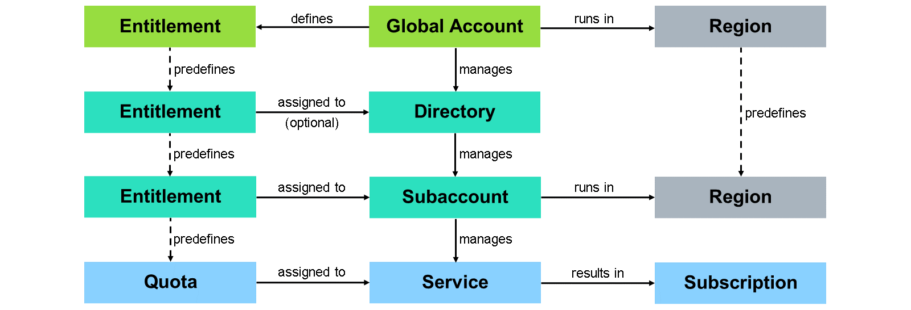
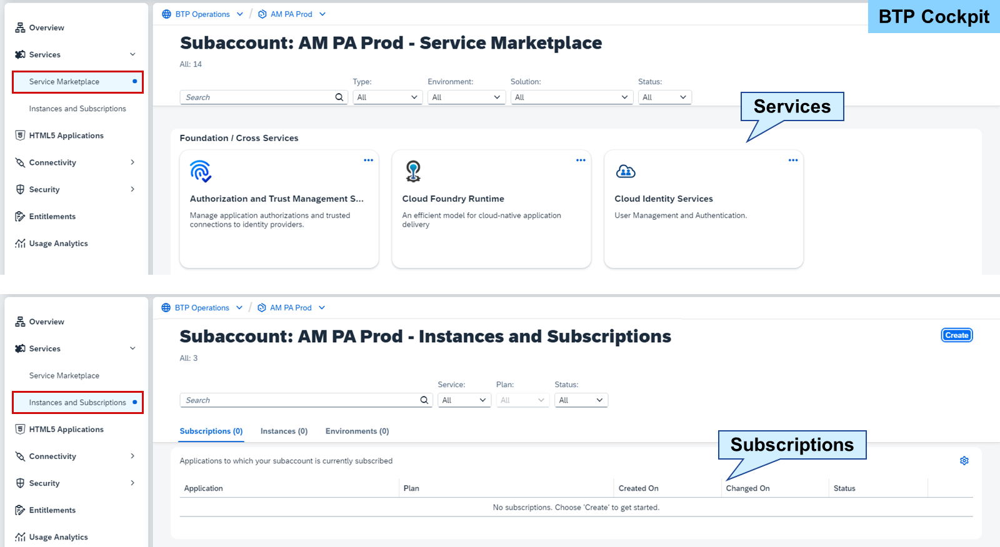
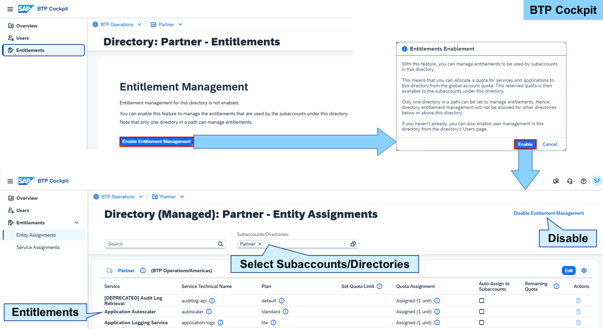
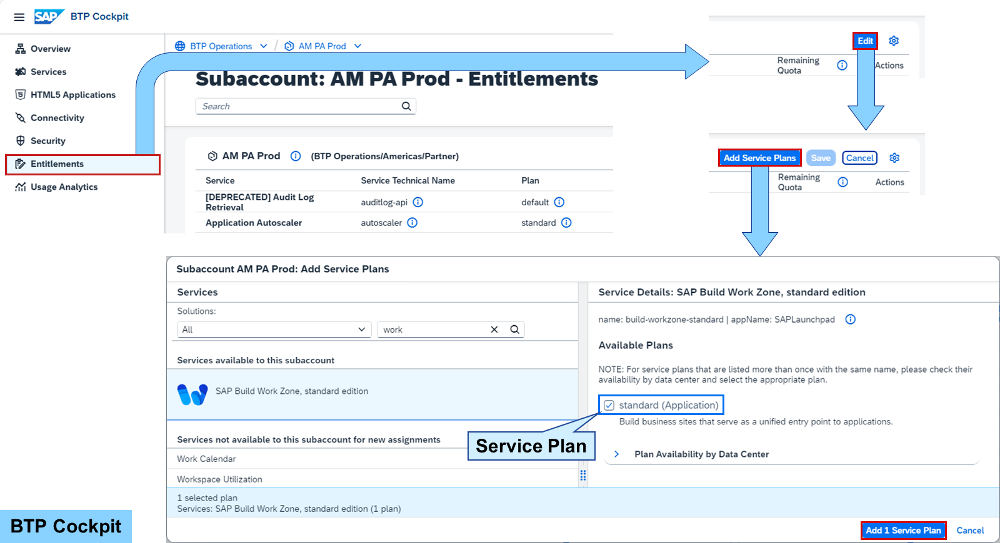
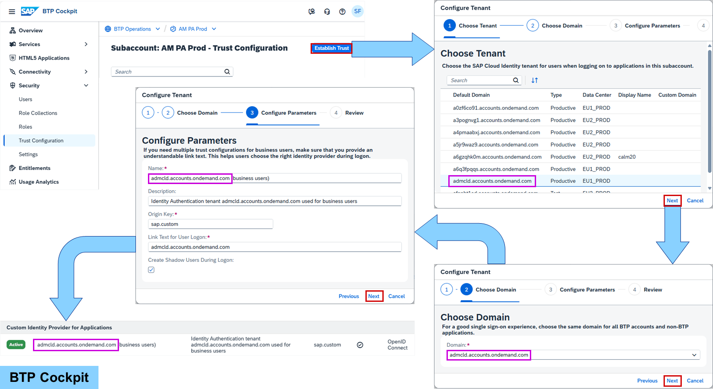
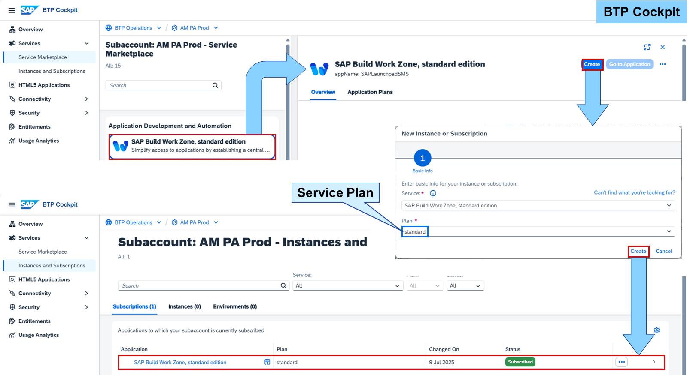

# Managing Service Subscriptions

### Entitlement Distribution
A subaccount manages services and their subscriptions based on entitlements:

#### Service
Services enable the operation of applications. A service is entitled by a service plan and a quota.
#### Quota
A quota defines the consumption scope of a service plan. Together they form the entitlement.
#### Subscription
Creating a service that runs standalone is called a subscription.

Services form the heart of SAP BTP. They enable, facilitate, or accelerate the development or operation of business applications and other platform services on SAP BTP. The number or kind of services available depends on the entitlement.

An entitlement is the right to provision and consume a service. It consists of a service plan and quota. A service consists of one or more service plans, which define the functional scope of a service. A quota represents the numeric quantity that defines the maximum allowed consumption of a service plan. Each service plan must be assigned a quota.

#### Numeric quota
A numeric quota is the number of units available in a subaccount, counted as whole numbers. Depending on the service, these units represent various things and may impact the number of service instances, applications, or routes in a subaccount.

#### Limited quota
A limited quota is a calculated unit, metered depending on the service. This enables a service plan in a subaccount (services can be entitled to multiple subaccounts as a whole).
Services can be instantiated or subscribed. A subscription is standalone and runs without the need of a runtime environment or any other service. Subscriptions often use limited quotas.

The services a subaccount is entitled to can be found in the Service Marketplace of the SAP BTP cockpit. It works like an app store providing search features to find the right service along with its documentation. Services can be created and are then available under Instances and Subscriptions for consumption and further management.

Subaccounts can utilize all entitlements of their global account. If you want to limit the entitlements available for a certain number of subaccounts, you can put these subaccounts in a directory and activate the entitlement management for the directory. Now, only the entitlements added to the directory can be utilized by its child subaccounts. Such directories are called managed directories.

If entitlement management is enabled for a directory with subaccounts already inside, all entitlements of all subaccounts are added automatically to the directory.

Note

Beside entitlements, directories can also manage users in the same way.
The SAP BTP cockpit allows you to select multiple directories and subaccounts at once to get a better overview and distribute the entitlements easier. The header of each table of entitlements leads directly to its directory or subaccount.

### Service Subscription

An example of a service subscription is the foundation (Application) service plan of SAP Build Work Zone, standard edition. It uses a limited quota and can, therefore, be used in multiple subaccounts in parallel without reducing the quota.

After an entitlement is defined in a global account, the service plan can be added to the entitlements of a subaccount. It can also be added first to a directory to then be distributed to subaccounts. The process of adding a service plan is the same for subaccounts and directories. There may be several service plans available to choose from but their distribution may be limited if using a numeric quota.

Services used by business or end users require an identity provider for applications for the user authentication. Therefore, it is a prerequisite when subscribing such a service that the subaccount has a trust established to an identity provider for applications.

Establishing a trust can be done under Security→Trust Configuration in the SAP BTP cockpit. The trust is sufficient to subscribe to the service, but users must be maintained in the identity provider to actually access the service.

Note

> Establishing a trust must only be done once per subaccount. All services in a subaccount then use this identity provider.

From the Service Marketplace in a subaccount, a service can be created by choosing a service plan. Some services need additional data to be created, like basic settings. Creating the SAP Build Work Zone, standard edition doesn't need any additional data and results in a service subscription in Instances and Subscriptions.

