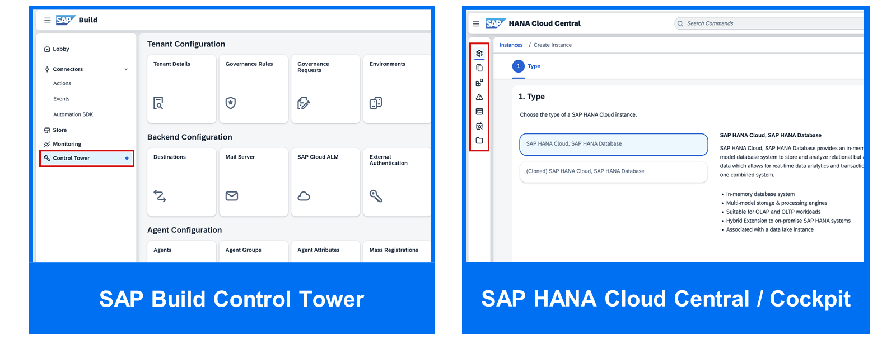
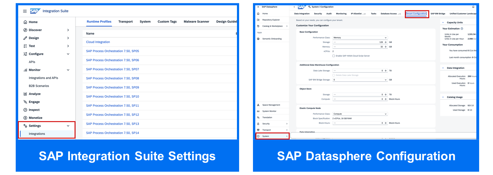
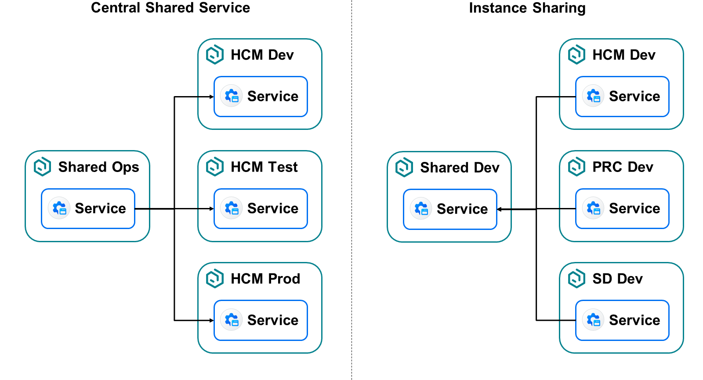
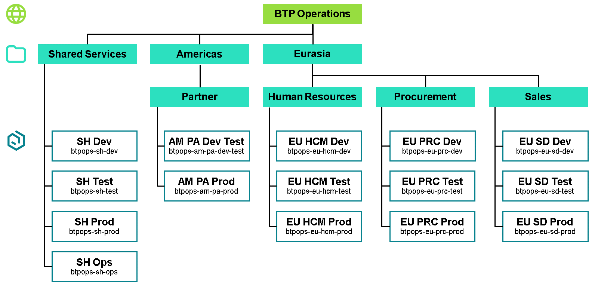

# Governing Services

### Service Configuration
From an architectural point of view, the SAP BTP cockpit is a central tool for administering a wide range of technical and organizational aspects next to the CLIs or using Terraform. This includes managing the account structure, roles and authorizations, provisioning and consuming services, and overseeing quotas and entitlements across global and subaccount levels.

However, it's important to understand that not all configurations can be performed centrally. Some services such as SAP Build require service configuration. These tasks cannot be completed using the SAP BTP cockpit alone, and often require specialized knowledge of the service’s capabilities and configuration options.

The responsibility for service configuration often depends on your organization's governance model and team structure. In some cases, these tasks are clearly owned by specific application developers, citizen developers, or process experts. However, in other scenarios, particularly in organizations with centralized IT governance, these responsibilities may also fall to BTP administrators. Understanding where configurations are performed, and who is responsible for them, is critical for effective platform and service management.

#### SAP Build
Within the Control Tower of SAP Build solutions you can configure a set of things like:
Governance Rules,
Environments,
Tenant Details e.g. whether it's a dev, test or prod tenant,
Whether gen-AI capabilities are activated,
And in case of SAP Build Process Automation certain Agent configurations,
API Keys,
and more.
The available configurations in the Control Tower of SAP Build vary based on the SAP Build solutions you've set up in the same Subaccount. For more details on the configurations consider the corresponding product documentation of your used SAP Build solutions.

#### SAP HANA Cloud
You're able to perform SAP HANA Cloud administration tasks using one of the following tools:

SAP HANA Cloud Central
SAP HANA Cockpit
SAP HANA database explorer
SAP HANA Cloud Central is a web-based tool used to manage all SAP HANA Cloud instances from a single interface. It enables users to create, monitor, scale, and delete database instances efficiently. This central platform simplifies administration by allowing resource management, usage tracking, and system maintenance in one place.

SAP HANA Cockpit enables administrators to perform database-level administration and monitoring tasks across all SAP HANA databases in SAP HANA Cloud. It allows for in-depth analysis by drilling down into individual systems or SQL queries, providing detailed insights into performance and operations. The cockpit also offers alerts, workload metrics, user and role management, and configuration options to support efficient and secure database management.

SAP HANA Database Explorer enables database administrators to interact directly with data and database objects within their SAP HANA Cloud databases. It allows users to run SQL queries to retrieve information, modify data, and explore catalog objects in detail. Additionally, the tool provides access to database diagnostic files, supporting deeper analysis and troubleshooting of database issues.

If you want to learn more about SAP HANA Cloud Administration, check out our learning journey: Provisioning and Administering Databases in SAP HANA Cloud

#### SAP Integration Suite
SAP Integration Suite is a powerful and comprehensive solution with a wide range of capabilities. As you work with it, you may need to manage various configurations, such as runtime profiles, transport settings, SAP PI/PO integration, and monitoring of your integration scenarios. The specific configurations required can vary depending on the capabilities you're using. To ensure you're well prepared, refer to the official SAP Integration Suite product documentation and consider expanding your knowledge through one of our SAP Integration Suite learning journeys.

#### SAP Datasphere
Similarly, we have administration capabilities in SAP Datasphere that allow users to configure and administrate their SAP Datasphere instance.

You can configure the tenant details and adjust the sizing, configure some security aspects, activating AI features, monitoring your tenant and more. For more details consider the SAP Datasphereproduct documentation.

You've now been introduced to the concept of service configuration through examples such as SAP Build, SAP HANA Cloud, SAP Integration Suite, and SAP Datasphere. Many other SAP BTP services also require similar configurations such as: setting up transport management, configuring delivery pipelines, or defining scaling rules for application autoscaler. It's important to establish a clear team setup to determine whether the central platform team or development teams are responsible for these configurations. Whenever you start working with a new service, always consult the relevant product documentation to identify the service configurations required.

### Shared Services

As divers as services can be, is the provisioning and usage of services. Many services are only used inside the same subaccount, where they are provisioned. That leads to multiple service subscriptions and instances of the same service distributed in your SAP BTP account model – which is totally fine.

It is also possible to provision services centrally in one subaccount and share them between users and other subaccounts. For some services it is your decision how you want to use it in your account model. Others are explicitly designed as a shared service. These shared services can be distinguished into two categories:

Central Shared Service
The service is used centrally and accesses other subaccounts, their services, and their applications, to manage these or to provide a feature while accessing.
Instance Sharing
The service is accessed from other subaccounts, their services, and their applications, providing its resources and features to them.
Running services centrally increases cost efficiency, streamlines administration, and facilitates user access.

In the SAP BTP Administrator's Guide, SAP recommends providing shared services in subaccounts organized in a directory called "Shared Services". The number of shared subaccounts depends on your account model and on the services you use. For example, if you use services for operating other services in other subaccounts, an operations (Ops) subaccount is recommended.

Examples
SAP Automation Pilot
This service provides a web-based entry point for platform administrators. It simplifies and automates complex manual processes to minimize operational efforts for cloud solutions in SAP BTP.

The service is designed as a shared service and must be used in a shared "Ops" subaccount providing a central access point for automation in other subaccounts.

SAP Build Work Zone, Advanced Edition
This service provides a web-based entry point for business users. The structure of the Web pages is designed in the service, but the content is originating from other sources inside or outside of the subaccount.

The service can be used as a shared service in shared "Dev/Test/Prod" subaccounts providing a central access point for business users to resources distributed in your system landscape.

SAP Business Application Studio
This service provides a web-based entry point for developers. Developers can define dev spaces providing development tools fitting to their needs. The developed applications are deployed via destinations defined in the subaccount.

The service should be used in every "Dev" subaccount where apps are being developed. Developers then access exactly that service in the area they are authorized.

SAP Cloud Transport Management
This service provides a web-based entry point for development operators. It enables transportation of development artifacts between subaccounts in a staged development process by defining transport routes.

The service is designed as a shared service and must be used in a shared "Ops" subaccount. The service administrator defines destinations to subaccounts, which are then part of the transport route.

SAP HANA Cloud
This service provides a web-based entry-point for database administrators (SAP HANA Cloud Central). It is an in-memory database providing its resources to all kinds of applications.

The service is designed for instance sharing and should be used in shared "Dev/Test/Prod" subaccounts. The service administrator maps an SAP HANA instance to an environment context of other subaccounts providing resources to this environment.
