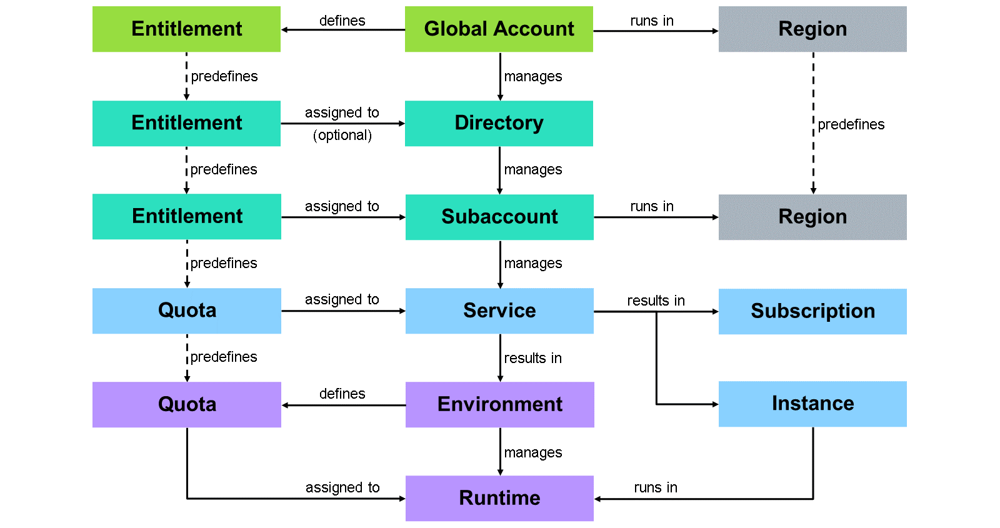
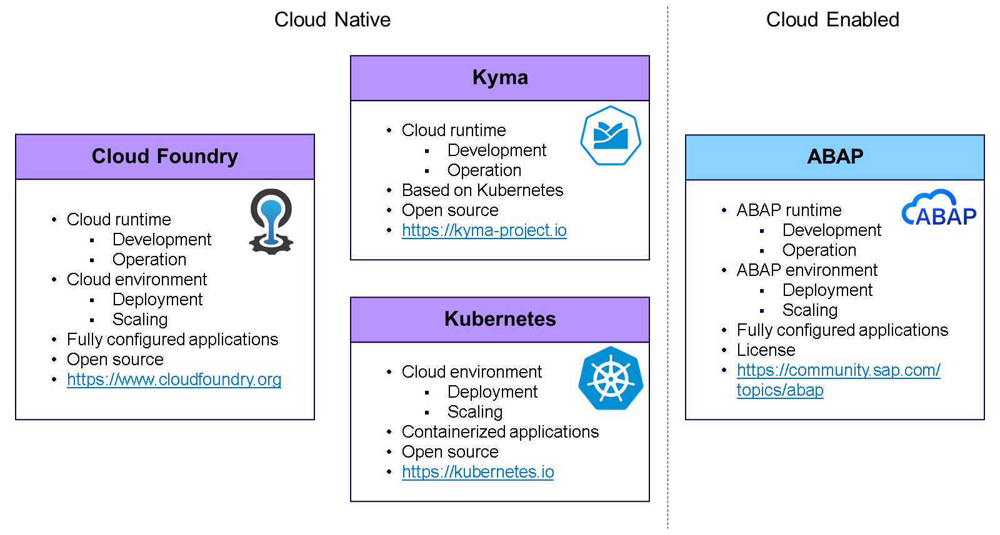
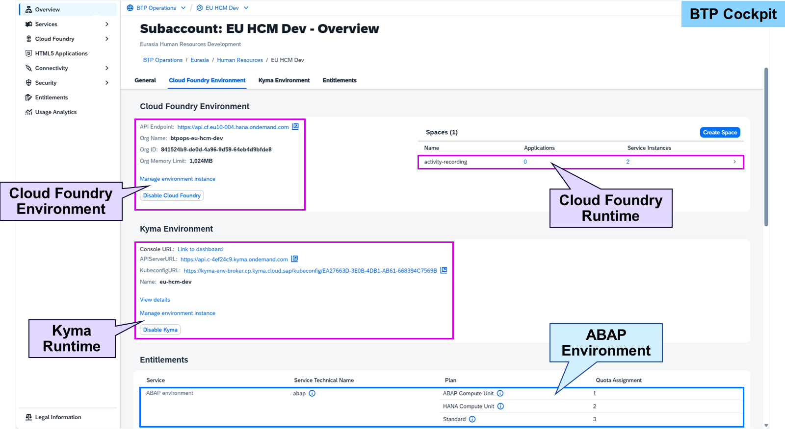

# Describing Runtime Environments

### SAP BTP Runtime Environments
Beside service subscriptions, subaccounts provide service instances and runtime environments in SAP BTP:

#### Environment
An environment is a service that manages one or more runtimes.
#### Runtime
A runtime provides resources and settings for apps and service instances.
#### Instance
A service instance runs together with apps and other service instances in a runtime.
#### Quota
An environment may define quotas for runtimes based on the quota of its entitlement.

Environments constitute the actual platform as a service (PaaS) offering of SAP BTP that allows for the development and administration of business applications.

Like service subscriptions, they're standalone but provide a runtime (environment) for applications and service instances. Environments use numeric quotas and can be sized, if applicable, by quota plans depending on the usage.

SAP BTP, Cloud Foundry Environment
The SAP BTP, Cloud Foundry environment enables development of new business applications and business services, supporting multiple runtimes, programming languages, libraries, and services. It leverages a multitude of buildpacks including community innovations and self-developed buildpacks.
https://www.cloudfoundry.org
SAP BTP, Kyma Runtime
The SAP BTP, Kyma runtime is a fully managed Kubernetes runtime based on the open-source project Kyma. It allows developers to extend SAP solutions with serverless functions and combine them with containerized microservices.
https://kyma-project.io
Kubernetes
Kubernetes, also known as K8s, is an open-source system for automating deployment, scaling, and management of containerized applications. It groups the containers that make up an application into logical units for easy management and discovery.

https://kubernetes.io
SAP BTP, ABAP Environment
Within the SAP BTP, Cloud Foundry environment, you can create a new space for ABAP development. This is what is referred to as the SAP BTP, ABAP environment. It allows creation of extensions for ABAP-based products, for example, SAP S/4HANA Cloud, and the development of new cloud applications. It's also possible to transform existing ABAP-based custom code or extensions to the cloud.
https://community.sap.com/topics/abap
SAP BTP, Neo Environment (only existing customers)
The SAP BTP, Neo environment allows development of HTML5, Java, and SAP HANA Extended Application Services (XS) applications. Especially SAPUI5 can be used to develop rich user interfaces for modern web-based business applications.
Note

If you're still using an SAP BTP, Neo environment, a migration may be suitable for you. Before starting to migrate your scenario, get in touch with our SAP BTP migration experts to create an individual road map for your transition. For further information please refer to:

https://help.sap.com/docs/btp/migrating-from-neo-environment-to-multi-cloud-foundation-cloud-foundry-and-kyma/migrating-from-neo-environment-to-multi-cloud-foundation-cloud-foundry-and-kyma

SAP BTP, Cloud Foundry environment and SAP BTP, Kyma runtime, based on Kubernetes, are cloud native runtime environments hosting service instances and a multitude of applications, whereas the SAP BTP, ABAP environment is a cloud-enabled runtime environment purely for ABAP applications.

Cloud Foundry and Kyma environments are shown in the Overview of a subaccount in their own tabs. The ABAP environment is handled like any other service instance and therefore only shown as an entitlement in the Overview.

Environments are enabled or disabled per subaccount, but there can be multiple runtimes of the same environment in one subaccount.