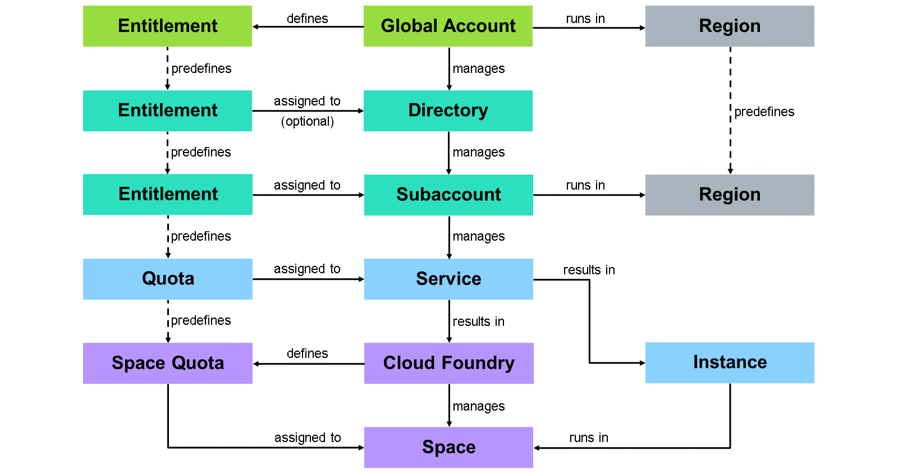
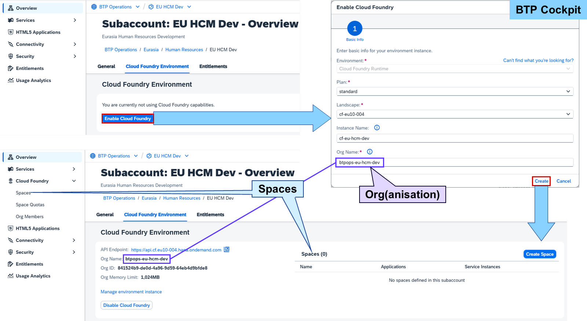
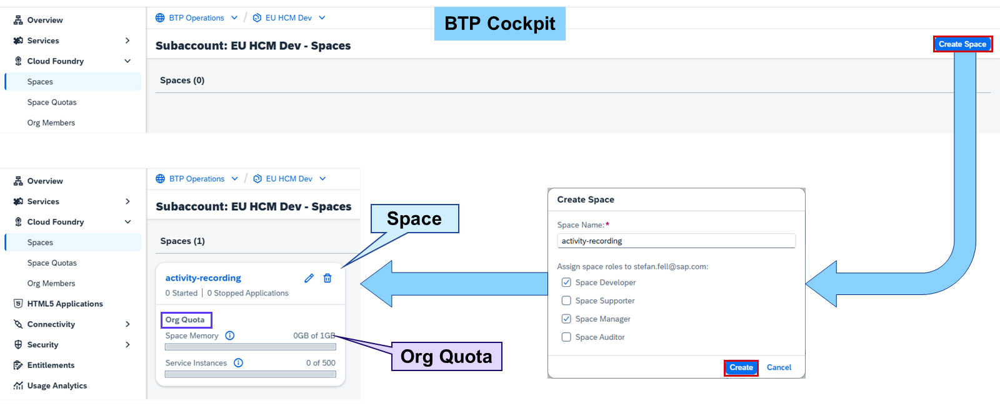
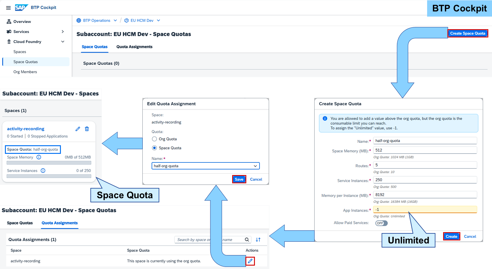
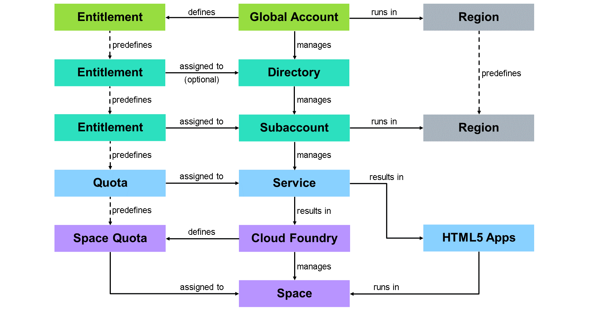
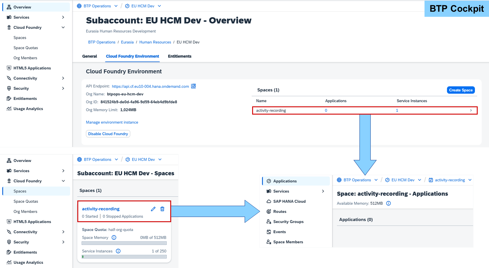
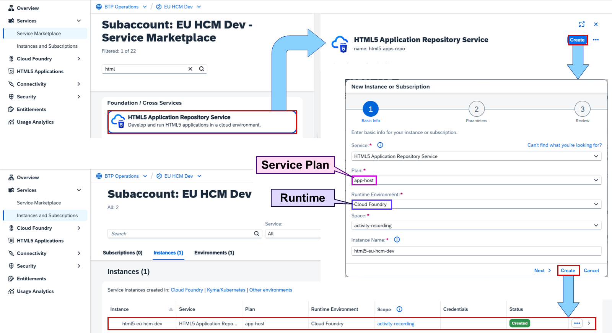

# Cloud Foundry Environment

SAP BTP supports Cloud Foundry environments and runtimes:

Cloud Foundry
The SAP BTP, Cloud Foundry environment is a service that manages one ore more spaces.
Space
A space provides resources and settings for apps and service instances.
Service Instance
A service instance runs together with apps and other service instances in a space.
Space Quota
The SAP BTP, Cloud Foundry environment may define space quotas for spaces based on the quota of its entitlement.



A space is a runtime of SAP BTP, Cloud Foundry environment. The Cloud Foundry environment manages these spaces and defines quotas to size them. Service instances run in a space. A Cloud Foundry environment contains what is referred to as an org.

Note

In Cloud Foundry, an org(anisation) is a development account that an individual or multiple collaborators can own and use. There's a one-to-one relationship between org and SAP BTP, Cloud Foundry environment.


SAP provides as part of the SAP BTP Administrator's Guide recommendations for structuring and naming Cloud Foundry orgs and spaces. Like every recommendation, it is depending on your company's requirements.

Cloud Foundry Structure Recommendations
Each subaccount can provide exactly one Cloud Foundry org. Therefore, following a staged development process, subaccounts and their org are handled as one entity (Dev, Test, Prod) based on categories like regions or departments, services or solutions, technical aspects or business topics.

Within each org, dedicated spaces for each application, extension, solution, team, or project should be created. The main reason here is that access and authorizations can be granted not only on subaccount but also on space level. In addition, the resources can be limited on space level, too. This makes spaces the smallest account management entity.

Naming Conventions
Because each Cloud Foundry org belongs to exactly one subaccount, SAP recommends reusing the subdomain of the subaccount as the org name. The subdomain on its part is derived from the subaccount name:

Template:
```
<company>(-<directory>-<directory>-...)-<purpose>
```

Example:
EU HCM Dev→btpops-eu-hcm-dev
Spaces are always accessed via its org. So, there is no need to repeat any account structure information in the space name. The name should describe the purpose of the apps and services running in the space. In addition, because there is no connection between spaces in different subaccounts, spaces should have the same name across a staged development landscape.



From the Overview of a subaccount, the SAP BTP, Cloud Foundry environment can be easily enabled by choosing Enable Cloud Foundry. There can be only one environment per subaccount, but this environment can have many spaces.

Hint

>The proposed Org Name includes the global account name. This may lead to a very long name with special characters like spaces. Other services refer to the name like destinations used for the SAP Cloud Transport Management Service (cTMS). Therefore, the org name shouldn't be too complicated.After enabling the Cloud Foundry environment in a subaccount, the Cloud Foundry menu on the left in the SAP BTP cockpit can be expanded showing Spaces, Space Quotas, and Org Members.



Spaces can be created in the Overview or by choosing Cloud Foundry→Spaces on the left. Choosing the Create Space button opens a popup asking for a space name and space roles, which should be assigned to the user creating the space.

The first space created in a Cloud Foundry environment gets the whole org quota assigned. If additional spaces should be created, this quota must be reduced to free quota for the other spaces.



A space quota defines the amount of memory and the number of routes, service, and app instances for a space. It can be created and assigned to spaces in Cloud Foundry→Space Quotas. The popup for creating a space quota provides the org quota underneath every input field as assistance.

Entering -1 in an input field assigns an "unlimited" quota for the resource. This means that the org quota is used.

Hint

> The only true unlimited resource is the number of app instances.

### Service Instance in Cloud Foundry



An example of a service instance is the app-host service plan of HTML5 Application Repository Service. It uses a numeric quota and can therefore be used in as many subaccounts in parallel as there's quota available.



A space can be opened by selecting the line in the Spaces table in the Overview of the subaccount. Another way is to choose the header of the tile for a space in Cloud Foundry→Spaces. Both will show the details like deployed applications or service instances running in the space.



From the Service Marketplace in a subaccount, a service can be created by choosing a service plan. A service instance needs in addition the environment (Cloud Foundry), runtime (space), and a unique instance name. Creating the HTML5 Application Repository Service results in a service instance in Instances and Subscriptions.

Note

The instance should have a CLI-friendly name (command line interface): A short string (up to 32 characters) containing only alphanumeric characters (A–Z, a–z, 0–9), periods, underscores, and hyphens. It cannot contain spaces.
From the Service Marketplace in a Cloud Foundry space, a service can be created in the same way as in the subaccount. The only difference is that only the service plan and instance name are needed. The environment and space were already set by selecting the service marketplace in the space.