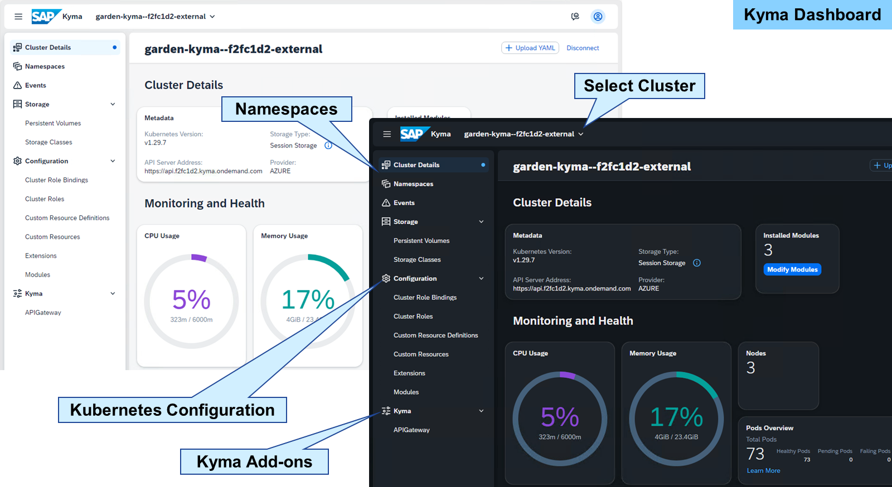
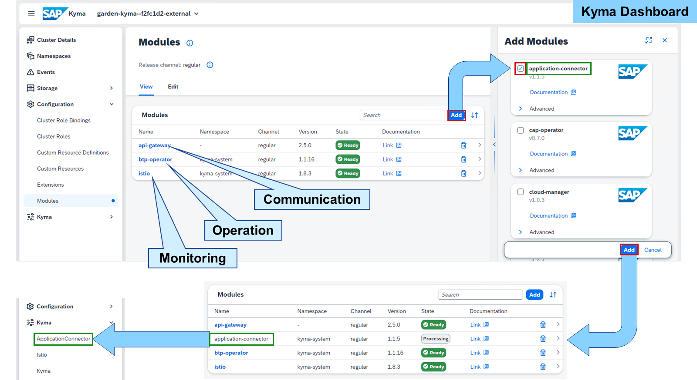
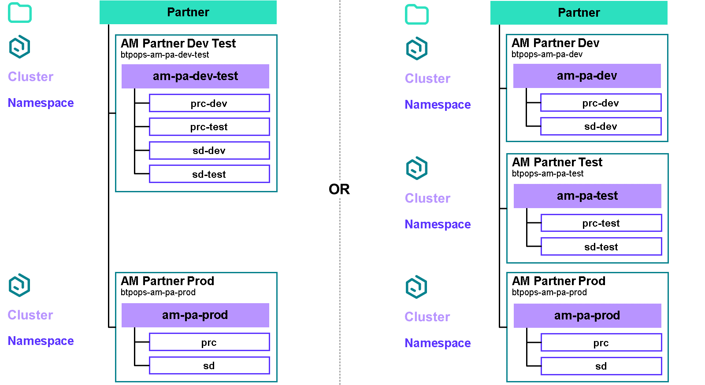
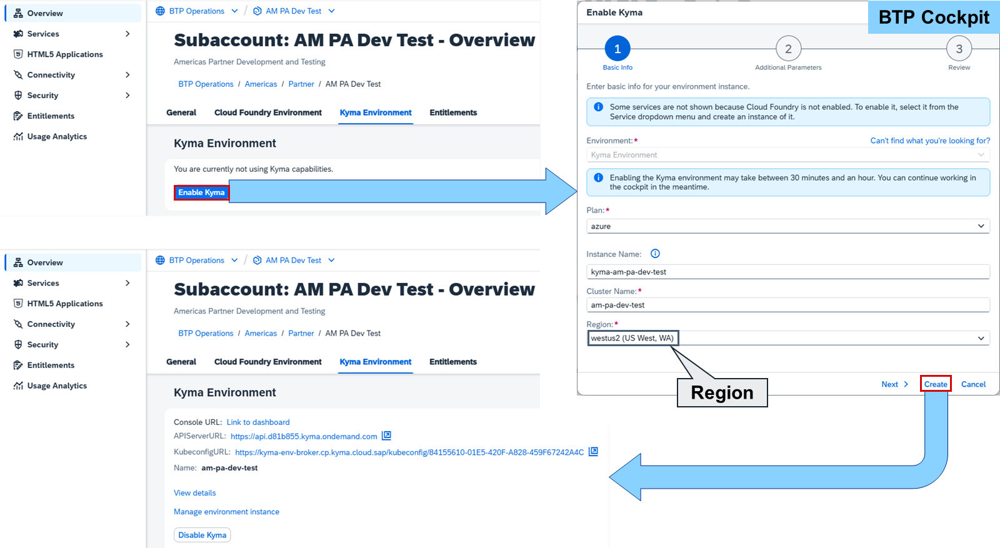
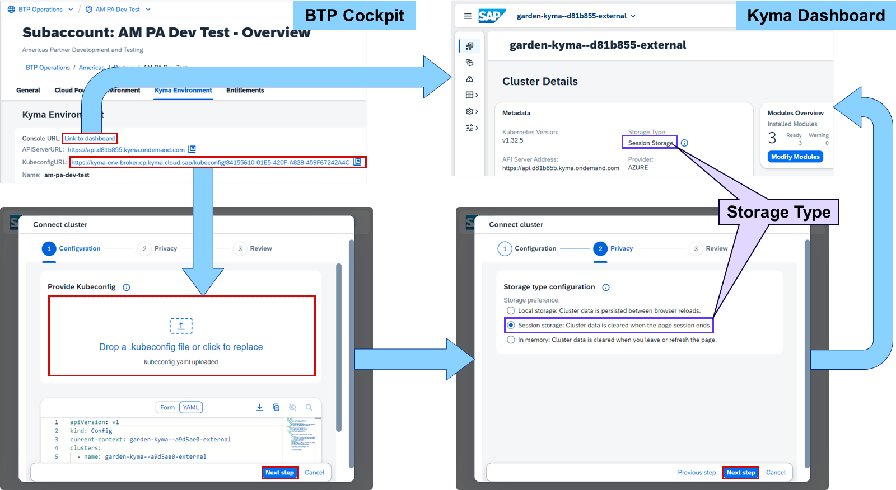
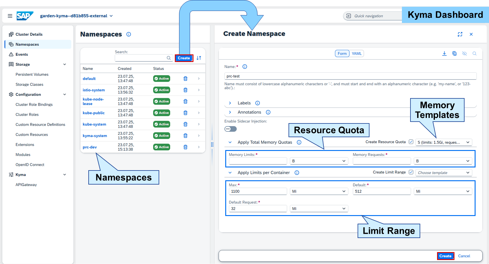
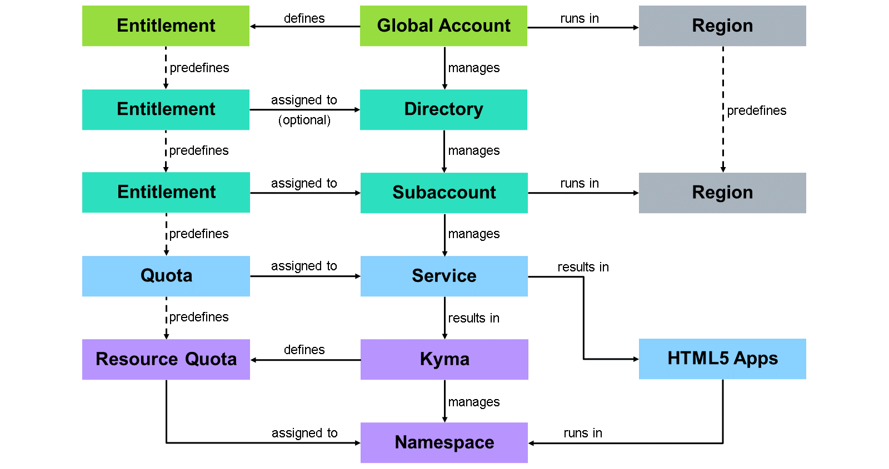
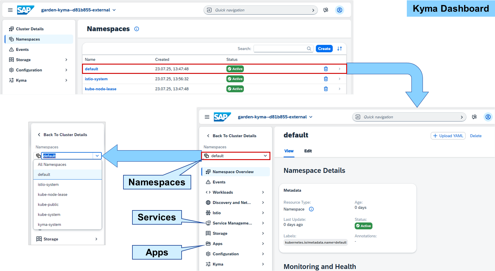
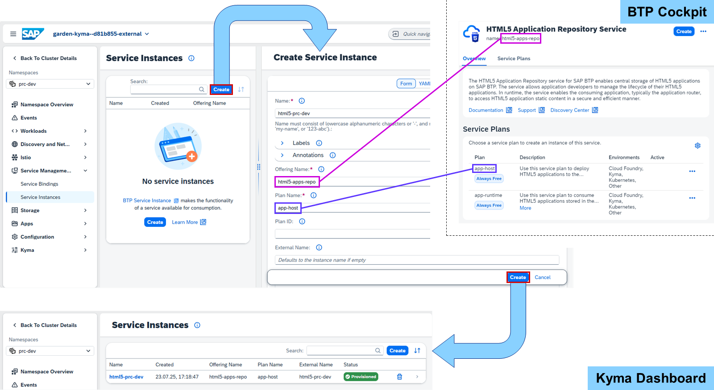
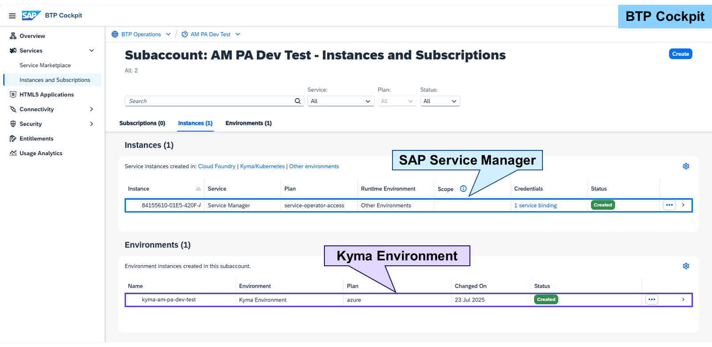

# Managing Kyma Runtimes

Kyma Dashboard

SAP BTP, Kyma runtime is managed in the Kyma dashboard, a web-based UI for managing resources within Kyma or any Kubernetes cluster. It uses Busola (https://github.com/kyma-project/busola) as central administration dashboard, which provides a graphical overview of your cluster and deployments.

The highest level displayed in the Kyma dashboard is a cluster. Here you can manage namespaces, create configurations for roles and resources, or access Kyma add-ons.

The Kyma dashboard can be used standalone or provisioned by SAP. SAP hosts it centrally for all customers under https://dashboard.kyma.cloud.sap. The dashboard is empty when first started and wants to connect to a Kubernetes cluster. This can be provided using a kubeconfig.yaml file consisting of the location of the cluster, cluster name, authentication details, and more. Multiple clusters can be managed in one dashboard.

The Kyma dashboard follows a modular approach to define the features and functions available in the dashboard for your user. You can add and configure modules at any time. If you decide that some of them are not needed for your use case, you can disable them and free the resources.

Kyma modules are deployed in two release channels:

The regular channel is the default release channel.

The fast channel provides more frequent releases offering early previews of new features before they are promoted to the regular channel.

You can use one or both release channels in your Kyma cluster, but you can define only one release channel per module.

The following modules are active by default:

API Gateway
Allows you to expose and secure APIs.

SAP BTP Operator
Allows you to create and manage SAP BTP services in Kyma.

Istio
Allows you to monitor traffic, telemetry, and security in complex deployments.

Note

The Application Connector allows you to connect with external solutions.

### Kyma Runtime
SAP BTP supports Kyma environments and Kubernetes runtimes:

Kyma
The SAP BTP, Kyma runtime is a service that manages one ore more namespaces.
Namespace
A namespace provides resources and settings for apps and service instances.
Service Instance
A service instance runs together with apps and other service instances in a namespace.
Resource Quota
The SAP BTP, Kyma runtime may define resource quotas for namespaces based on the quota of its entitlement.

A namespace is a runtime of a Kyma environment. The Kyma environment manages these namespaces and defines resource quotas to size them. Service instances run in a namespace. A Kyma environment contains what is referred to as a cluster.

Note

A Kyma environment is also referred to as Kubernetes or K8s.

SAP provides as part of the SAP BTP Administrator's Guide recommendations for structuring and naming Kyma cluster and namespaces. Like every recommendation, it is depending on your company's requirements.

#### Kyma Structure Recommendations
SAP recommends using at least two separate subaccounts for a staged development process: One for development and testing, and one for production. Ideally, there should be a third cluster for testing alone. However, for cost-efficiency, it can be combined with development.

If Cloud Foundry orgs and Kyma clusters are using the same resources like services, they should run in the same subaccounts. But for more complex scenarios, SAP recommends providing Kyma clusters in shared subaccounts. Within each cluster, dedicated namespaces for each solution, team, or project should be created. This is possible because of the control and data plane isolation feature of Kubernetes. So, instead of subaccounts, namespaces are used for isolation.

For more information about sharing clusters in Kyma, please read the documentation:

https://help.sap.com/docs/btp/btp-admin-guide/sharing-clusters-in-kyma

#### Naming Conventions
Because each Kyma cluster belongs to exactly one subaccount, SAP recommends deriving the cluster name from the subdomain of the subaccount. The company name in the subdomain should be omitted:

Template:
(-<directory>-<directory>-...)-<purpose>
Example:
AM Partner Prod→am-pa-prod
Namespaces are always accessed via its cluster. There is no need to repeat any account structure information in the namespace name. But namespaces are often shared between subaccounts. So,the name should describe the purpose of the apps and services running in the namespace in a shared manner like for a solution. In addition, namespaces should have similar names across a staged development landscape.

Note

"Prod" is omitted in the name for productive namespaces.

From the Overview of a subaccount, the Kyma environment can be easily enabled by choosing Enable Kyma. There can be only one environment per subaccount, but this environment can have many namespaces.

Note

Enabling the Kyma environment may take between 30 minutes and an hour. You can continue working in the cockpit in the meantime.

After enabling the Kyma environment, the subaccount overview provides the Console URL as a direct link to the Kyma dashboard, the APIServerURL, and KubeconfigURL.

The kubeconfig.yaml for an SAP BTP, Kyma runtime can be downloaded via the KubeconfigURL in the subaccount overview of the SAP BTP cockpit. After the download, the file can just be dragged and dropped in the Kyma dashboard. You can decide if the data should be:

Persisted in the browser locally
Stored in the browser session
Put in the memory until the next page refresh
Caution

The kubeconfig.yaml file is all you need to access the cluster. Therefore, the information is highly sensitive and should be handled with care.

In the SAP BTP cockpit, the dashboard can also be launched directly for the selected SAP BTP, Kyma runtime:

In the Overview section
In the Instances and Subscriptions section
The logon information is saved in the browser session.

A namespace can be created by just giving it a name. Resource quotas can be applied to limit the total memory consumption in a namespace, and limit ranges can be defined as memory constraints for individual containers in a namespace. Both work independently from each other, can already be set during creation, and are managed inside the namespace Overview.

### Service Instance in Kyma

An example of a service instance is the app-host service plan of HTML5 Application Repository Service. It uses a numeric quota and can therefore be used in as many subaccounts in parallel as there's quota available.

In the Kyma dashboard, a namespace can be opened by selecting the line in the Namespaces table of a cluster. You can jump from one namespace to another one by selecting it in the namespaces dropdown at the top of the menu. Both will show the details like deployed applications or service instances running in the namespace.

In the Kyma dashboard, a service can be created from the Service Management→Service Instances in a namespace. All services like the HTML5 Application Repository Service require an Offering Name and Plan Name. Both can be found in the online documentation or in the Service Marketplace of the SAP BTP cockpit. The technical (offering) name is underneath the heading and the service plans are shown in a table under the description.

Once created, new services appear under Service Management→Service Instances in the Kyma dashboard and under Services→Instances and Subscriptions in the SAP BTP cockpit.

Services hosted by Kyma are not visible in the SAP BTP cockpit. In the Instances and Subscriptions of a subaccount, beside the Kyma environment, the SAP Service Manager can be found. It's the central registry for service brokers and platforms in SAP BTP.

This service instance allows you to consume platform capabilities in any connected runtime environment, track the creation and managing of service instances, and share services and service instances between different environments. It's created and deleted automatically when creating or deleting a Kyma runtime in SAP BTP.
