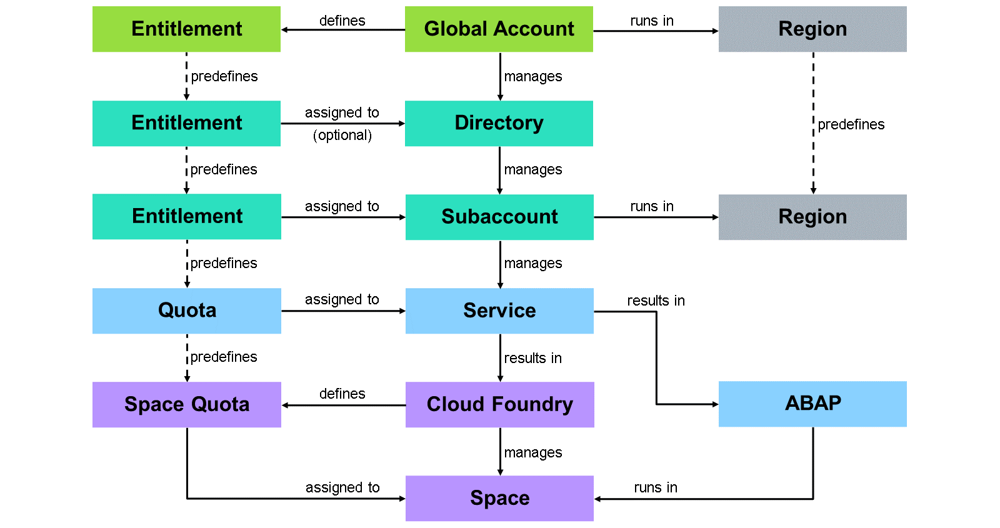
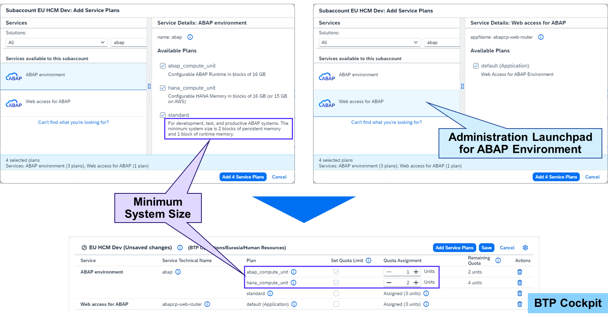
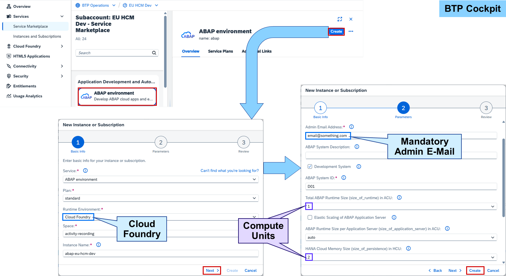
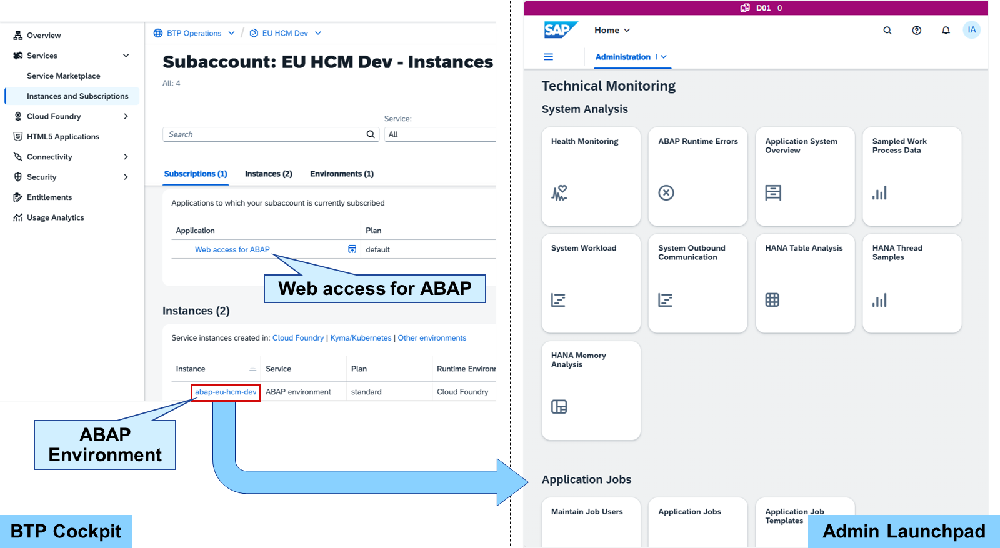
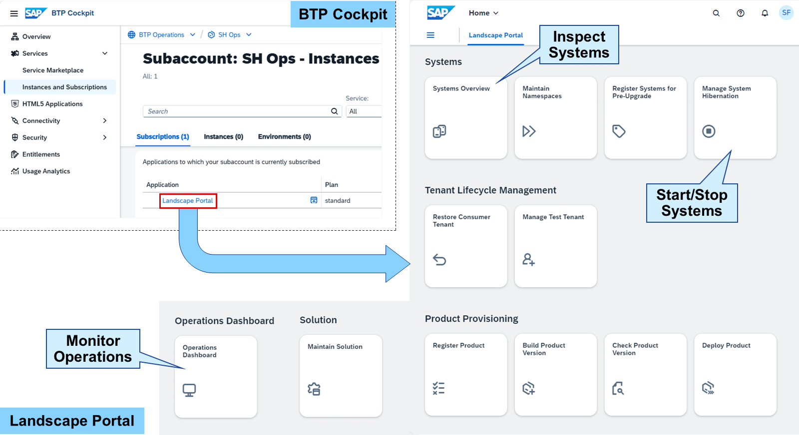
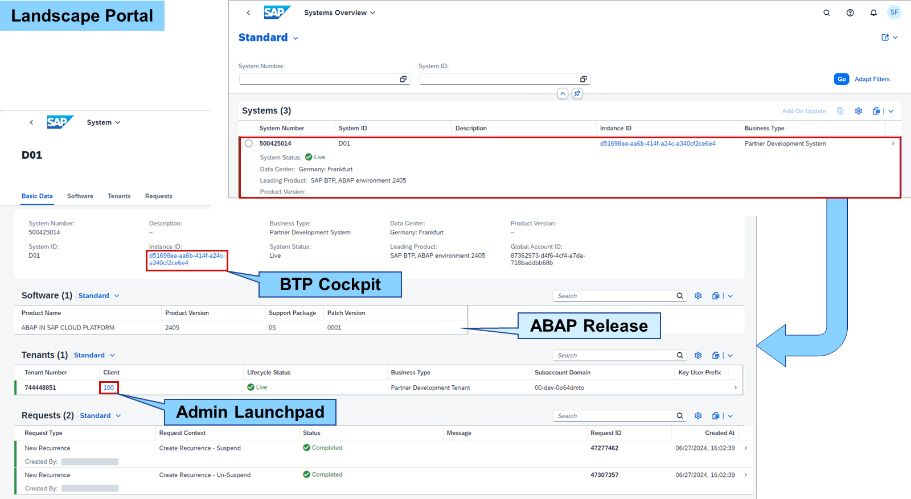
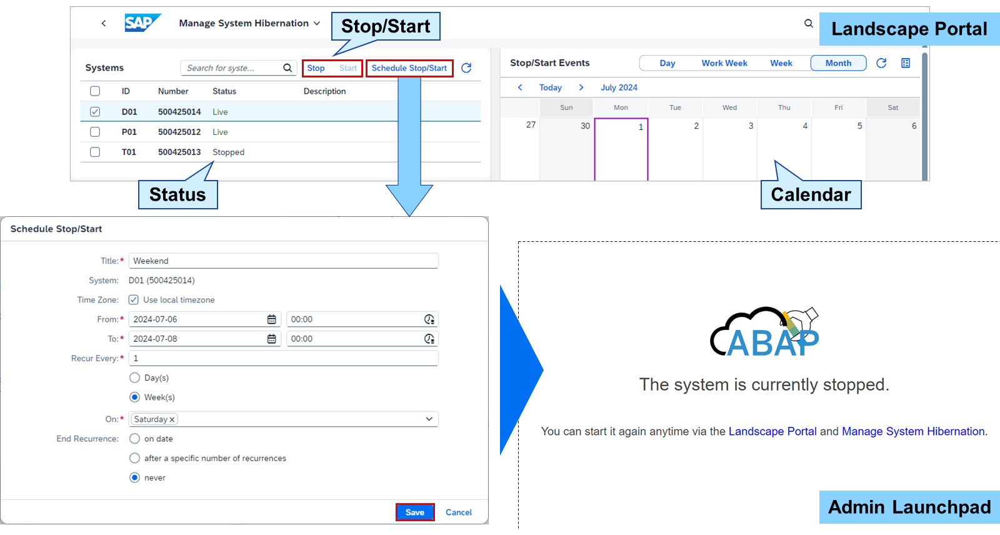
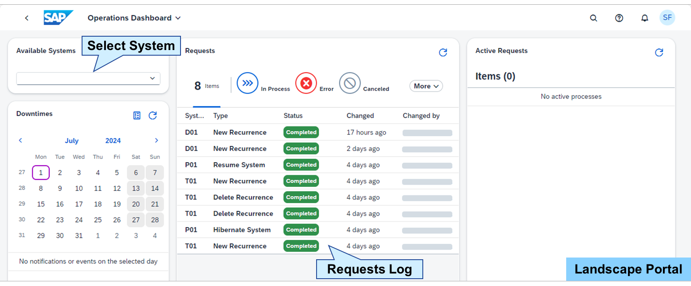

# Managing ABAP Environments

### ABAP Environment



The SAP BTP, ABAP environment is cloud enabled, but not cloud native. It therefore needs a cloud native environment, or PaaS, as its foundation – the SAP BTP, Cloud Foundry environment. The ABAP environment runs as a service instance in a space and can be activated like any other service instance.

Service availability may be restricted based on the region. To operate an ABAP environment, please check the available quota in your region.
Hint

An ABAP environment is also referred to as Steampunk system.



The following service plans are needed to entitle an ABAP environment:

abap_compute_unit
ABAP runtime (minimum one unit)
hana_compute_unit
SAP HANA memory (minimum two units)
standard
Combine and size ABAP runtime an SAP HANA memory independently from each other.
To administer the ABAP environment, the Web access for ABAP service provides the Administration Launchpad. This launchpad is mandatory to manage users, handle communication, monitor the system and much more.



From the Service Marketplace in the SAP BTP cockpit, the ABAP environment can be created by choosing a service plan, Cloud Foundry as runtime environment, a space, and a unique instance name.

In addition, the e-mail of the initial admin user and a system ID are mandatory. These and other parameters can also be passed using a JSON file:

```
{
  "admin_email": "email@something.com",
  "description": "Something",
  "is_development_allowed": true,
  "sapsystemname": "H01",
  "size_of_runtime": 1,
  "elastic": false,
  "size_of_persistence": 2,
  "size_of_persistence_disk": "auto",
  "admin_user_name": "ADMIN",
  "login_attribute": "email"
}
```

admin_email
E-mail of the administrator and initial user
description
System description (optional)
is_development_allowed
Enable development (default true)
sapsystemname
System ID consisting of three characters (default H01)
size_of_runtime
Size of the ABAP runtime
Note

It's part of the quota plan abap_compute_unit, with one ABAP compute unit representing 16 GB. The following sizes are available: 1, 2, 4, 6, 8, 16, 24.
elastic
Adapt the number of ABAP application servers depending on the system load (default false)The number scales between one ABAP compute unit and the number configured with size_of_runtime.
size_of_persistence
Size of the SAP HANA memory
Note

It's part of the quota plan hana_compute_unit, with one HANA compute unit representing 16 GB on Azure and GCP, or 15 GB an AWS. The following sizes are available: 2, 4, 8, 16, 32, 64.
size_of_persistence_disk
Size of the HANA disk space (default auto)If set to auto, the size is set between 40 * size_of_persistence + 40 and 120 * size_of_persistence + 40.
admin_user_name
ABAP user name for administrator (optional)
login_attribute
email or user_name used for login (default email)
Creating the ABAP environment results in a service subscription in Instances and Subscriptions.



For Cloud Foundry environment, the Administration Launchpad of the ABAP environment can be started by choosing the service instance name in Instances and Subscriptions. The prerequisite for that is the subscription of the Web Access for ABAP service.

The initial admin user already got some apps mapped for administration and development. The Technical Monitoring, for example, provides plenty of apps for monitoring the ABAP environment, such as the Health Monitoring.

### Landscape Portal

[]

The Landscape Portal is the central tool to perform lifecycle management operations for ABAP systems in SAP BTP. As a service subscription, it does not need any Cloud Foundry or Kyma environment. By subscribing to the Landscape Portal in a subaccount, all ABAP systems in the global account of the subaccount can be managed. No further configuration is needed.

Hint

It's recommended to put the Landscape Portal in a separate subaccount for operation purposes.
The Landscape Portal provides a predefined set of apps for example to:

Get an overview of all your ABAP systems and tenants.
Schedule (regularly occurring) system hibernation periods for specific systems.
Monitor your operations in the Landscape Portal.
To use the Landscape Portal, your user needs the LandscapePortalAdmin role collection.



The Systems Overview app does what the name implies: It provides a list of all ABAP systems of your global account with general information like data center, ABAP release, or if it's up and running.

Choosing the Instance ID jumps to the services and subscriptions of the subaccount hosting the ABAP environment. Choosing the Client opens the Administration Launchpad of this ABAP system.

Landscape Portal admins and users are allowed to access Systems Overview.



Every running ABAP system costs money based on the resources consumed. One way to reduce the resources is the elastic scaling of ABAP application servers based on the system load. This feature can be set when creating the ABAP environment. But at least one ABAP compute unit will still run. To reduce the costs even further, the ABAP system can also be stopped.

Stopping temporarily unused ABAP systems can be done in the Manage System Hibernation app. You may want to stop:

Development systems outside of working hours and during the weekend
Correction systems outside of correction activities
Test systems outside of test activities
Custom code analysis system when analysis is done
Production systems before go-live
Beside stopping and starting ABAP systems directly, you can also schedule stop/start events. You can set the date and time of the event, the recurrence, and how long it should be valid. A calendar supports in keeping an overview of all events.

Trying to access a stopped ABAP system will show the message that the system is stopped and that it can be started anytime using Manage System Hibernation.

Only Landscape Portal admins are allowed to access Manage System Hibernation.



Finally, a simple but useful app is the Operations Dashboard. It gives an overview of all processes that have been triggered in the Landscape Portal to help you monitor your operations. Downtimes and past and active requests are shown per ABAP system.

Only Landscape Portal admins are allowed to access the Operations Dashboard.