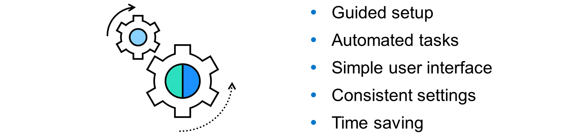
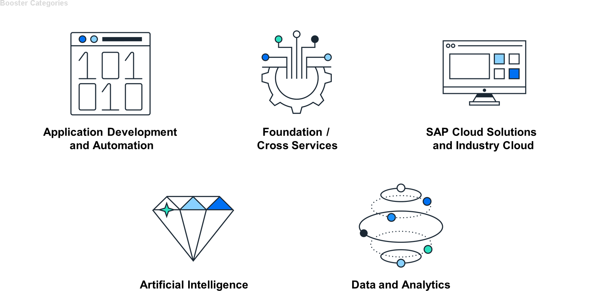
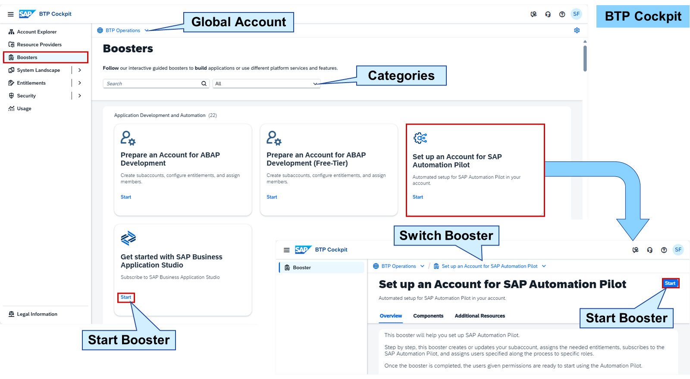
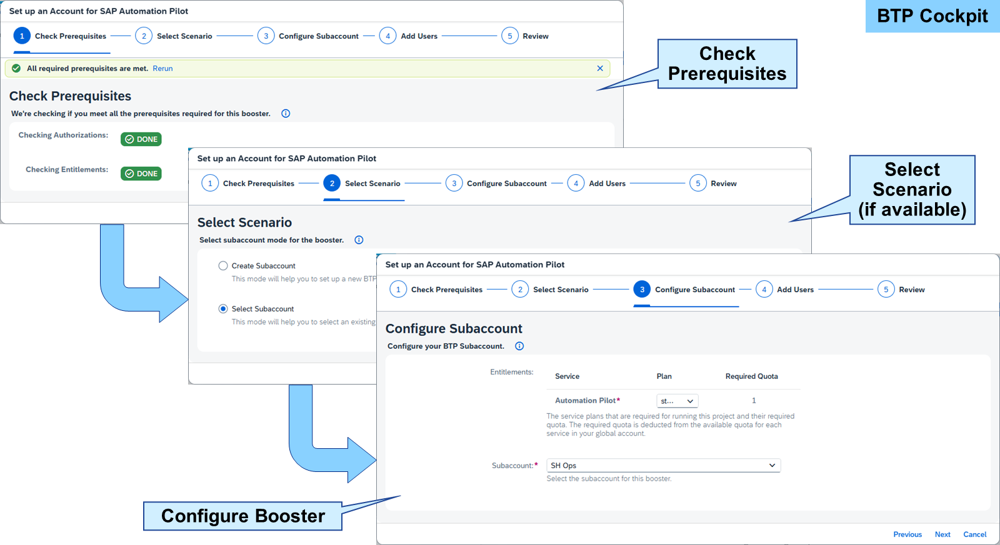

# Utilizing Boosters

### Boosters

Boosters are a set of guided interactive steps that enable you to select, configure, and consume services on SAP Business Technology Platform (BTP) to achieve specific technical goals. These interactive and automated processes can be, for example, setting entitlements, creating service instances, or authorizing users. In a nutshell, they simplify the process of setting up and configuring BTP services, making it easier for administrators, developers, and users to get started with SAP BTP.

Guided Setup
Boosters provide a step-by-step guidance for technical tasks reducing the chance of errors and ensuring consistent setups.
Automated Tasks
Boosters automate repetitive tasks by handling configurations, authorizations, and prerequisites automatically.
Simple User Interface
Boosters simplify complex processes making them accessible to a broader audience with limited technical expertise. The UI prevents errors by validating settings and notifying users of possible issues.
Consistent Settings
Boosters ensure that setups are consistent across different environments, allowing users to rely on standardized configurations.
Time Saving
Boosters streamline the setup process saving time and effort.

Boosters can be distinguished in five categories:

Application Development and Automation
Examples:

Get Started with SAP Build Code
Prepare an Account for ABAP Development
Set up an Account for SAP Automation Pilot
Artificial Intelligence
Examples:

Set Up Account for SAP AI Launchpad
Set Up Account for SAP Document AI
Setting Up Joule
Foundation/Cross Services
Examples:

Get Started with SAP Print Service
Configure Access to the Authorization Service
Data and Analytics
Examples:

Set Up SAP HANA Cloud Administration Tools
Set up SAP Datasphere to replicate data to SAP HANA Cloud
SAP Cloud Solutions and Industry Cloud
Examples:

Prepare an Account for SAP Customer Order Sourcing
SAP S/4HANA for Microsoft Teams
Set Up SAP Ariba Buying

You can access the boosters catalog directly from your global account in the SAP BTP cockpit by choosing Boosters in the navigation menu. The catalog overview lists all the available boosters grouped by category. From this overview page, you can view a quick information about a booster, start a booster, or choose access the booster details.

When you select a booster in the booster catalog, you start with the Overview page. Here you get an explanation of what the booster does, that is, its features and some more details in how the booster can assist you.

In the Components screen, you can see all components that are required for the booster to run. These services and subscriptions can be mandatory or optional.

In the Additional Resources screen, you get links to more information related to the booster, for example, blog posts in the SAP Community, missions in the SAP Discovery Center, documentation on SAP Help Portal, or learning jourrneys on SAP Learning.

With the Start button, you can execute the booster.

Starting a booster leads to a popup with interactive steps that allow the configuration of the booster run:

The first step automatically checks if the prerequisites for running the booster are met. If something is missing, for example, an entitlement, the booster stops. You must then close the popup and solve the issue.
If the prerequisites are met, some boosters offer scenarios, how the booster can be used. A typical scenario is to run the booster in an already existing subaccount or to create a new one.
All following steps are depending on what should be accomplished with the booster. Configuring the subaccount and adding users are just two examples here.
In the last step, you can review the configuration of the booster before you start the actual run. The time needed for the booster to finish depends on what is actually done.