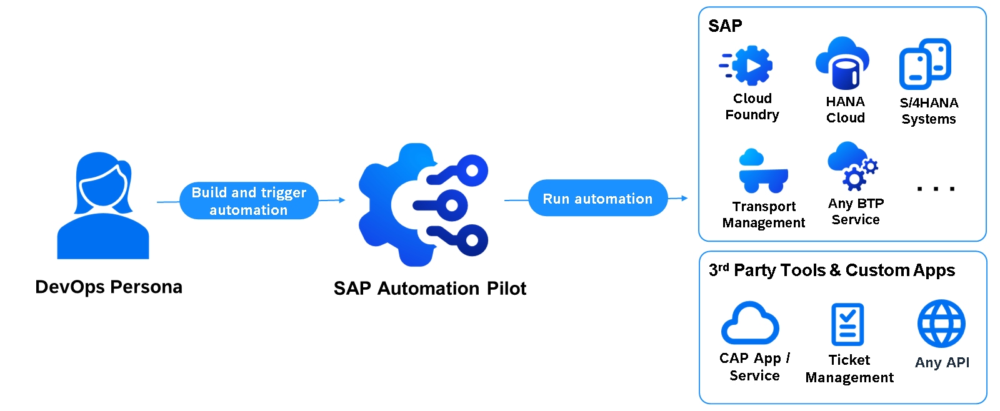
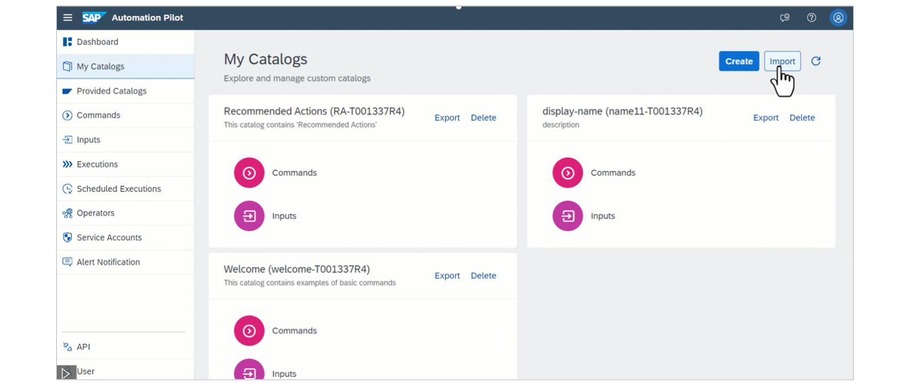
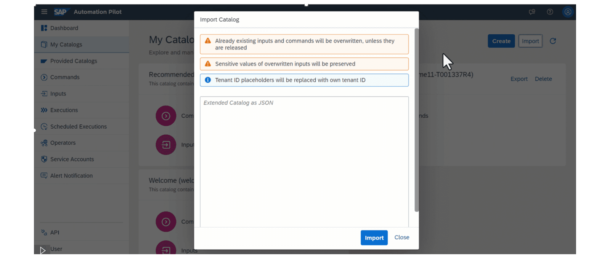
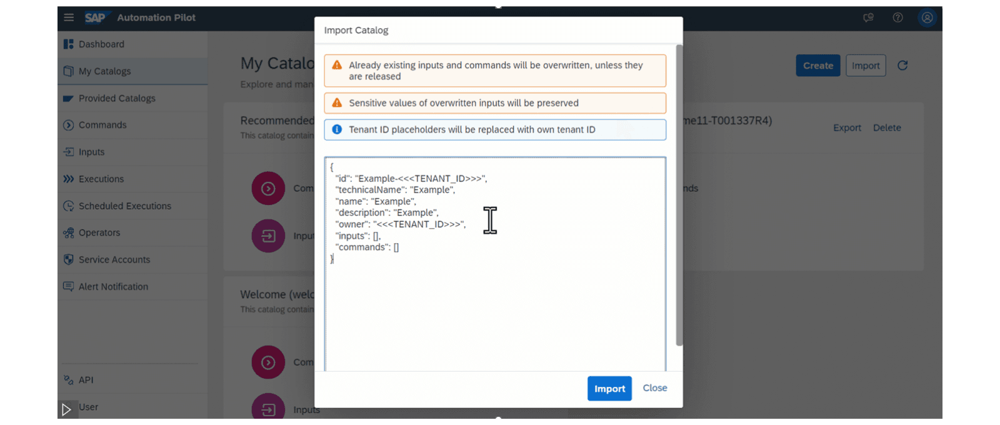
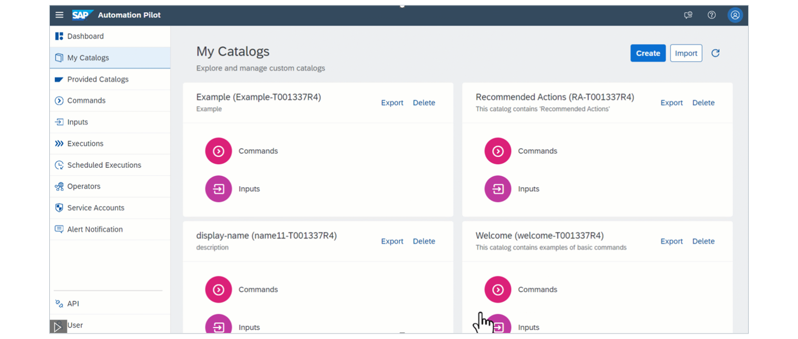
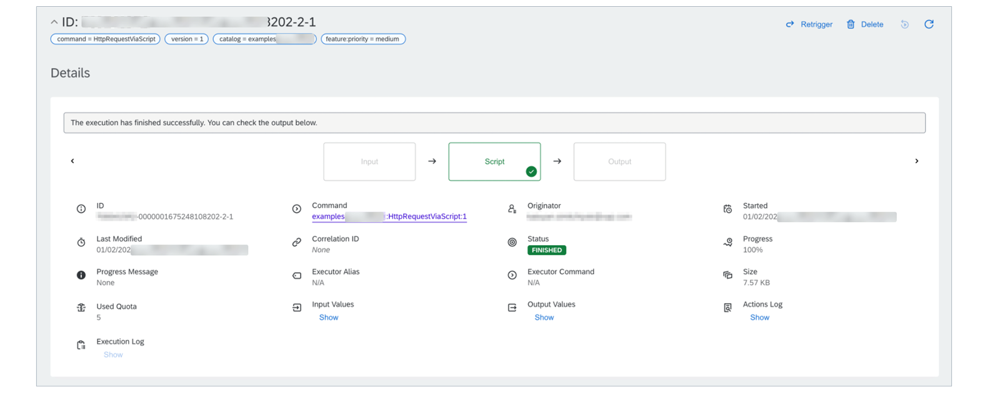
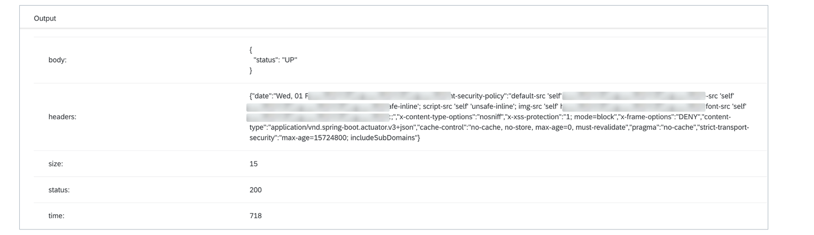
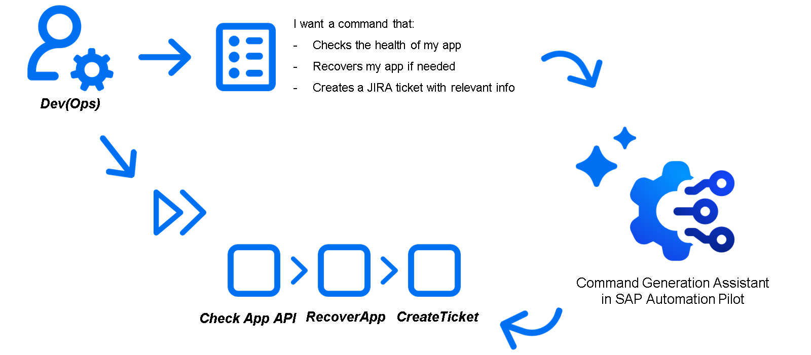

# Building Technical Ops Automation Flows with SAP Automation Pilot

### SAP Automation Pilot

SAP Automation Pilot
The goal of SAP Automation Pilot is to simplify and automate complex manual technical processes and flows. This enables DevOps teams to design and execute automation flows in order to run their solutions on SAP BTP with minimal operational effort.

SAP Automation Pilot is a low-code / no-code automation engine that allows you to:

Automate sequences of steps,
Execute scripts in a serverless manner,
Use catalogs of commands provided by SAP to automate typical Ops tasks in and outside your SAP BTP landscape,
Build custom automations. The service is designed to work with low latency, even under a heavy workload, and is capable of triggering hundreds of automations simultaneously.

Designing your first command in SAP Automation Pilot
Before creating your first automation command, there are a few key concepts to review to better understand how to use SAP Automation Pilot. Please see these below:

Command – The top-level automation entity you execute. A command is versioned and built from one or more executors wired in sequence. Commands declare inputs (parameters you pass in) and outputs (named values produced by executors) that you can reference via dynamic expressions.
Input(Key) – A typed variable (string, number, boolean, secure/text, list, map) accepted by a command at runtime. Inputs can have validations (required, allowed values), defaults, and descriptions.
Executor – A step inside a command. Many types exist (e.g., Script, HTTP, Kubernetes, BTP, Cloud Foundry, etc.). Executors run in order and can reference the command’s inputs and any outputs produced by previous executors.
Output(Key) – A named value a command makes available to callers. Under the hood, outputs are assigned from executor output value (for example, the body of an HTTP response, a derived boolean, or an extracted field).
Output Value – The actual runtime value produced by an executor (string, number, boolean, object, etc.). You map these values to command output keys.
Provided Catalogs – Prebuilt catalog tiles provided by SAP (e.g., http-sapcp/HttpRequest) that you can import and reuse, or combine with your own commands.
SAP Automation Pilot includes ready-made commands, such as HttpRequest, which lets you send HTTP requests to any public endpoint. It’s easy to use and works with most modern HTTP APIs, but it has limits on how long a request can run and how large the response can be.

Some situations, like calling slow synchronous APIs or handling large responses, need more flexibility. For these cases, you can use the ExecuteScript command. It runs scripts in a secure, isolated environment for up to 5 minutes, with limited CPU, memory, and storage. It supports bash, Python, and Node.js, and includes popular tools like curl, jq, and Git.

Example
In the current example, we will explore and run our first simple command to get started with SAP Automation Pilot.

It will be a reusable command that:

Accepts inputs such as URL, method, headers, and body.
Uses a script executor to perform the HTTP call.
Exposes outputs like statusCode, responseBody, and responseHeader for downstream use.
Fails fast with clear error messages and emits structured outputs even on errors.
To do so, first import the content of the examples catalog (prepared for your accelerated onboarding) into your SAP Automation Pilot tenant. Then, navigate to the HttpRequestViaScript command and trigger it.

Important: to learn how to import the ready-to-use content from the example repository, consult the following resources:

Samples repo – How to use
SAP Automation Pilot help documentation - Operations (check out the section Import)

### How to Import Ready-to-use Catalogs in SAP Automation Pilot

You'll need to provide values for the following input keys:

method - Request method to use
url - URL to which to send the request
body - Optional: Request body to send with the request
headers - Optional: Request headers to send with the request
timeout - Optional: Maximum time that the request can take. Defaults to 60 seconds. The maximum allowed value is 240 seconds.
user - Optional: Username to use for server authentication
password - Optional: Password to use for server authentication
authorizationHeader- Optional: Explicit value for the HTTP authorization header. Overwrites all other forms of authentication
responseBodyTransformer- Optional: JQ expression to transform the response body with. The format must follow the one described in https://github.com/stedolan/jq
Now, let’s execute the command HttpRequestViaScript with the following input:

method - GET
url- https://eu10.autopilot.ondemand.com/health (hint: you can use any other API depending on your use case and needs)
timeout - 30
After a few seconds, the execution should finish successfully:

The execution's output should be similar to the one below:

Designing your ops automation flow with SAP Automation Pilot and Generative AI
However, building a custom automation flow could be challenging for new users. Generative AI Command Generation addresses this by using simple prompts to create complete automation flows directly in SAP Automation Pilot. In this lesson, you will learn how to enable the feature, craft prompts, generate commands, and execute them for immediate impact.

Start exploring its full potential now!

What GenAI in SAP Automation Pilot does
GenAI features have been introduced in SAP Automation Pilot to improve customers’ onboarding and boost Dev(Ops) Teams' efficiency. The solution itself is to make GenAI available to users via a simple prompt so that it:

Generates fully working DevOps automation flows for customers’ SAP landscapes that can be implemented immediately
Enhances the variety and the quality of commands by fully utilizing coding knowledge (bash, python, etc.) of the model
Extends the ops use cases even further as the knowledge of different public APIs (e.g., SAP BTP, GitHub, Jira, Dynatrace, etc.) is also fully utilized.
Find below a quick overview of the flow of how SAP Automation Pilot users can generate fully working Ops commands:

Summary
By completing this lesson, you have learned how to:

Generate a first simple command by importing and adapting a ready-made Script: HTTP Request command from SAP Automation Pilot’s public examples
Understand key SAP Automation Pilot concepts: Commands, Inputs (Keys), Executors, Outputs (Keys), Output Values, and Provided Catalogs.
Define and validate command inputs such as URL, method, headers, body, and timeoutSeconds.
Use a Script executor to perform HTTP requests, handle responses, and set structured outputs like statusCode, responseHeaders, and responseBody.
Map executor output values to command output keys.
Consider using the Command Generation Assistant in SAP Automation Pilot to generate further commands.
