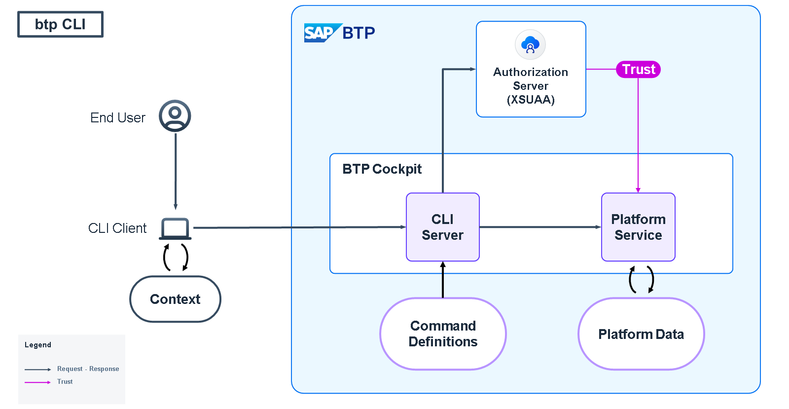
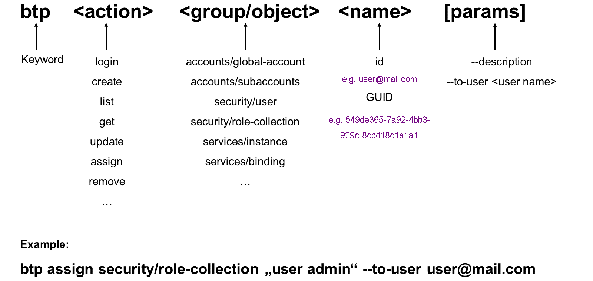
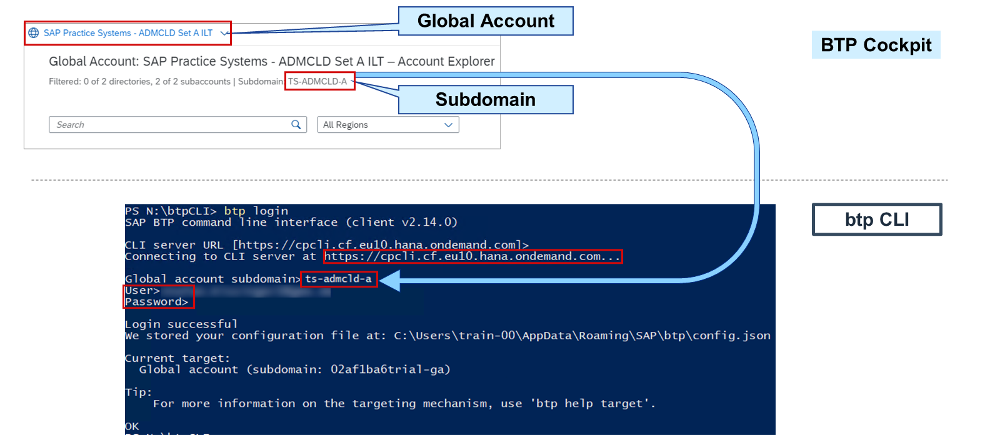
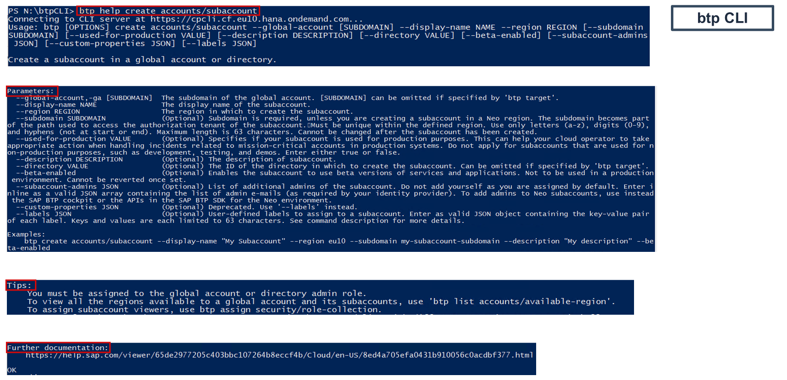
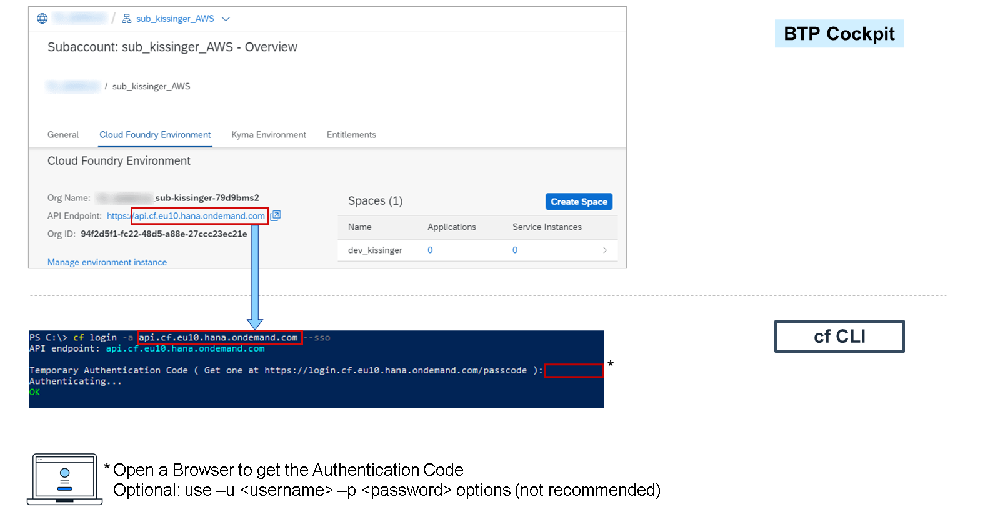
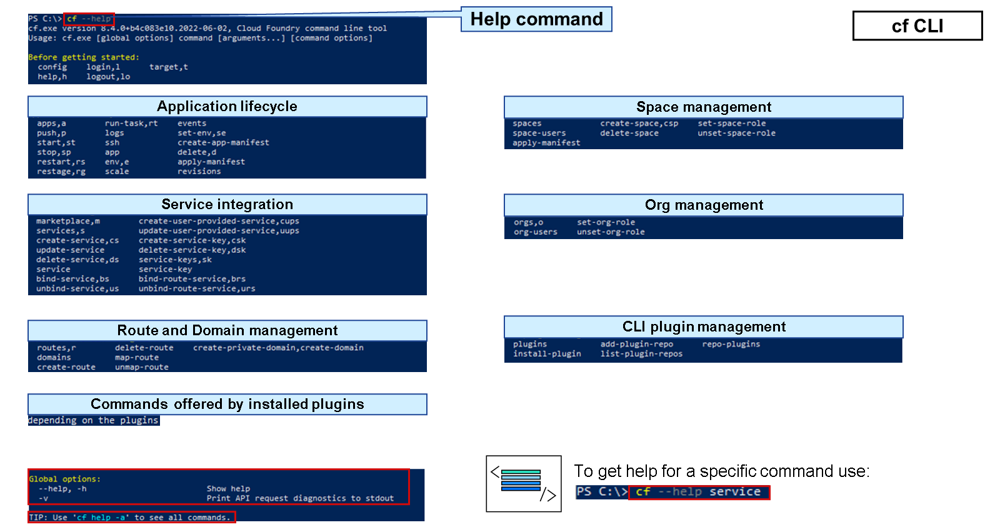

# Operating Command Line Interface Tools

### Command Line Tools for Administration

You can manage and operate the SAP Business Technology Platform (SAP BTP) using various command-line tools.


SAP BTP Command Line Interface (btp CLI)
The SAP BTP command line interface (btp CLI) is an alternative to the SAP BTP cockpit for users who prefer working on the command line and/or want to automate operations using scripts.

This tool can be used to perform tasks to work with global accounts on SAP BTP. This includes creating subaccounts and directories but also allows you to get information about your current global account.

Cloud Foundry Command Line Interface (cf CLI)
The Cloud Foundry command line interface (cf CLI) is used for managing subaccounts in the Cloud Foundry environment, such as creating orgs and spaces, or managing quotas.

Plug-ins can be installed to add further commands. For example, the Multitarget Application plug-in to simplify managing and deploying applications that consist of multiple modules and perform lifecyle operations on them, the Service Fabrik based on B&R plug-in to perform backup and restore operations on service-instances, or the Custom Domain Self-Service plug-in to manage TLS server certificates and client authentication trust for custom domains.

Kubernetes Command Line Tool (kubectl)
The Kubernetes command line tool (kubectl) for interacting with Kubernetes clusters enables you to perform various operations on cluster resources using the Kubernetes API. With kubectl, you can deploy applications, manage pods, services, and other resources within your cluster. Additionally, you can inspect the cluster’s state, view logs, and perform checks on resource details. Rather than issuing HTTP requests directly, kubectl simplifies the process by providing a user-friendly interface.

SAP BTP Command Line Interface (btp CLI)
btp CLI Technical Infrastructure



The SAP BTP command line interface (btp CLI) is an alternative to the SAP BTP cockpit for users who prefer working on the command line and/or automate administration tasks.

The technical infrastructure of btp CLI consists of a client and a server. The client is installed on your computer, and it interacts with SAP BTP via a server. You connect to this CLI server when you log on to your global account through the btp CLI.

btp CLI Features and Functions
The list shows some of the tasks that the btp CLI enables you to perform:

Creating subaccounts and directories.

Managing entitlements of global accounts and subaccounts.

Managing users and their authorizations in global accounts and subaccounts.

Subscribing to applications.

Setting entitlements.

Automating administrative tasks.

Working with resources of the SAP Service Manager.

btp CLI Command Structure
The btp CLI is the command line interface for all tasks on global account, directory, and subaccount level. Going down the account hierarchy, the last step with btp CLI is creating a Cloud Foundry environment instance, which essentially creates a Cloud Foundry org.

Note

From org level onwards, that is, for managing members in orgs and spaces, creating spaces, as well as assigning quotas to orgs and spaces, the cf CLI is used, which will be discussed later.

The base call to enter on the command line is btp.



The btp CLI has a command structure, which makes it really convenient to use. A command has to start with the keyword btp, which will call the executable file.

Next, you have to define an action, which could be a create, read, update, and delete (CRUD) operation to, for example, create a subaccount or remove a role collection. Then you need to specify which group or object the action should apply to. This is followed by the object or group's ID.

Finally, there's the option to provide additional parameters to perform more specific configurations, such as setting a password of an SAP HANA Cloud instance.

Note

> Please note that, depending on the task that should be executed, not all command placeholders will be required.

Prerequisites for administrating and configuring a global account:

You have downloaded and extracted the btpCLI (see related information).
You have a user and password for the global domain with the appropriate permissions.

btp CLI Login
First, log in to your global account. For this you need the URL of the btp CLI server. If you leave this empty, the client will typically propose https://cpcli.cf.eu10.hana.ondemand.com.

It is also necessary to provide the subdomain of the global account you'd like to log in to. The subdomain is shown in the switch global account dialog.

To complete logging in, you'll need to provide your username (typically your e-mail address) and the corresponding password. If the login is successful, the client will store a token on your machine, which is valid for 24 hours, and will be renewed with each request, enabling you to work without interruptions.

if you don't know the global account subdomain ID by heart, you can easily copy it from the SAP BTP cockpit:



This is the complete syntax to login:

```
btp login --url https://cpcli.cf.eu10.hana.ondemand.com –-subdomain <global-account> --user <user> --password <password>
```

At some stage, you may require some details about your global account. You can use the btp CLI to get an overview with all the relevant information.

```
btp get accounts/global-account
```

btp CLI – Help and Examples

While using the btp CLI, you can get help for every command. You can consume the online documentation or directly use the help command of the btp CLI. The help command has multiple stages for help. With btp help, you get a general help overview for all commands.

With btp help accounts, you get an overview of all commands regarding account structure. With btp help create accounts/subaccount, you get a fully detailed help for the creation command of subaccounts as shown on the following slide:



Once you select enter, you get a quick Usage help followed by Parameters you could use. In addition, you get a Tips section, which authorization you need to call this command, and a Further documentation link.

Hint

Your can even append --help to the end of (incomplete) commands.

You can, of course, use the online documentation instead of the built-in help commands. The information should be identical and supports you to use the btp CLI correctly.

Important Tasks
The management of users and their authorizations is a major task when working with global accounts. An important role in the global account context is the global account administrator. This role is needed to create new subaccounts or add new members to the global account.

Assign the role collection Global Account Administrator to a user by running the following in the btp CLI:

```
btp assign security/role-collection "Global Account Administrator" --to-user <user>
```

Sometimes you may also need information about which regions are available for your global accounts and subaccounts, for example, to create and manage them. For this, you can use the following command:

```
btp list accounts/available-region
```

This command also provides information about the environments and infrastructure providers for each region.

Tips and Tricks
Use btp login --sso to automatically open a browser for single sign-on at the identity provider.
Use btp enable autocomplete to enable command auto-completion for the specified shell to save keystrokes when entering command actions, group-object combinations, and their parameters.
Hint

Currently, autocomplete runs in Bash, PowerShell, and Zsh.
Use btp target for command calls to a subaccount, a directory, or the global account.
Hint

Use btp get accounts/global-account --show-hierarchy to get ids.
Use the --format json option to change the output format of a command to JSON to make use of automation.
The --config option specifies the location of the configuration file.


### Cloud Foundry Command Line Interface (cf CLI)

cf CLI Command Structure
Use the Cloud Foundry command line interface (cf CLI) for managing subaccounts in the Cloud Foundry environment, such as creating orgs and spaces, or managing quota.

The cf CLI has a command structure, which makes it really convenient to use. A command has to start with the keyword cf, which will call the executable file.

Next, you could define a global option. Then you have to define a command, which could be a start, stop, create-space for example. Depending on the command, arguments and commands could follow.


cf CLI Login
Prerequisites

You have created at least one subaccount and enabled the Cloud Foundry environment in this subaccount
Download and install the cf CLI (see related information).
To login to the cf CLI, you need to set the target API endpoint (like api.cf.ap11.hana.ondemand.com). To log on to the Cloud Foundry environment, use the command cf login.

We recommend to use the option --sso. You need a browser within this logon procedure. Otherwise, log on with the user and password associated with your account in the default identity provider, SAP ID service. If you've forgotten this password and this user is associated with your SAP Universal ID user, reset your password.

To log on with a specific identity provider, use the option --origin.

Below you can see an example of log in using the --sso option.



This is the complete syntax to log in:

cf login [-a API_URL] [-u USERNAME] [-p PASSWORD] [-o ORG] [-s SPACE] [--sso | --sso-passcode PASSCODE] [--origin ORIGIN]

After logon, check the org and space that you are working with. Use cf target -o ORGANISATION -s SPACE to select the space you want to work with!

cf CLI Help and Features
To view the help for the CLI, execute cf --help, which lists the most common CLI commands.



The command cf help -a will list all commands with a short description.

To get help for a specific command, execute cf --help <command> like the btp CLI tool.

The following key features are available:

Add Organization Members
Create Spaces
Add Space Members
Create Space Quota Plans
Assign Quota Plans to Spaces
Change Space Quota Plans
Delete Spaces
In addition, you can add plug-ins to extend the functionality like:

Multitarget Application plug-in
Service Fabric plug-in
Custom Domain plug-in

