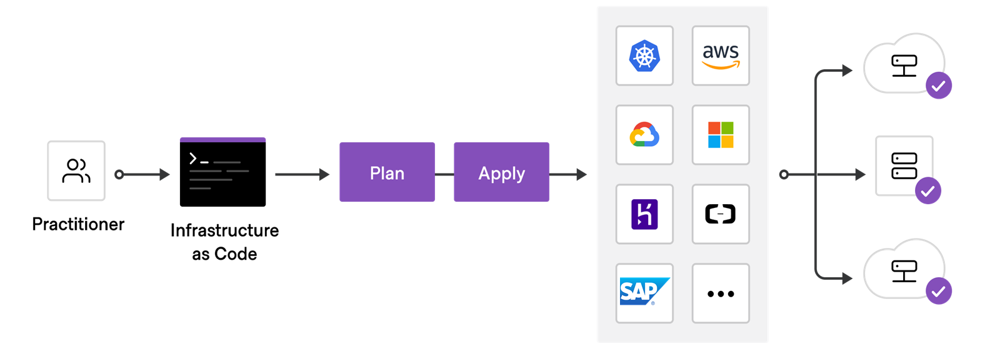
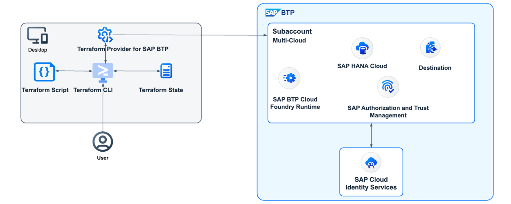

# Managing SAP BTP with Terraform

### Explain Infrastructure as Code

Introduction
Setting up and managing your cloud environment in an automated way is one of the key concepts for DevOps. In this lesson, you'll learn how to automate the setup and management of your SAP BTP landscape by using the Terraform Provider for SAP BTP.

Infrastructure as Code
Infrastructure as Code (IaC) enables you to automate infrastructure provisioning and management using code instead of manual actions. It helps ensure consistency, scalability, versioning, collaboration, and documentation of your infrastructure.

IaC uses a declarative approach. You define the desired state of the system, including what resources you need and any properties they should have. The IaC tool will take this target configuration and execute the necessary steps to match it.

Idempotency is another key concept. Rerunning a script should always result in the same configuration.

Key benefits of IaC:

Automation: IaC lays the foundation to automate the provisioning and management of your infrastructure. Infrastructure can be created, modified, and destroyed programmatically, reducing the need for manual intervention and minimizing human error.
Consistency: Using IaC, you can ensure that your infrastructure is consistently provisioned and configured across different environments, such as development, test, and production. This reduces configuration drift and improves reliability.
Scalability: IaC allows you to roll out infrastructure in a scalable way. By defining infrastructure configurations in code, you can easily replicate and deploy infrastructure resources in a consistent and repeatable manner.
Versioning and collaboration: IaC configurations should be stored in version control systems, allowing you to track changes over time and roll back to previous versions if needed. It also enables collaboration among team members, as multiple people can work on the same infrastructure codebase simultaneously.
Documentation: IaC serves as a form of documentation, providing a clear and concise representation of the desired infrastructure state. It helps in understanding the infrastructure architecture and facilitates knowledge sharing within the team.
Explain Terraform
Terraform is the de-facto standard of IaC tools. It supports more than 3,000 infrastructure providers. Users interact with the providers by declaring resources or invoking data sources via configurations written in the Hashicorp Configuration Language (HCL).

Terraform describe the desired final state using declarative configuration. Once a user invokes Terraform on a given configuration, Terraform will perform CRUD operations on the user's behalf to accomplish the desired state.

Terraform keeps track of your real infrastructure in a state file, which acts as a source of truth for your environment. Terraform uses the state file to determine the changes to make to your infrastructure so that it will match your configuration. This can also be used to detect configuration drifts due to changes on resources outside of Terraform.

The Terraform Flow
Implementing a Terraform configuration consists of the following steps:

Scope: Identify the infrastructure for your project.
Write: Write the configuration for your infrastructure.
Initialize: Install the plugins Terraform needs to manage the infrastructure.
Plan: Plan and validate the changes Terraform will make to your infrastructure
Apply: Make the planned changes.

Terraform generates or updates a terraform.tfstate file in the apply phase. This file contains all the IDs and properties of the generated resources and will be used by Terraform to update or destroy your environment. It’s recommended to store this file in a central and safe place.

Apply the Terraform Provider for SAP BTP
The Terraform Provider for SAP BTP
The Terraform provider for SAP BTP enables you to automate the provisioning, management, and configuration of resources on the SAP BTP. This enables you to simplify and streamline the deployment and maintenance of services and applications on SAP BTP.

You can manage the following resources using the Terraform provider for SAP BTP:

Global Accounts, Directories and Subaccounts
Entitlements and subscriptions
Environments (Cloud Foundry, Kyma, SAP BTP ABAP Environment)
Trust configurations
Roles, role collections and role collection assignments
Service instances and service bindings
From a user perspective the flow of Terraform interacting with SAP BTP is shown in the following picture:

Technically the Terraform provider for SAP BTP uses the SAP BTP CLI as technical foundation i.e., as a unified API to interact with the platform APIs of SAP BTP.

The Terraform provider for SAP BTP is open source and licensed under the Apache License 2.0.

SAP Terraform Provider for Cloud Foundry
Provisioning and managing Cloud Foundry specific resources must be handled via the Terraform Provider for Cloud Foundry.

SAP developed the provider and donated it to the Cloud Foundry Foundation. As a member of the foundation, SAP takes care about the maintenance and future enhancements of this provider.

Technically the provider makes use of the go-cfclient to interact with the Cloud Foundry Controller v3 APIs. Consequently the provider is fully compatible with the Cloud Foundry environment on SAP BTP.

Watch the video below to understand how to create and manage SAP BTP resources using Terraform.

