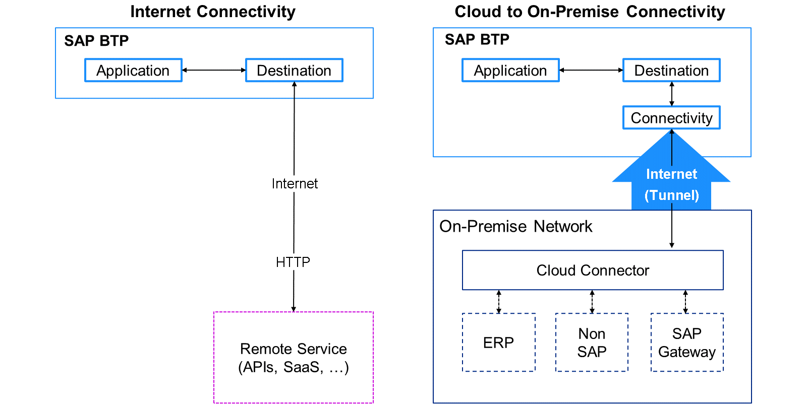

### Connectivity in SAP BTP

Why do we need Connectivity in SAP BTP?
As an intelligent, sustainable enterprise, you follow the clean core strategy. You want to build side-by-side extensions or custom development projects, but integrate them to capabilities or data from the internet or your on-premise system landscape. You need to connect them to each other. For this, SAP BTP offers connectivity functionalities.

The SAP Connectivity service provides a connectivity proxy that can be used to access on-premise resources through a Cloud Connector. Through the use of the SAP Destination service, you can retrieve and store the technical information about the target resource (destination) that you need to connect your application to a remote service or system (internet or cloud connector).

What is the Cloud Connector?
The Cloud Connector connects SAP on-premise back-ends (or even supported non-SAP systems) to SAP BTP subaccounts via an encrypted tunnel. The connection is bidirectional. From an architectural point of view, the Cloud Connector is a possible single point of failure. For this purpose, there is also the possibility of high availability, monitoring, alerting, and more. You need to set up the Cloud Connector in your landscape and connect it to your SAP BTP subaccounts. Then, you need to define which system resources are shared. You access resources shared through the Cloud Connector with consuming Destinations.

The Cloud Connector combines an easy setup with a clear configuration of the systems that are exposed to SAP BTP, letting you use existing on-premise assets without exposing the entire internal landscape and act as a reverse invoke proxy between the on-premise network and SAP BTP.

Connectivity Types

Usage of the connectivity types.
In principle, there are two types of connections to and from SAP BTP:

Internet Connectivity.
Cloud to On-Premise Connectivity (or other way around).
Internet Connectivity is needed when you want to consume capabilities or data from a resource on the internet, while Cloud to On-Premise Connectivity is used when you want to utilize your existing on-premise landscape resources. The Internet Connectivity can be reached via HTTPS, while the connection to an on-premise system requires the Cloud Connector. The communication is bi-directional.

Note

Be aware that this content is related to SAP BTP Connectivity in general and with SAP BTP Cloud Foundry Environment focus. Connectivity with SAP BTP Kyma Environment and SAP BTP ABAP Environment differ. You can get more information in the operation documentation of the environments.

SAP BTP Kyma Environment Operation Documentation:

SAP BTP ABAP Environment Operation Documentation:

