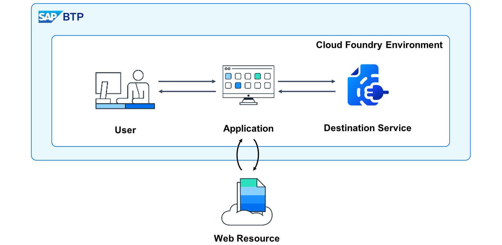
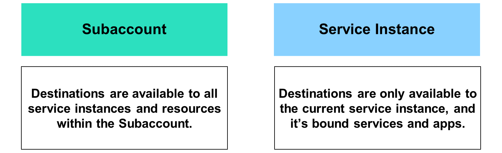
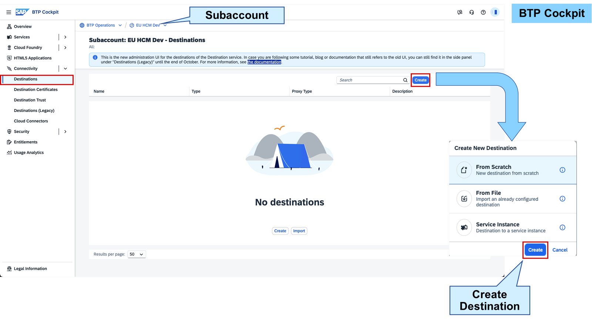
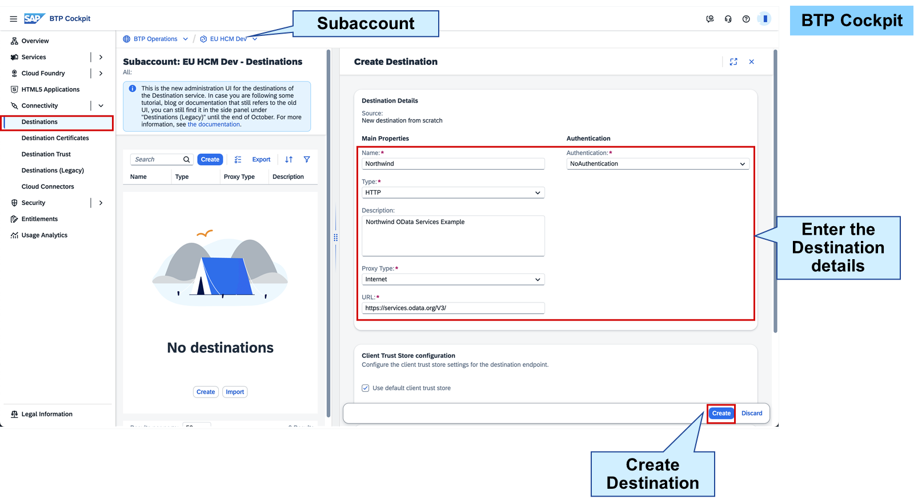
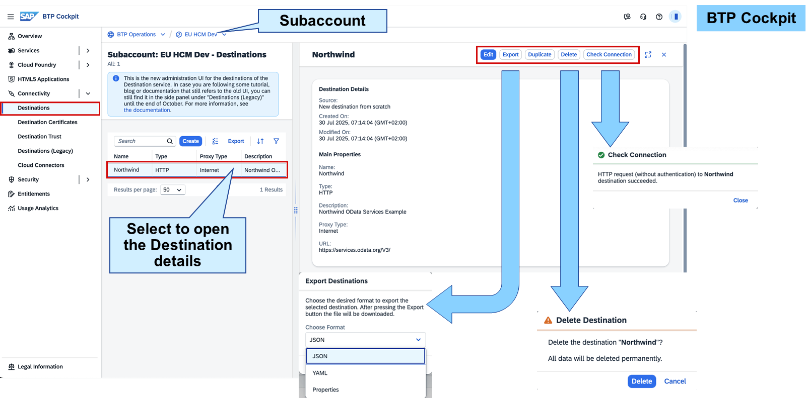

# Using Destinations

Destinations

Leveraging existing services and data sources is fundamental for any cloud-based business application. Establishing connections to these services is critical to ensure your application functions correctly.

Destinations, which contain connection information, are key components in SAP BTP. They define outbound communication links from your application to remote systems, which may be on-premises or cloud-based. A destination includes a symbolic name, URL, authentication details, and additional configuration parameters. The integration of destinations varies depending on the environment and forms an integral part of the connectivity strategy within each SAP BTP environment. Destinations provide a dynamic means to store connection information, avoiding the need to hard-code this data into the application's source code. This process unfolds in the following way:

A business user interacts with the business application.
The business application initiates a call to a remote system, not directly, but through a destination.
The destination service resolves the destination name into connection information and returns it to the business application.
Using the received connection information, the business application communicates with the remote system to retrieve the requested data.
The retrieved data is then displayed to the business user.
This approach enhances flexibility and maintainability by centralizing connection details within destinations, enabling a streamlined and efficient connectivity architecture.

Note
For applications operating within the Kyma or SAP BTP ABAP environments, this process may vary depending on the specific scenario. For detailed information, please refer to the relevant product documentation.

Managing Authorizations for Destinations
In order to manage, create, modify, or utilize a destination within SAP BTP, it is essential that both administrators and developers have the appropriate authorizations. You have previously learned about user management and authorization handling in the preceding units. For details on destination-specific predefined roles and additional information, please refer to:Technical Connectivity Roles and Operations [Feature Set B].

Destinations can be maintained on the Subaccount level or on the service instance level via the SAP BTP cockpit.

Subaccount Destination
All destinations defined on the Subaccount level are available in the entire Subaccount - meaning all applications or services could use this destination.

Service Instance Destination
The second approach involves creating destinations directly within an SAP Destination service instance. These destinations will be confined to the specific Destination service instance in which they are created and can only be accessed by services or applications that have an established service binding. Depending on your requirements or application scenarios, you can have multiple Destination service instances within your Subaccount.

Note
Destinations defined at the Subaccount level have a lower priority compared to those defined within the Destination service instances. It is advisable to prioritize using destinations at the service instance level whenever possible, and reserve Subaccount level destinations for broader, more generic scenarios or as a fallback option.

Creating Destinations
There are four ways to create a destination:

SAP BTP Cockpit
You just use the SAP BTP cockpit user interface to create the destinations.

Destination Service REST API
This method is only available for destinations in combination with a Cloud Foundry environment. You can call the API methods to maintain destinations.

Destinations with MTA Descriptor
You can use the multi target application (MTA) descriptor to manage destinations for complex deployments.

Destinations of Service Instance Creation
While creating a destination service instance, you can provide a JSON-based configuration to create destinations.

Not all destination management capabilities are supported across all four methods. For detailed information, please refer to:Managing Destinations.

Using SAP BTP cockpit for creating the destinations is the UI based approach. In reality you will find a mixture of the different approaches. Some developers might define them along their deployment within their MTA, others will use the SAP BTP cockpit.

Note
When managing destinations at the service instance level, the user interface appears identical and provides the same features as those at the Subaccount level. The key requirement is to navigate and open the destination service instance through the sidebar menu, rather than the Subaccount level.

When you want to create a destination on Subaccount level you need to navigate to: Connectivity → Destinations. When creating a new destination, you will be prompted to make a selection:

From Scratch: Creating a new destination without pre-configured details.
From File: Importing a destination from a previous exported one.
Service Instance: Creating a destination to a specific service instance within your SAP BTP Subaccount.

When creating a destination, you need to define all the destination details which are the connection information. These are things like the name, an authentication method, a description, the URL, the destination type and some further details dependent on the destination type you select. There are a couple of destination types available:

Destination Types
HTTP(S)
Exchange data between your cloud application and Internet services or on-premise systems.
RFC
RFC destinations provide the configuration required for communication with an on-premise ABAP system via Remote Function Call.
TCP
Create and manage SAP BTP destinations using the TCP protocol for communication into the internet or towards your on-premise landscape.
LDAP
Used for creating LDAP connections to your on-premise systems.
MAIL
You can use MAIL destinations to access target systems which use the SMTP, POP3 or IMAP protocol.
Next to all these connection details you need to maintain, destinations can have additional properties to configure and control how the connection information can be used.

To connect to on-premise systems, a Cloud Connector must be set up in the respective Subaccount. Various authentication mechanisms exist to connect to an on-premise system and can be configured inside the destination configuration of the Destination service. Cloud Connector connections and Destinations are Subaccount dependent.

Managing Destinations

You can change a destination anytime it's needed. In addition to that, you can even download and import destinations to, for example, transfer them to another Subaccount of SAP BTP or just storing them somewhere as a local backup. For the export of destinations you can choose between three file formats:

JSON
YAML
properties
Choose whichever file format is your favorite one.

You can always do a connection check for each destination to determine whether everything is working as expected. Additonally you can create a new destination based on an existing one through using the Duplicate option.

