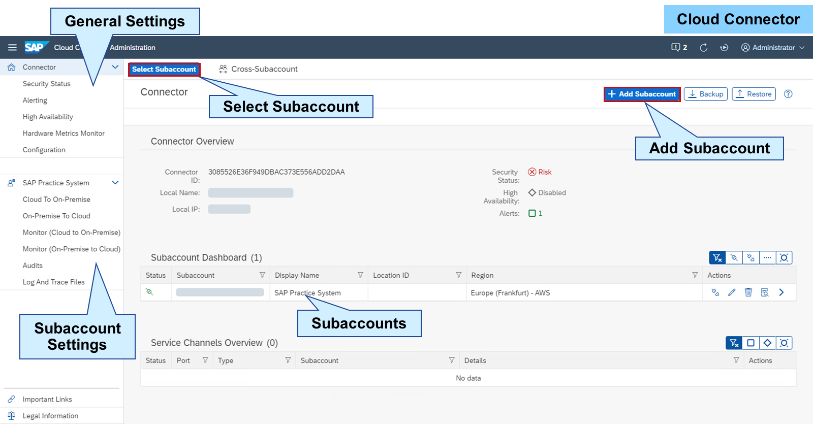
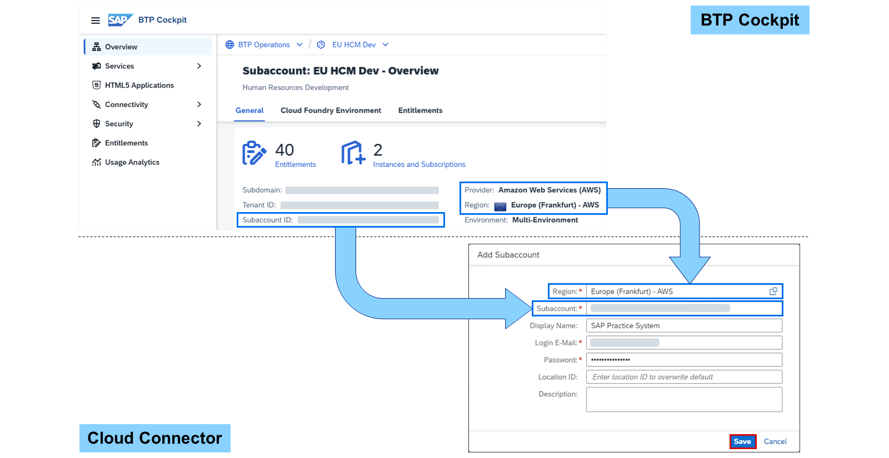
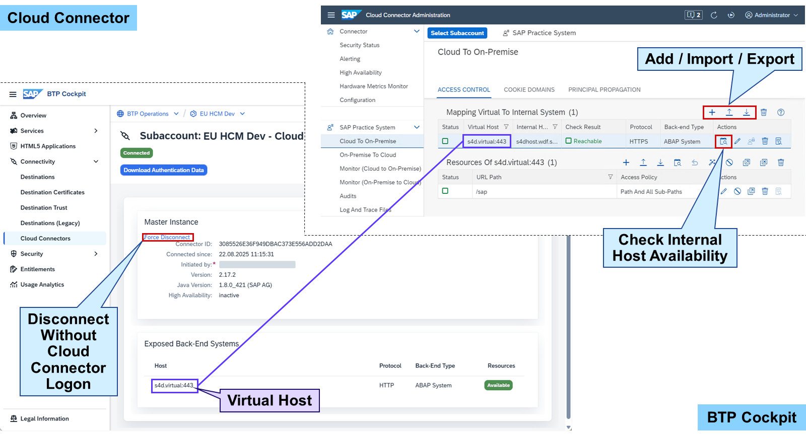
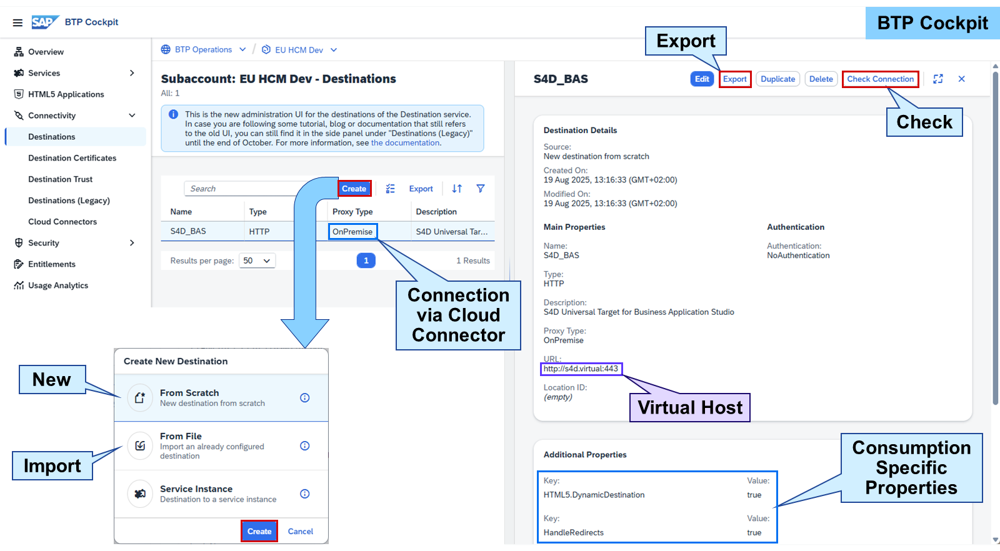

# Operating Cloud Connector

Cloud Connector

The Cloud Connector is a middle-ware available free-of-charge on https://tools.hana.ondemand.com/#cloud. It provides a secure tunnel through the internet between the SAP BTP and an on-premise system landscape. It is installed in the on-premise system landscape on connectivity layer and manages landscape access based on subaccounts.

The Cloud Connector Administrator is the central tool for managing the Cloud Connector. In the standard setup, it can be accessed via https://localhost:8443/. The entry page shows a list of subaccounts and their connection status. The menu on the left offers access to subaccount-specific and general settings of the Cloud Connector. These general settings are valid for all connections and all subaccounts:

Security Status
Alerting
High Availability
Hardware Metrics Monitor
Configuration
Choosing a subaccount from the list grants access to the subaccount settings. In addition, the button Select Subaccount at the top allows you to switch between the subaccounts at any time. The first part of these settings are the resources and services provided to or consumed from SAP BTP. For example, in Cloud to On-Premise, the on-premise systems and their services are defined, which are approved to be used with SAP BTP. The second part is monitoring this communication including audits, logs, and traces.

To add a subaccount to the Cloud Connector, region, subaccount ID, and user/password are needed. Region and subaccount ID can be found in the Overview of a subaccount using the SAP BTP Cockpit. The subaccount is a generated Universally Unique Identifier (UUID). The region in the Cloud Connector combines the (physical) region and provider of the subaccount in one entry.

Hint

If your region is not available in the Cloud Connector Administration, you should update the Cloud Connector.
When adding the subaccount in the Cloud Connector, you can decide if you want to configure the connection manually as previously seen or using the authentication data from a file. In the SAP BTP cockpit, you can download the authentication data to connect to the subaccount using Connectivity→Cloud Connectors→Download Authentication Data.

Note

If you are continuously getting the error that you are not authorized adding the subaccount, please read the SAP Note 3085908 – Getting an error (e.g. invalid credentials) in certain applications (e.g. SAP Download Manager) when using S-user ID or SAP Universal ID.

By adding and connecting a subaccount in the Cloud Connector Administration, the Cloud Connector is shown in Connectivity→Cloud Connectors of the subaccount. It is possible to disconnect the Cloud Connector in the Cloud Connector Administration as well as in the SAP BTP Cockpit.

Just by connecting a subaccount to a Cloud Connector does not expose any back-end systems. These must first be defined in Cloud to On-Premise in the Cloud Connector Administration including the resources. For an ABAP-based system, these resources are the services provided by the Internet Communication Framework (ICF) like an SAP Gateway service.

Caution

Exposing /sap and all sub-paths allows access to all ICF-services. Securing all services is quite challenging. Therefore, this should only be done in test environments but not in productive ones.

Applications and services in the SAP BTP use destinations to consume remote resources. This also includes the resources provided via a Cloud Connector. The Cloud Connector can provide one or multiple resources to one or multiple applications or services, and one application or service can consume one or multiple resources. A destination is the connecting element between resource and consumer.

Destinations can be defined on two levels granting connectivity to a resource on this level:

Subaccount
Service
The destination configuration consists of general and additional properties. The general properties can be defined from providing a certain service up to a complete back-end system. This depends on what is provided by the Cloud Connector and what should be consumed by the application or service. The proxy type OnPremise defines that the destination connects to a Cloud Connector.

Additional properties are defined by the consumer and should be set based on the documentation of the application or service. For example, the SAP Business Application Studio needs the following properties to connect to an ABAP-based system:

HandleRedirects = true
HTML5.DynamicDestination = true
HTML5.Timeout = <milliseconds>
sap-client = <ABAP-system client>
WebIDEEnabled = true
WebIDEUsage = dev_abap,odata_abap
Note

For more information about this topic, see:

Connecting SAP BTP and On-Premise Systems using the Cloud Connector (Learning Journey)

https://learning.sap.com/learning-journey/connecting-sap-btp-and-on-premise-systems-using-the-cloud-connector

