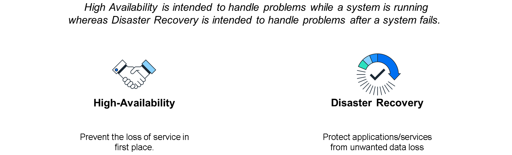
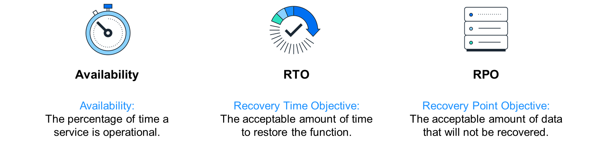
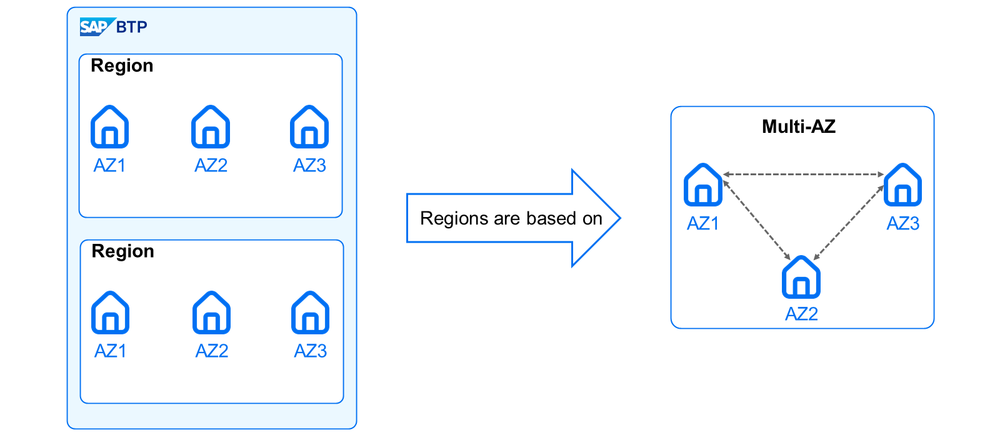
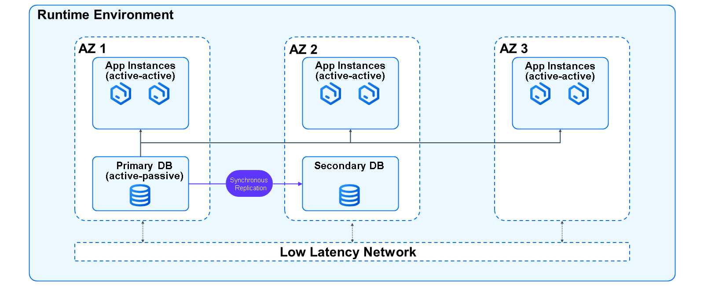
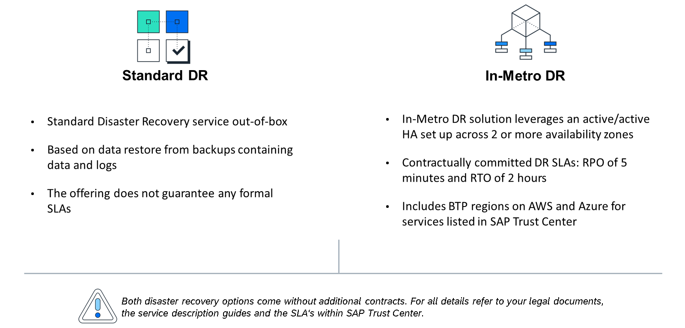

# Explaining High Availability and Disaster Recovery Concepts for SAP BTP

High Availability and Disaster Recovery Concepts for SAP BTP
In today's dynamic business environment, ensuring continuous operations is paramount for any organization. Business continuity is essential for minimizing the impact of disruptions, and SAP Business Technology Platform (SAP BTP) plays a central role in SAP's portfolio as the platform for integrations and innovations. Therefore, having a resilient platform with High Availability (HA) and Disaster Recovery (DR) capabilities is crucial. In the following sections, we will explore High Availability and Disaster Recovery, critical components of business continuity that further ensure your organization's resilience and uninterrupted operations.

Note

Please note that this learning journey provides an overview of concepts related to high availability and disaster recovery within SAP Business Technology Platform. For legally binding information, please refer to the SAP Trust Center or consult your legal documents such as contracts.

Differentiating High Availability and Disaster Recovery

High Availability and Disaster Recovery are essential for maintaining the resilience and continuous operation of systems on the SAP BTP. They serve distinct roles in business continuity.

High Availability ensures a service remains operational and accessible with minimal downtime. It aims to prevent service loss by handling issues while systems are running. HA involves designing systems with redundancy and failover solutions, maintaining availability across all infrastructure layers, services, and applications.

Disaster Recovery (DR) focuses on restoring operations following a significant failure. It handles problems after systems fail, protecting against unwanted data loss. DR strategies include regular backups, data replication, and defined processes for recovery, ensuring that systems can be swiftly brought back online after a disaster.

When thinking about HA and DR, it is important to consider relevant Service Level Agreements (SLAs) such as Availability in relation of the high availability context, Recovery Time Objective (RTO) and Recovery Point Objective (RPO) in relation of disaster recovery.

Relevant Business Continuity SLAs for SAP BTP

Availability
Availability refers to the percentage of time a cloud service is operational and accessible to users. It indicates how consistently the service can be relied upon to function without downtime, ensuring users can access and use the system whenever needed. High availability is critical for maintaining user trust and ensuring the continuity of operations. For example, a 99.9% availability means that the service is guaranteed to be functional and accessible for 99.9% of the time within a given period, such as a month or year.
Recovery Time Objective
Recovery Time Objective (RTO) defines the acceptable amount of time to restore normal operations after a disaster. For example, if the systems are down, an RTO might specify that normal operations must be restored within 2 hours. This ensures that disruptions are brief and manageable, helping businesses resume their activities with minimal delay.
Recovery Point Objective
Recovery Point Objective (RPO) specifies the maximum acceptable amount of data loss in case of a disaster. For example, if an RPO is set to 5 minutes, it means that in the event of a failure, the system guarantees that no more than 5 minutes of data recorded before the disaster will be lost. This mitigates significant data loss and ensures the continuity of operations with up-to-date information.

SAP BTP Region Setup using multi Availability Zones
Before we dive into the technical concepts SAP has in place for BTP’s high availability, we need to refresh our minds on BTP regions: Each region represents a geographical location (for example, Europe, US East) where applications, data, or services are hosted. Regions are provided either by SAP or by our Infrastructure-as-a-Service partners Amazon Web Services (AWS), Microsoft Azure, Google Cloud and Alibaba.

Regions in cloud computing consist of several isolated locations known as Availability Zones (AZs). These availability zones are logical groups, each housing one or more data centers, equipped with independent power, cooling, and network connectivity. The main purpose of AZs is to enhance the reliability and resilience of cloud services by ensuring that localized issues do not affect the entire region. Each Availability Zone (AZ) within a region is interconnected through low-latency, high-bandwidth communication links, which allow for seamless replication of resources between them.

Making use of availability zones of regions for high availability is referred as multi-AZ. Multi-AZ deployments enhance resiliency against failures by distributing services across multiple AZs and replicating service data between them. In this setup, application instances are located across all the different AZs, ensuring that the failure of one zone does not affect the overall availability and performance of the application. This configuration includes synchronous data replication, automatic failover mechanisms, and robust traffic management, including load balancing and failure detection.

High Availability setup

The multi-cloud environments of SAP BTP run in an HA setup, employing a multi-AZ structure within a region. Regular testing with "Chaos Days" ensures the operational reliability and resilience of multi-AZ configurations. SAP BTP provides critical services with out-of-the-box multi-AZ high availability. Most service instances, such as SAP Cloud Identity Services, SAP Build Work Zone, SAP HANA Cloud and SAP Integration Suite run in an active-active mode across all AZs within a region, utilizing active load balancing. Data persistency is configured in an active-passive mode across AZ 1 and AZ 2, with synchronous replication to maintain data integrity in case the passive instance needs to become active. If an issue occurs in one of the AZs, the remaining zones automatically take over, maintaining service continuity until normal operations are restored. This ensures high availability and robust performance for SAP BTP services.

Disaster Recovery
But what about disasters? Disasters such as data center outages, natural disasters or cyber-attacks have a crucial impact on your businesses cloud software. Unfortunately, it is not possible to protect against and avoid disasters entirely. In case of a disaster, it is important to keep the impact as low as possible through disaster recovery (DR). For SAP BTP we have two concepts in place.

Standard DR
SAP BTP includes a Standard DR solution that is provided out-of-the-box at no additional cost. It is designed to safeguard production data against unwanted losses in the event of a declared disaster by SAP. Standard DR operates by restoring data from backups stored in another availability zone within the region. SAP continuously backing up the data of SAP BTP with a retention period of 14 days. These backups encompass data and logs from databases or persistence services on SAP BTP. While the service does not guarantee formal SLAs, the disaster recovery process is based on "best commercially reasonable effort" to restore the affected services as quickly as possible during a disaster. You can find more information on the backups in the product documentation:

https://help.sap.com/docs/btp/btp-admin-guide/data-backups-managed-by-sap.

As this approach is the barely minimum and you as a customer want to have SLAs in place, SAP BTP offering In-Metro DR.

In-Metro DR
The In-Metro DR solution is available to all SAP BTP customers for a list of audited services, offering contractually committed SLAs of a 5-minutes RPO and a 2-hours RTO. This solution utilizes the multi-AZ concept. A DR test is performed at least once every 12 months. The scope of this DR offering includes SAP BTP services and SAP BTP regions listed in the SAP BTP Disaster Recovery Overview available at the SAP Trust Center. In-Metro DR is only protecting against single-AZ disasters and not against full region disasters.

Caution

Please be aware, for both Standard DR and In-Metro DR, SAP declares the disasters and starting the recovery process. You cannot trigger or request it on your behalf.

Customer-managed Scenarios
In-Metro DR and high availability is available out-of-the-box for SAP-managed services, allowing customers leveraging SAP BTP under SAP’s management to benefit from the setup without additional configuration or contracts. However, there are some customer-managed scenarios, such as side-by-side extensions or persistency services, customers must configure these appropriately to ensure multi-AZ obligations are met. Within Cloud Foundry and Kyma environment, it is recommended to run at least three instances of your application, which SAP will automatically distribute across different availability zones in your region. For persistency services, you need to ensure you’ve configured the corresponding replicas, ensuring primary and secondary databases to distribute them across availability zones.

To learn more about high availability and disaster recovery of SAP BTP, please refer to the official product documentation:

https://help.sap.com/docs/btp/sap-btp-neo-environment/resilience-high-availability-and-disaster-recovery.
