# Explaining The Observability Strategy Of SAP BTP

SAP BTP Observability Strategy
Observability is one of the key qualities of any cloud technology. When you're using the SAP BTP as an innovation platform, you need to observe what's happening with the applications that you've built on the platform, your integration scenarios and so on. This is where the SAP BTP observability strategy comes into play.

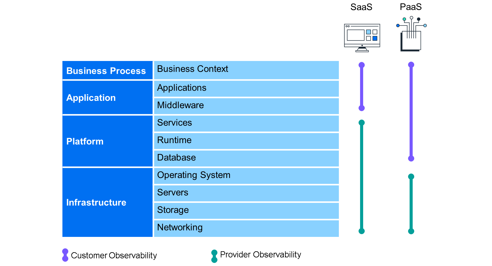

Diagram showing observability use cases in platform as a service versus software as a service.
First we'll try to understand this platform from two perspectives. On one hand, when you look at the SAP Business Technology Platform, you see that there are certain applications that work more as software as a service, or SaaS, applications. For example, SAP Build Work Zone Advanced Edition, which is consumed to create workspaces and different kind of pages without coding.

On the other hand, we have a whole list of services that are constituted as platform as a service, or PaaS, which will give an open platform for you to build using our app development runtimes, for example, Cloud Foundry, or it could be any of the integrations that you build using our Integration Suite.

So, SAP BTP has two flavors to it in terms of offering you both SaaS experience like services and pure platform services. When you think about observability, you need to see what kind of data you need to monitor and observe both for SaaS like services and PaaS services from SAP BTP. For each of these usage scenarios, the kind of information that you need to identify the problems and find their root cause is different. That's the core of our strategy, along with seeing what kind of tools and capabilities that we can offer to you to help you detect the problems quickly and resolving the problems quickly in the SaaS and PaaS versions of SAP BTP.

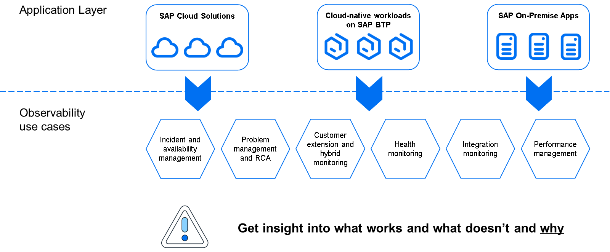

Many of our customers are on a cloud journey. They have a variety of SAP cloud solutions, which are used by our customers to run their end-to-end business processes. They also have many on-premise solutions, making it a hybrid landscape. When it comes to the observability use cases for such a hybrid landscape, customers need tools for incident and problem management, for performance management, tools to look at the health of the systems and cloud services, and also, specifically for the platform use case, to look at the performance and health and exceptions that happen on the custom applications that they're building on the platform. To address this complex set of use cases, we need an approach to help customers to both detect and resolve the problems as quickly as possible.

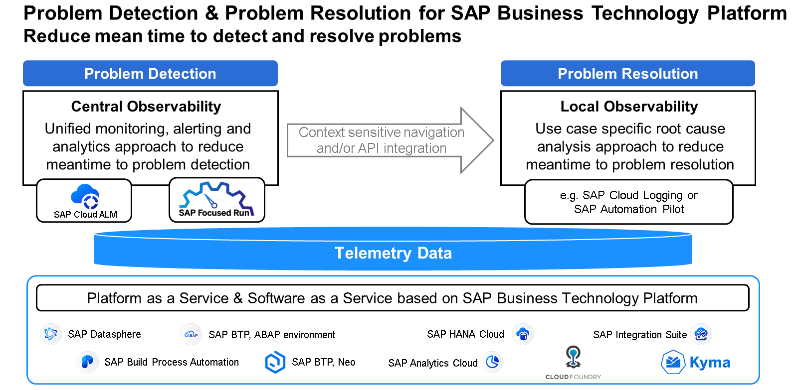

Our vision is to harmonize the way we handle observability or telemetry data across the different platform services and applications. For the entire platform, whether you're consuming the runtimes on one end or SaaS applications on the other end, we want to harmonize the collection of all telemetry data, which is leveraged for detecting problems, as well as resolving the problems.

Once we collect and process this data, we want to provide you with the tools that you need to reduce the mean time to detect, as well as to reduce the mean time to resolve any problems that occur in the various SAP BTP services and applications. We also have an Open API approach where we expose the raw telemetry data for consumption in third-party tools.

For problem detection, we want to provide a central single source of truth to easily detect problems. For problem resolution, we believe that there's a need for a decentralized set of tools depending on the kind of problem we are trying to resolve. We come to that in a later point in time.

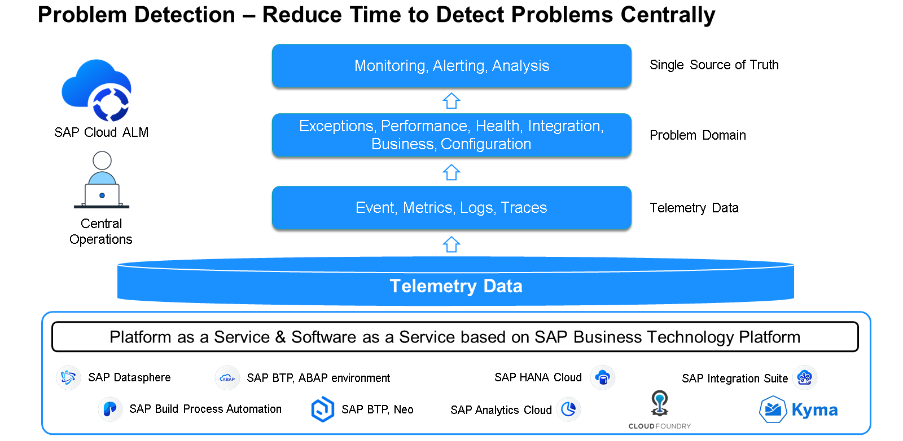

For problem detection, the end goal is to reduce the time you need to detect the problems, which means that we need to provide the information as quickly as possible in a central monitoring tool. Whenever there's an anomaly on the platform, you should be able to detect the problems in various problem domains, like availability problems, performance problems, or health of the instance itself, or with the integration of services and applications. To do this, we are collecting events, metrics, logs, and traces, and composing them into different problem areas, so that you can monitor the platform in a seamless way to be able to get alerted as quickly as possible for any kind of problem that occurs. The central monitoring tool of choice for SAP BTP is SAP Cloud ALM. An Application Lifecycle Management (ALM) tool built in the cloud, supporting all SAP solutions, including SAP BTP as well.

SAP Cloud ALM for operations is an end-to-end operations platform that's available from SAP and included in your subscription. You can use the platform when you want to centralize your end-to-end operations across different SAP applications, whether it's SAP BTP, SAP S/4HANA, SAP SuccessFactors, or any other SAP solution that you use.

SAP Cloud ALM processes various telemetry data points like events, alerts, log entries, metrics, and traces, and it categorizes them into various problem domains, for example, Business Process Monitoring, Integration and Exception Monitoring, Real User Monitoring, Job and Automation Monitoring, Configuration and Security Analysis, Health Monitoring, and so on. It also has intelligent event processing so that you can easily deliver the relevant detection of problems into a harmonized approach, trigger an automation script, or trigger an external ticket in an incident management tool.

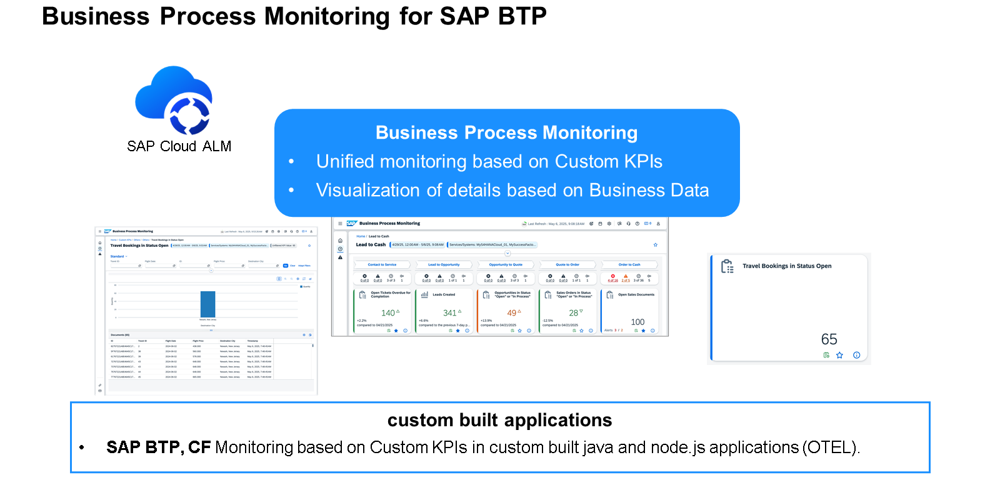

Business Process Monitoring provides transparency about the end-to-end process health based on predefined key performance indicators (KPIs). It enables both line-of-business users and IT users to directly identify business process disruptions across the entire system landscape and to react to anomalies before critical situations arise. The objective of this app is to ensure smooth business operations without disruptions and to increase the quality and performance of the business process execution. For SAP BTP, you can add custom KPIs based on your custom-built application to monitor the business-related aspects as part of the end-to-end processes and benefit from alerting capabilities.

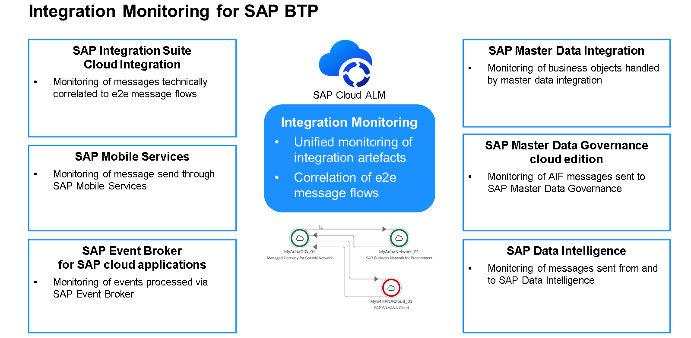

A key capability of SAP Cloud ALM that supports SAP BTP is integration monitoring. This capability allows end-to-end monitoring by correlating single messages to end-to-end message flows across cloud services and systems and monitoring of integration-related exceptions.

It supports end-to-end message monitoring and correlates them across various applications. It supports monitoring of messages through SAP Mobile Services and SAP Event Broker. It also supports monitoring of Business Objects in SAP Master Data Integration and AIF messages in SAP Master Data Governance.

It's useful when you have a complex landscape where applications are talking to each other. It provides a single view where you’ll be able to track end-to-end the message flows from one system to another. You can then drill down for further analysis into the local administration tools in the integration suite as well. So, integration monitoring for SAP Integration Suite - Cloud Integration is a great capability within SAP Cloud ALM.

You can find the entire list of Supported Solutions in the SAP Help Portal, and further details in the SAP Cloud ALM for Operations Expert Portal.

The next capability that's relevant for SAP BTP is Exception Monitoring. This provides a central view into all exceptions happening across multiple services and applications in SAP BTP. Currently, SAP Cloud ALM supports exception monitoring of Integration Suite, SAP Analytics Cloud, and custom applications built on SAP BTP runtimes, such as Cloud Foundry and ABAP environments. You can find the entire list of Supported Solutions in the SAP Help Portal and further details in the SAP Cloud ALM for Operations Expert Portal.

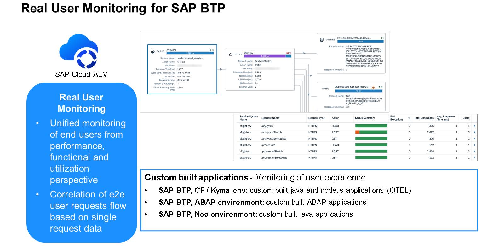

Real User Monitoring in SAP Cloud ALM provides transparency regarding performance and errors as experienced by end users, as well as utilization of business functionality. It provides measurement at the front end and server side to identify root causes of performance and functional problems, and it allows you to correlate monitoring data measured at the front end, cloud service, and/or system side to end-to-end user request flows. In SAP BTP, you'll be able to do real-time performance monitoring of the usage of any custom extensions you've developed using any of the runtimes.

In the previous screenshot, you can see the user call trace of a Cloud Foundry based application from the front end to the service calls and all the way back to the database back end. This will help easily identify the bottlenecks in real user performance issues.

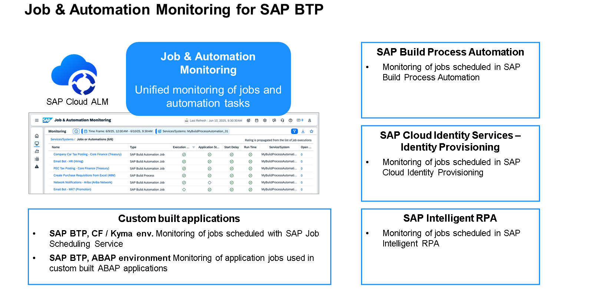

Job and Automation Monitoring ensures efficient execution of jobs and tasks by monitoring execution status, application status, start delay, and response time for jobs and tasks to enable root cause analysis. This functionality can be used to monitor the Robotic Process Automation (RPA) bots created using SAP Build Process Automation of SAP BTP. It also allows you to monitor jobs scheduled by the custom applications developed using SAP BTP Cloud Foundry and ABAP environments as well. You can find the entire list of Supported Solutions in the SAP Help Portal and further details in the SAP Cloud ALM for Operations Expert Portal.

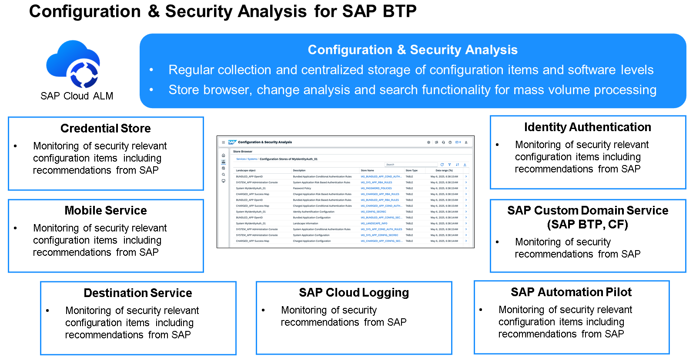

Configuration and Security Analysis collects a comprehensive set of technical configuration data from SAP Solutions, on-premises and Cloud. Technical configurations are displayed, changes to items can be evaluated in certain time frames, and administration provides information about the managed systems and their status in the application. For SAP BTP, it offers support for services such as Identity Authentication, SAP Custom Domain Service, SAP Cloud Logging, Destination Service, Mobile Service, Credential Store, and so on.

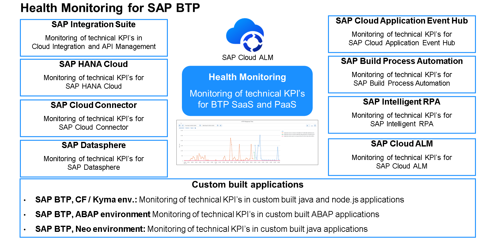

Health Monitoring in SAP Cloud ALM helps in monitoring of technical metrics and events for cloud services and systems by executing application health checks for SAP SaaS services and by delivering technical metrics and events for customer applications built with SAP Business Technology Platform. It also allows embedded analytics to analyze trends and root causes for discovered problems.

SAP Cloud ALM gives you a dashboard specific to the SAP BTP service/application instances. For example, there's a different set of metrics that you monitor for SAP HANA Cloud, as you'll use for monitoring your custom apps developed with SAP BTP. So, it gives you one view to monitor the health of various SAP BTP services.

SAP Cloud ALM health monitoring currently supports various SAP BTP services like SAP Integration Suite, SAP HANA Cloud, Cloud Connector, SAP Build Process Automation, and the various runtimes. You can find the entire list of Supported Solutions in the SAP Help Portal and further details in SAP Cloud ALM for Operations Expert Portal.

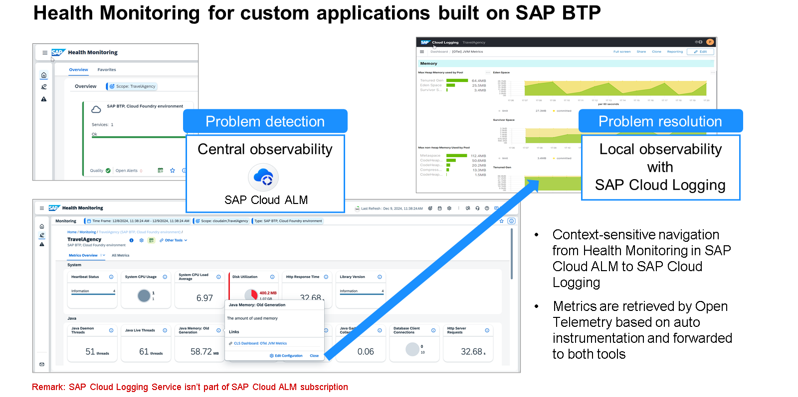

In the context of a custom application built on SAP BTP Health Monitoring supports the problem detection from a central observability perspective with technical metrics as well as context sensitive links for problem resolution for local observability.

Detecting problems is only one part of the story. What you need to do then is to figure out ways and means to quickly resolve problems. For each of the SAP BTP applications and services, the way you debug the issues or find the root cause could be different based on your use case and the tooling.

To support this complexity, we want to centralize the problem detection with tools like SAP Cloud ALM. But once you detect a problem, there could be multiple places that you could go to resolve the problem, depending upon the case.

Certain problems could be resolved quickly using automation or workflows, where even auto-resolution can be built in. Other scenarios might require a deeper analysis of log or trace analysis, and you might want to correlate the logs that are coming from different services to be able to find the root-cause analysis of a particular problem.

And in specific cases, there are application-specific debugging tools that are needed to debug the situation as well. So, depending upon the use case and the complexity of the issue, you might have to jump into an export tool to debug the issue, or, if the issue is very simple, you would be able to automate the issue as well. Let's look at the various tools available to quickly resolve the issues.

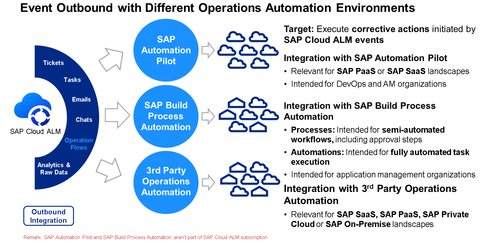

One of the most efficient ways to resolve the problem is to automate the resolution of known issues. SAP BTP provides a choice of services to automate resolution workflows and bots. SAP Cloud ALM integrates with these services to have a seamless navigation between problem detection and these operation automation tools

It integrates with SAP Build Process Automation to automate problem resolution and operational procedures, which eventually require manual tasks across multiple organizational levels and, optionally, also automated tasks. You can also use bots with SAP Build Process Automation to automate your tasks.

Another key service that plays a significant role in problem resolution is SAP Cloud Logging. SAP Cloud Logging is a new logging service available in SAP BTP that enables application developers to ingest, store, and analyze application logs for any custom-built applications on SAP BTP.

It supports ingestion leveraging the Open Telemetry standard protocol. There are also various standard dashboards available with prebuilt content to easily analyze the logs.

This service helps in problem resolution of various types of problems in custom-built SAP BTP applications. We will dive deeper into SAP Cloud Logging service later.

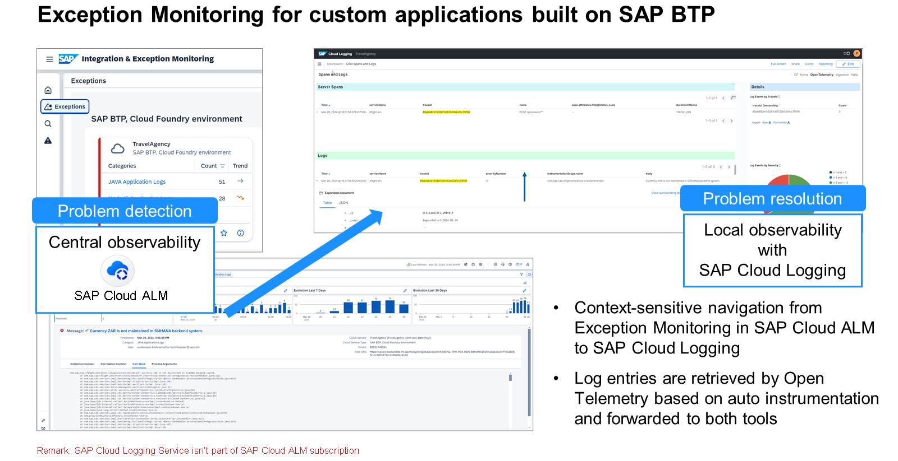

With the integration of SAP Cloud ALM as the central observability tool and SAP Cloud Logging service, we started to realize the strategy of an integrated observability offering. This means that users can navigate from SAP Cloud ALM capabilities like exception monitoring, Health Monitoring, and Real User Monitoring directly into the SAP Cloud Logging dashboard, with the context of the application in question seamlessly transferred between these tools. This will help significantly improve the resolution time and let the user focus on the relevant logs when navigating to the SAP Cloud Logging Service.

Summary
The SAP BTP observability strategy provides an end-to-end observability tool set. To reduce the mean time to detect issues, we provide a central observability platform in the form of SAP Cloud ALM, which provides various capabilities like Health Monitoring, Integration Monitoring, Exception Monitoring, Configuration and Security Analysis, and Business Process Monitoring for various SAP BTP services and applications. SAP Cloud ALM also provides an open API approach to getting SAP BTP telemetry and monitoring data, which can be used to integrate with third-party tools.

To reduce the mean time to resolve the identified issues, we provide a set of services like SAP Automation Pilot for operations automation, SAP Cloud Logging for log ingestion and analysis, and other application-specific expert tools.
