# Explaining Central Observability Tools

SAP Cloud ALM for Operations - Value Proposition
SAP Cloud ALM is an SAP SaaS (Software as a Service) product, this means that SAP takes care of the respective service. All customers who have an SAP cloud subscription or an SAP Enterprise Support contract are entitled to use SAP Cloud ALM.

SAP Cloud ALM empowers customers to understand the health of their cloud-centric and hybrid SAP solution landscapes:
It provides full stack monitoring covering processes, integrations, users, jobs & tasks, and the health of services and systems.
It delivers embedded alerting for problem resolution as well as embedded analytics for root cause analysis.
It acts as collaboration platform between the Lines of Business (LoB) and Information Technology (IT).
SAP Cloud ALM introduces Intelligent Event Processing as central routing infrastructure to enable event correlation and intelligent alerting.
SAP Cloud ALM integrates analytics and intelligence functionality context sensitively.
SAP Cloud ALM enables operations automation by integrating several automation engines.
SAP Cloud ALM provides transparency regarding the health of business processes including event calendar and service level management.
Functional Overview
On a more architectural level, SAP Cloud ALM consumes different types of raw data at the inbound side. This could be metrics, configuration items, log entries, as well as all the events and alerts from other infrastructures. SAP Cloud ALM for Operations assigns this raw data to different monitoring use cases.

The monitoring stack of SAP Cloud ALM for Operations consists of the following tools:

Business Process Monitoring, which is intended for business users, and which contains only business process KPIs (Key Performance Indicators) (and no technical KPI visible in Business Process Monitoring).
Integration & Exception Monitoring, which is addressing the needs of integration personas. All types of integration, whether it's peer to peer or orchestrated integration is covered by Integration & Exception Monitoring.
Synthetic User Monitoring and Real User Monitoring for those who are dealing with end user experiences, or end user performance.
Job & Automation Monitoring for background processing, where certain business process steps are executed automatically.
The Configuration & Security Analysis application for those who are responsible to ensure compliance in the configuration - and specifically from security perspective .

Health Monitoring for the remaining technical aspects for the technical metrics.

With these tools, SAP Cloud ALM provides complete coverage for SAP Solution Landscapes and all this different raw data is assigned to the right use case.

SAP Cloud ALM for Operations unifies this in it's central event management, which we call Intelligent Event Processing. This means that all these use cases are constantly calculating events.

These events can then lead to certain activities: From an event, SAP Cloud ALM for Operations can:

generate an alert or notification
trigger an operation flow
call an Application Programming Interface (API)
At the outbound side, this can lead to different other activities. For example – via API call – SAP Cloud ALM for Operations can generate a ticket in a ticket system or can generate a task in a task management tool of your choice. Similarly, SAP Cloud ALM can create chat messages, trigger operations flows in SAP Build Process Automation or SAP Automation Pilot. In addition, this data is exposed both to third-party analytics tools (in the raw data format) and for the monitoring capabilities of SAP Cloud ALM.

SAP Cloud ALM for Operations offers built in analytics and intelligence specifically for the different use cases providing dashboards and analytics, which are specific for the appropriate monitoring persona.

On top of this, there is Business Service Management, which is summarizing the different technical information to different signals that are produced with the help of the infrastructure of SAP Cloud ALM to easily understandable status information. To achieve this, we collect several services and systems together to business services and Business Service Management consolidates all this to one status information. This information can come directly from SAP via the cloud availability in SAP for Me or it is calculated within the SAP Cloud ALM infrastructure. This status information can be enriched with manually created customer specific information and can then be shown in the Event Calendar. Based on this, we can also define service levels and then also measure whether and to which degree these service levels are met within the Service Level Management function.

Business Process Monitoring
The next graphic shows how Business Process Monitoring detect operational issues in business process execution:

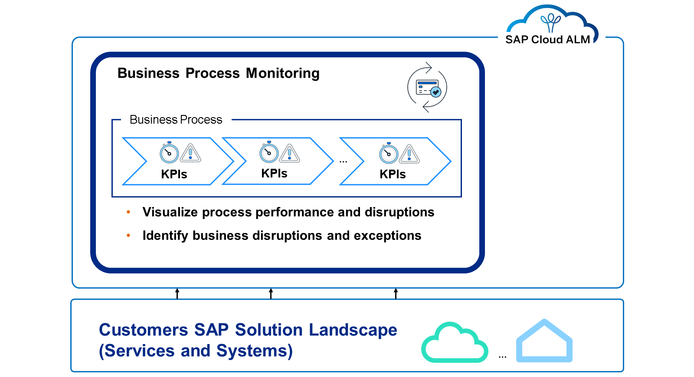

Business Process Monitoring:

Provides transparency on end-to-end business processes within a distributed solution landscape.
Ensures business continuity to increase business process execution quality and performance.
Monitors processes' health and detect anomalies during process execution including drill down into business documents.
Alerts users directly on process disruptions including automated problem resolution.
Delivers pre-defined process content including auto-discovery of relevant business process KPI's to be switched on.

Integration & Exception Monitoring
This figure shows the data exchange between services and systems and the Integration & Exception Monitoring:

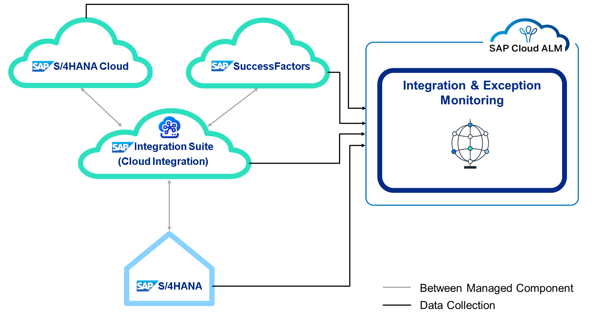

An image depicting the end-to-end monitoring of data exchange between services and systems with Integration & Exception Monitoring in SAP Cloud ALM..
Integration & Exception Monitoring provides an end-to-end monitoring by correlating single messages to end-to-end message flows across cloud services and systems. It enables monitoring of integration related exceptions and provides the following advantages:

Unified approach for peer-to-peer interfaces as well as orchestrated integration
Efficient problem resolution support with enabling of collaboration between business and IT
One-stop application with integrated monitoring, alerting, analysis, and search-and-track functionality
Real User Monitoring
The following image shows the data collection of Real User Monitoring to understand performance and utilization from the end user perspective:

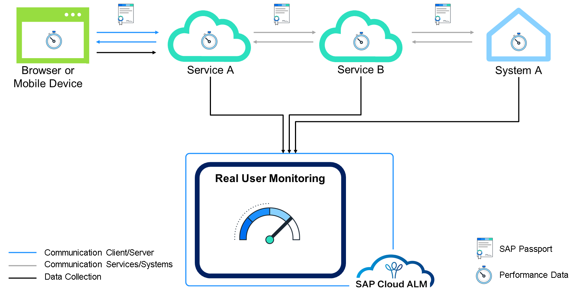

A flowchart illustrating the performance experienced by end users, as well as the utilization of business functionality, with a focus on front-end and server-side measurement with Real User Monitoring in SAP Cloud ALM.
Real User Monitoring:

Provides transparency regarding performance and errors experienced by end users as well as utilization of business functionality.
Offers measurement at front-end and server side to identify actual root cause of performance and functional problems.
Allows to correlate monitoring data measured at front-end, cloud service and/or system side with end-to-end user request flows.
Synthetic User Monitoring
The following graphic illustrate how to monitor performance and availability of web applications from an user perspective using selenium-based scripts within Synthetic User Monitoring:

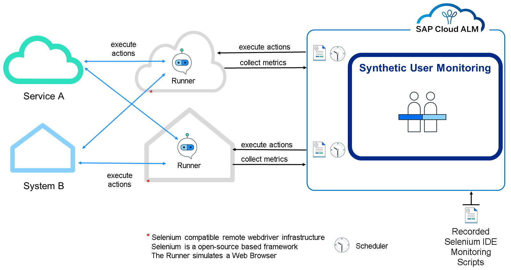

Synthetic User Monitoring:

Enables monitoring based on custom Selenium-based scripts, and therefore supports most of the web applications.
Is based on regularly executed scripts on Selenium-based remote webdriver infrastructures.
Provides proactive problem detection: 24x7 monitoring enables detection of performance and availability issues before end users are impacted.
Runs independently, based on real user activities.
Allows comparable measurements as the monitoring relies on identical user scenarios regularly executed.
Makes it possible to monitor the evolution of the performance and availability based on comparable metrics.
Job & Automation Monitoring
The next slide shows how Job & Automation Monitoring aims to provide transparency regarding job executions and automated activities:

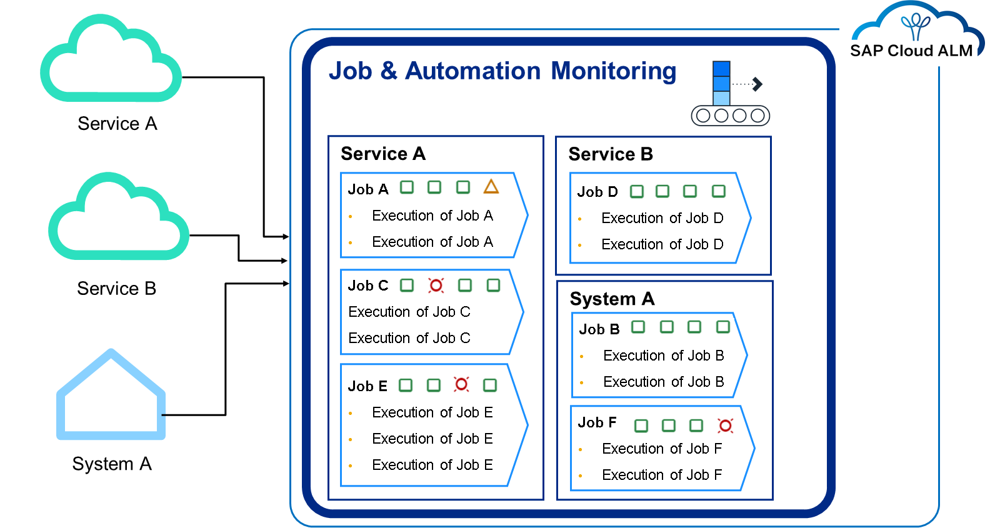

Job & Automation Monitoring ensures efficient execution of jobs and tasks:

By monitoring execution status, application status, start delay and response time for jobs and tasks.
By providing details of job on task execution level to enable root cause analysis.
By reducing configuration efforts when using historical execution information.
Embedded Alerting enables notification of business and IT users on job & task related disruptions and exceptions.

Embedded Analytics allows to analyze root causes and trends based on historical data.

Configuration & Security Analysis
This picture shows the collection of configuration items from services and systems within Configuration & Security Analysis:

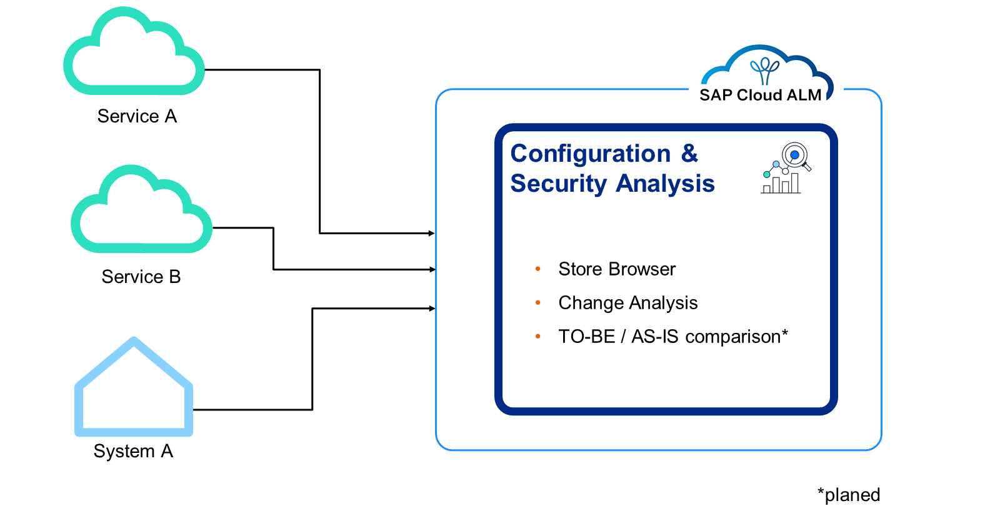

Configuration & Security Analysis:

Enables a regular collection of configuration items and software levels into the configuration stores of the Configuration and Change Database (CCDB).
Provides a store browser as user interface to visualize content of configuration stores.
Allows a change analysis for selected scope and timeframe.
Includes a search capability for pattern-based browsing into configuration items of selected scope.
Additional planned functionality includes configuration validation to compare the TO-BE with the AS-IS situation, embedded alerting to notify on critical issues, and embedded analytics to analyze trends and root causes for discovered problems.

Health Monitoring
The following infographic gives an overview of Health Monitoring:

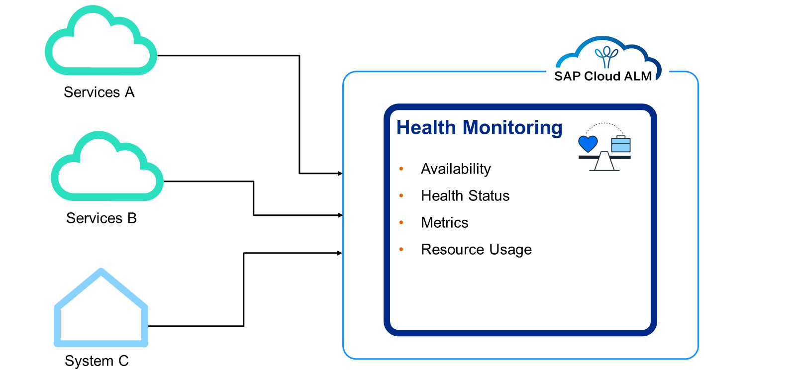

Health Monitoring enables the monitoring of technical metrics and events for cloud services and systems by:

Executing application health checks for SAP SaaS services.
Delivering technical metrics and events for customer applications built at SAP Business Technology Platform (SAP PaaS Services).
Providing metrics for light-weight system monitoring for SAP ABAP based systems.
It provides embedded alerting including the capability to trigger notifications and corrective actions and allows embedded analytics to analyze trends and root causes for discovered problems.

Intelligent Event Processing, Alert Management, and Notification Management
The following graphic shows process events from different sources and lists options for follow-up activities possible with Intelligent Event Processing:

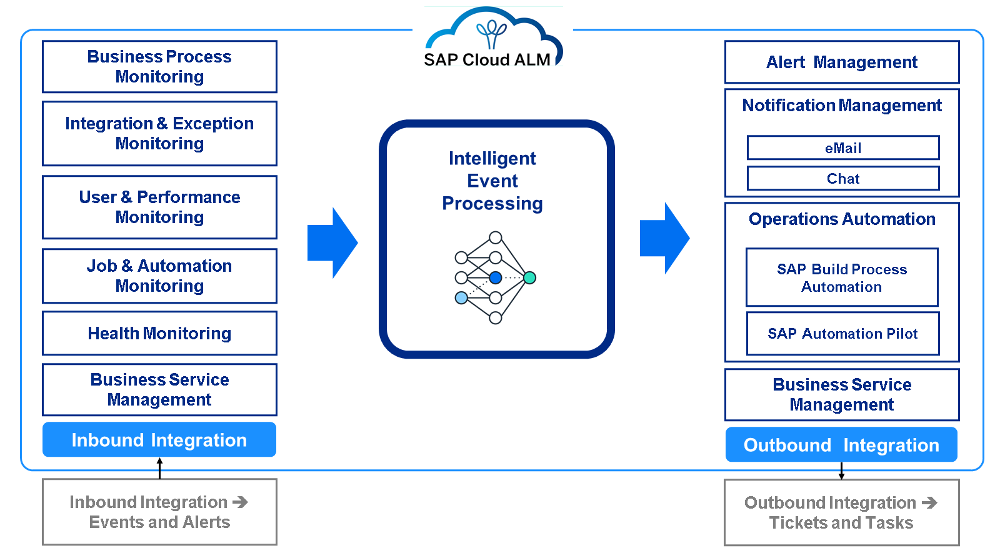

ntelligent Event Processing, including Alert Management and Notification Management:

Represents the central intelligence for efficient event routing between internal and external producers and consumers.
Enables unified event processing based on rules for automatically as well as manually triggered events.
Includes centralized event handling via event log viewer as well as alert handling via use case specific alert inbox.
Is the foundation for intelligent correlation of events, for example, correlation of manually generated notifications with automatically generated alerts.
External API Management and Operations Automation
The graphic shows the process flow both for the build and for the run part, together with components that can be connected to SAP Cloud ALM via API:

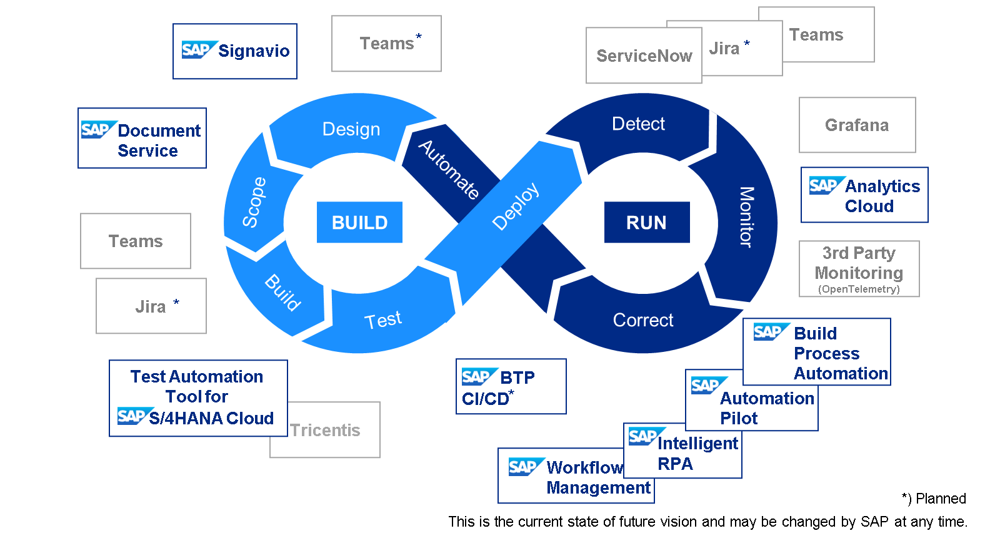

Today, ALM tool chain must connect different teams from different locations, platforms, solutions, and tools relying on open source or proprietary technologies. Strong API management is essential for integrating ALM tools throughout the application life cycle. SAP Cloud ALM offers three integration options:

Use built-in integration for selected SAP products.
Implement Open APIs available in SAP Cloud ALM.
Develop integration apps and services combining SAP Cloud ALM APIs and SAP platform functionalities.
Note

The Grey objects are examples of third-party components which could be connected.

With focus on SAP Cloud ALM for Operations the External API Management could be relevant for the following use cases:

Enables to watch and react on events from SAP Cloud ALM.
Allows to subscribe to external services and to trigger actions there.
Uses built-in mappings for selected services like, for example ServiceNow, Teams, etc.
Exposes mass volume data APIs to third-party analysis and monitoring.
Operations Automation allows to trigger operation flows from events in SAP Cloud ALM and integrates several automation engines like SAP Build Process Automation and SAP Automation Pilot.

More information can be found in the API Guide for SAP Cloud ALM or in the SAP Cloud ALM APIs for Operations.

Analytics & Intelligence
This image illustrates the current state and future vision of our Analytics & Intelligence capabilities.

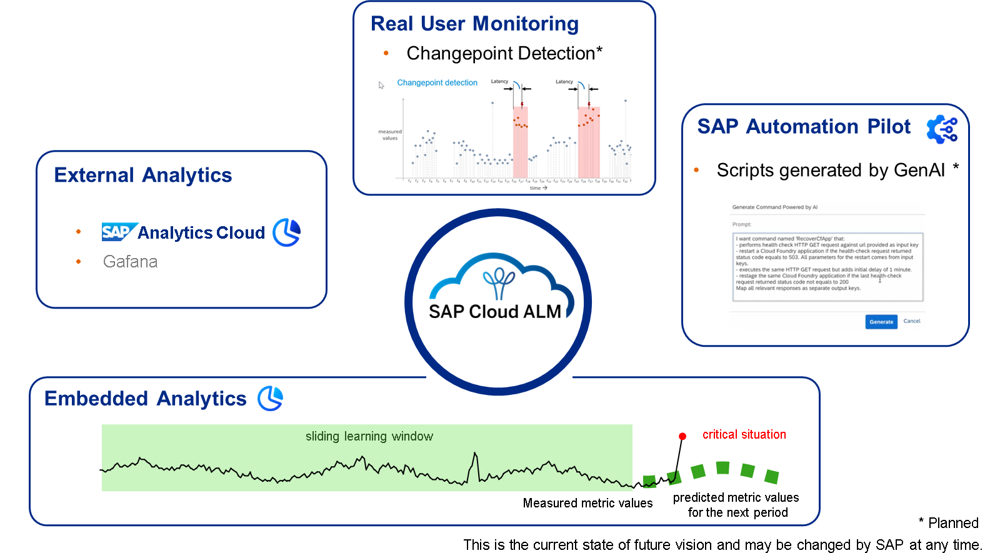

An image highlighting the embedded analytics and intelligence features within SAP Cloud ALM, including use case-specific dashboards and data exposure for external analytics.
SAP Cloud ALM for Operations includes several Analytics & Intelligence features, some other features are planned:

Several use cases include Embedded Analytics functionality.
The SAP ALM analytics APIs come with Open Data Protocol (OData) and Representational State Transfer (REST) endpoints exposing analytics data for External Analytics, also for cross use-case analytics.
Synthetic User Monitoring is the first use case, which includes Dynamic Thresholding.
Real User Monitoring is planning to include a Changepoint Detection.
It is planned to provide SAP Automation Pilot scripts supported by Generative AI.
Business Service Management
Business Service Management allows to create and modify business services by assigning services and systems. This allows to abstract from the technical landscape details, which are typically unknown to the business users. In addition, Business Service Management enables to display and process service status events (disruption, degradation, maintenance, communication), which are communicated by SAP for Me.

The following graphic illustrating the management of Business Services, Service Level Management, and the Event Calendar within Business Service Management:
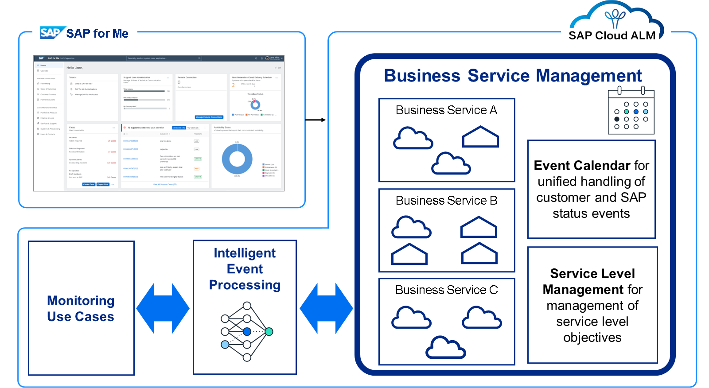

It also includes Service Level Management with the following possibilities:

Definition of service level objectives at business service level.
Automatic and continuous calculation of service level and consolidation to business services level.
Embedded service level reporting including drill down.
Finally, it includes an Event Calendar with the following possibilities:

Business service as collection of services and systems.
Import of SAP initiated status (maintenance, disruptions, degradation, communication events) including outbound API.
Maintenance and execution of customer initiated status.
Forwarding of status events from Business Service Management towards monitoring use cases.
Calculation of status events by monitoring use cases and forwarding to Business Service Management (planned).

