# Applying Cost and Usage Management

BTP Cost and Contract Transparency
All projects and IT landscapes have budgets. Account cost management is an essential part of the BTP admin task. One of your admin duties is monitoring the cost and usage of your SAP BTP accounts. You'll get an overview of the cost and usage management capabilities within the SAP BTP cockpit and be able to answer all the questions coming from the project leads or controllers related to the usage and corresponding costs. 

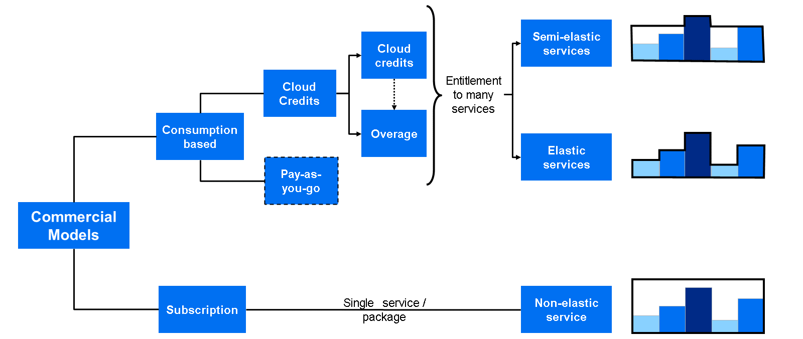

To understand how to review and manage costs you need to understand the differences between a consumption and a subscription based commercial models and how they differentiate:

Consumption based
You get access to all current and future services that are eligible for this model. You have complete flexibility to turn services on and off and to switch between services as your business requires throughout the duration of your contract. This commercial model is available in the following flavors: 
BTPEA/CPEA
BTPEA/CPEA are also so called commit-to-consume models, where you do an upfront commitment (a prepaid investment in cloud credits for the contract duration, with an annual commitment to consume SAP BTP Services). You can top your cloud credits at any time. However, any overages are billed at list price.

Pay-As-You-Go
Pay-As-You-Go is a highly flexible zero-commit model: You pay nothing upfront and there's no minimum usage requirements or annual commitment. You pay only for the used SAP BTP services.

Subscription based
You subscribe only to the services that you plan to use. You can then use these services at a fixed cost, irrespective of consumption. Service subscription might be user metric or a resource metric (for example, SAP Build Work Zone service, which can be based on number of site visits or user metric). You can increase your initial order if the resource/user usage exceed the subscribed quota.

The commercial model is one aspect. The other aspect is the type of service and how it's consumption is metered:

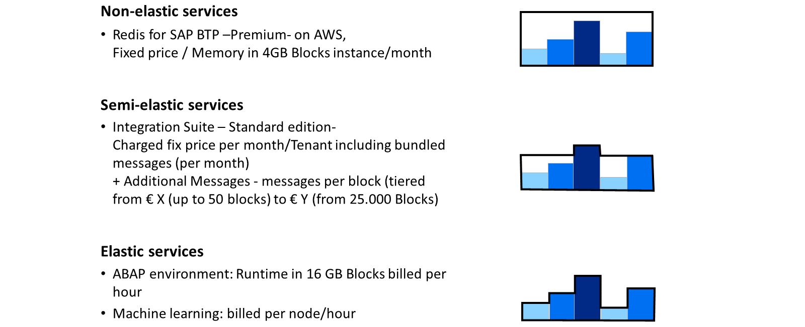

Non-elastic
Non-elastic services are charged as fixed monthly price. For example, with the Redis for SAP BTP, you have a fixed price for memory (which is on 4 GB blocks) per instance and month. If you need an instance with 6 GB, then you have to pay for two blocks of 4 GB.

Semi-elastic
In this case, we have a service that has a fixed price per month with included metrics quota, but for some of the metrics you can buy additional quota. For example, SAP Integration Suite, when you buy it, in the monthly price you have the tenant cost plus included message bundles. You can buy additional messages month for months, based on your needs (block only). Depending on the number of blocks you want to buy in addition, the price may vary.

Elastic
Those are services where the price is on finer granularity. For example, ABAP environment runtime (in 16 GB blocks) is billed per hour. The cost will be calculated based on the hours the configured instance is up and running.

Due to the market situation, over the last years our customers are getting more sensitive regarding costs. The feedback we hear is that controlling costs is challenging in general, but even more with cloud services, especially when using consumption-based commercial models.

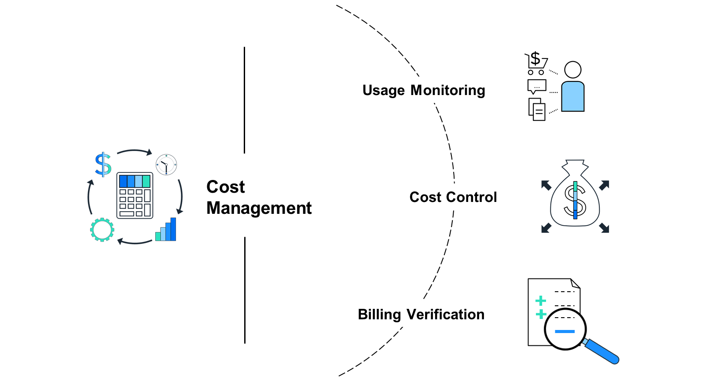

To help the customers with the cost management with the SAP BTP cockpit we address the following three business flows:

Usage monitoring: Continuously monitor the usage and resource consumption of services, viewing trends, and drill down in Subaccounts. For accounts using the BTPEA / CPEA commercial model you also get some forecasts for the usage.
Cost Control (cross charging): Easily track and manage cost in an account hierarchy through search and filter options based on labels. Additionally you can define and assign budgets and configure according alerts for exceeding the defined thresholds.
Billing verification: Verify billing accurately, using data and terminology incorporated from your monthly balance statement.

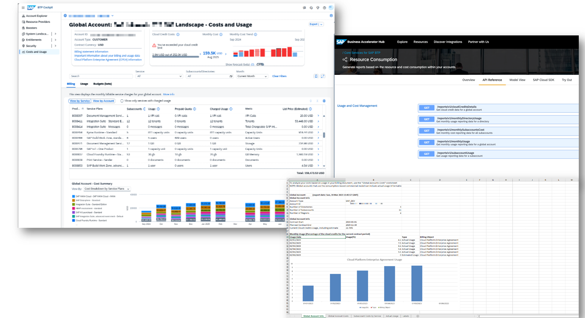

To support those flows and the different business needs of the customers, we offer one central flexible UI within the SAP BTP cockpit: the Cost and Usage view. You can do an analysis from different perspectives (for example, in the account hierarchy view) and drill down into the details. It allows you to bookmark filters and queries for quick access, future reference, or sharing. There are many improvements that you can benefit from.

For customers which do analytics using their own tools, we provide the usage data via an export as an XLS file download or accessing it via APIs.

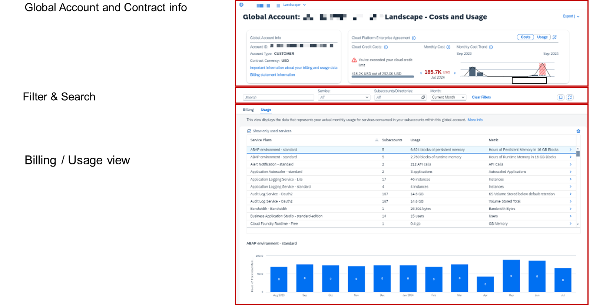

Let's have a look at the Cost and Usage UI. It's divided into three main sections:

Global Account and Contract Information
Filter and Search
Billing / Usage view, including the service cost trend over the past 12 months.

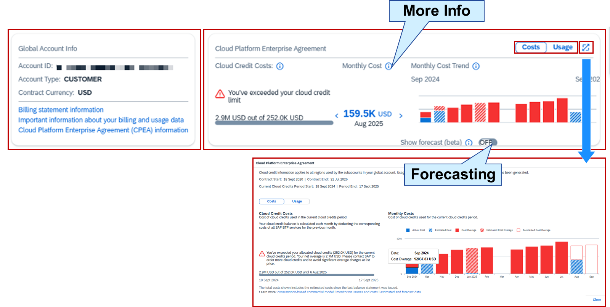

Screenshot showing the UI of Global Account and Contract view.
Looking at the Global Account and contract information: The view contains two side-by-side view cards:

The Global Account info on the left side which displays general information about your Global Account.
The Contract Info on the right side for CPEA or BTPEA, which provides information related to your cloud credit usage and cost per month, relative to your total cloud credits for the current contract phase. It also shows your monthly trend of the cloud credit usage and costs.
You can switch the view between Cost and Usage using the switch on the top right or expand to see more information.

Note

Cloud-credit usage and cost information is displayed for the current contract phase only. The total contract duration is split into contract phases (usually yearly), and the total cloud credits are divided between these phases.
Your cloud credit balance is calculated each month by deducting the corresponding costs of all SAP BTP services for the previous month.
If your Global Account has received a cloud-credit refund at any time during the current contract phase, you may see a difference between your total usage / costs and the monthly usage / costs in the chart.
Pay attention that if your Global Account uses a combination of the consumption-based commercial model and the subscription-based commercial model, the card on the right shows billing and usage data that is charged solely according to the consumption-based commercial model. In other words, for services that are part of your subscription-based commercial agreement, the billing and usage data in this card applies only to consumption that exceeds your prepaid subscribed quota. For this excess service usage, you're charged according to your contract for the consumption-based commercial model.

For example, if your subscription contract is entitled to consume a given service at a fixed cost for up to 100 unique site visits, and 151 unique site visits are registered, this card shows data relating only to the 51 visits that have exceeded the prepaid 100 visits.

Forecasting for your SAP BTP Usage
Until now, you could view a monthly graph of your cloud credits trend including actual and estimated costs.

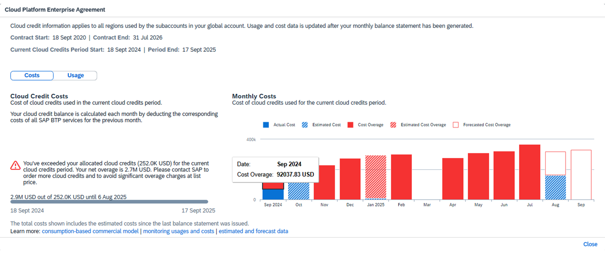

With the new cloud credits forecasting capability, you stay ahead using:

Cloud Credit Projections
Forecasts monthly costs and usage based on historical consumption data of at least 9 months.

Trend Identification
Detects when cloud credits are likely to exceed purchased limits or fall below them, potentially leading to unused credits.

Optimized Purchasing
Making informed decisions to adjust credit purchases and reduce the risks of future costs

Planning Support
Provide administrators with insights to better plan and manage cloud resources and budgets.

Please be aware that, the forecast does not include the costs and usage of the current month (since this estimated data only), nor does it take into consideration any changes to future usage patterns or costs. Additionally, you cannot turn on the forecasting when you're in the last month of the current cloud credits period. The forecast data provided by our software is intended for informational purposes only. However, it can you help to anticipate and plan for future usage needs and budgets accordingly.

Caution

SAP is not responsible for and cannot guarantee the accuracy or reliability of the forecast data, and it should not be considered as financial, legal, professional or any other advice. It is your responsibility to independently review and validate the forecast information before making any decisions or taking any actions based on it.

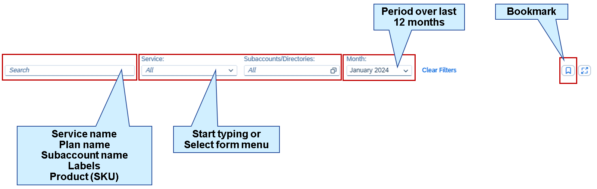

Looking at the filter and search area of the Cost and Usage UI: You can configure searches and filters for: service, Subaccounts/Directories, or the billing month. The filters and searches are applied to both Billing and Usage views below.

When using the search, you can start typing, and the search offers results that apply to service names, plan names, Subaccount names, Directory names, labels assigned to Subaccounts and Directories, product IDs (SKU), and metrics. The search offers suggestions only for items that are currently listed.

The filters for Services and Subaccount/Directories apply the same pattern. You can just start typing, or select a value from the list.

For the time period filter, you can choose between the current month or choose any other out of the last 12 months.

Once you have the desired information displayed, you can use the Bookmark option to copy the URL of the displayed view and the currently defined filters. You can save this URL as a bookmark in your browser, or you can share it with a colleague so that they can quickly open the same view with the same filter settings.

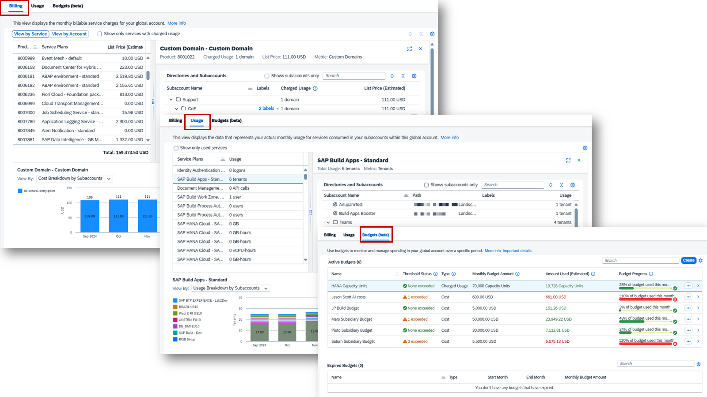

This UI section has three views represented by tabs:

Billing view: Shows the monthly billable service charges in your global account based on the aggregation of your resource's actual usage. The aggregation of all your Subaccounts is calculated according to the pricing structure and legally billable metric of each service.
Usage view: Shows the data representing your actual non-aggregated monthly usage for services consumed in your Subaccounts withing your Global Account. The view applies for both, consumption-based and subscription-based commercial models.
Budgets view: Manage and review budgets effectively, and configure alerts to monitor and track service consumption when thresholds are exceeded.
Taking a closer look at the Billing view.

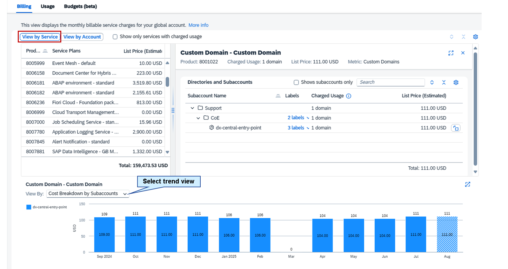

Billing view gives you two perspectives: View by Service and View by Account.

View by Account
View all the services costs according to those selected in the Filter and Search filed billing month. You can drill down to see the costs per Directory or Subaccount and see the trend over the past 12 months by selecting the desired view.

To drill down and display more details about a particular service, select an entry in the table or its View Details button. When you drill down, a new pane opens and you can see, for example, exactly which Subaccounts consume the selected service and the subtotal of charges and usage per Directory and Subaccount.

If the display is cluttered by too many service plans or account entities that have no charged usage, you can choose the Show only services with charged usage checkbox to hide them.

To view the monthly trend of a specific service plan over the last 12 months, select the plan in the main table, and then scroll down past the main table until you reach a chart. Choose the chart type in the View By dropdown list.

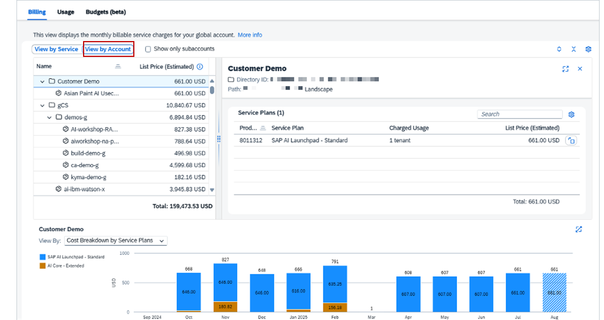

View by Account
This perspective provides an overview of your charged usage across different Subaccounts and directories within your account hierarchy. It's useful for verifying cross charges within your company or organization.

To drill down and display more details about a particular Subaccount or Directory, select an entry in the table (or View Details button > at the end of the row). When you drill down, a new pane opens and you can see, for example, exactly which plans are consumed by the selected Subaccount or Directory and the subtotal of the charges and usage per plan.

Hint

To filter the main table for specific Subaccounts or directories, use the Subaccounts/Directories drop down list.
If your account hierarchy includes Directories, you can hide them and display your Subaccounts as a flat list by choosing the Show only Subaccounts checkbox.

You can quickly expand or collapse the entire account hierarchy by selecting the Expand All and Collapse All buttons.

To filter the main table for specific services, use the Services drop down list.

To view the monthly trend of a specific Subaccount or Directory over the last 12 months, select the Subaccount or Directory in the main table, and then scroll down past the main table until you reach a chart. Choose the chart type in the View By drop down list.

When you haven't selected a row in the main table, the Global Account Cost Summary chart is displayed below the main table. It shows a summary of the costs by month of your Global Account over the last 12 months. To get back to this chart when a chart with the costs for a specific Subaccount, Directory, or service is displayed, deselect the selected row in the main table. If your global account has Subaccounts that have been deleted but have charges in the last 12 months while they were still active, they'll still be listed. Such Subaccounts are marked with (deleted) after their name. If these Subaccounts were originally located under a Directory, you'll see them listed directly under the root Global Account.

If your Global Accounts uses both, a subscription-based and a commercial-based model, the Usage column shows the combined total usage of services, both subscription-based and consumption-based.

Note

The subscription-based consumption includes usage of services that falls within the prepaid quota that is specified in your subscription-based commercial model agreement. This part of the combined usage is shown in the Prepaid Quota column. There is no additional billing for consumption of those services that falls within your prepaid subscription quota.
The consumption-based usage includes the usage of services that exceeds the prepaid subscription-based quota. This part of the combined usage is shown in the Charged Usage column. For this usage, you get charged based on the terms outlined in your consumption-based commercial model agreement.

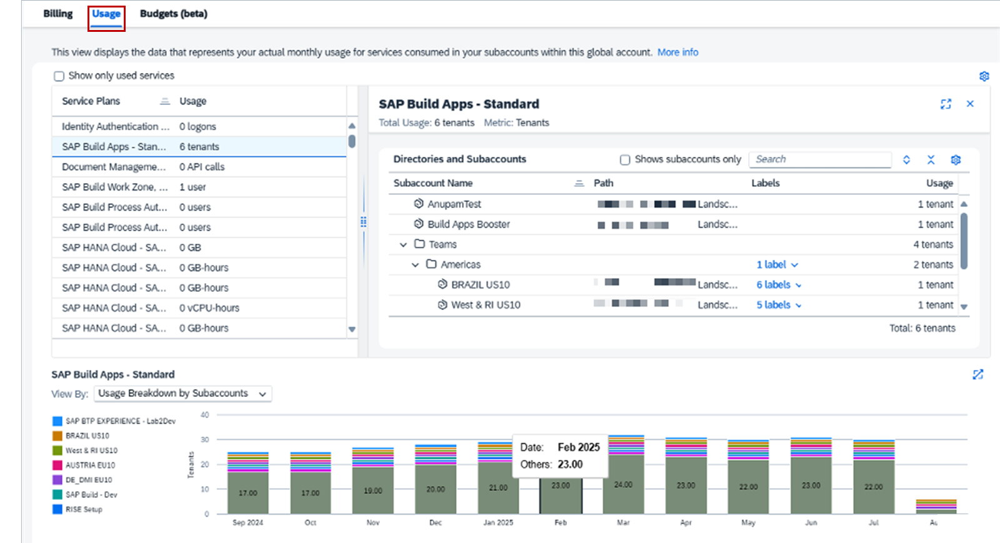

Switching to the Usage view: You can use it to display, monitor, and analyze the distribution of the raw (actual) monthly usage metrics for services consumed by the Subaccounts in your Global Account over the past 12 months.

Th Usage view displays the data prior to aggregation for billing and can contain metrics that will no be aggregated since they are free or belongs to free services. Therefore, you can notice some discrepancies when comparing the data in the Usage view to the overall data shown in the Billing view.

Note

If your Global Account uses only a consumption-based commercial model, such as SAP BTP Enterprise Agreement (SAP BTPEA), Cloud Platform Enterprise Agreement (CPEA), and Pay-As-You-Go for SAP BTP, this view includes all usage data, including non-rated services, such as free service plans.
If your Global Account uses both, the consumption-based and subscription-based commercial models, this view combines all usage data, which falls under your consumption-based plans, prepaid subscription quota, and non-rated data sets, such as free service plans. You can see the distribution of charged and prepaid usage and costs in the Billing view.

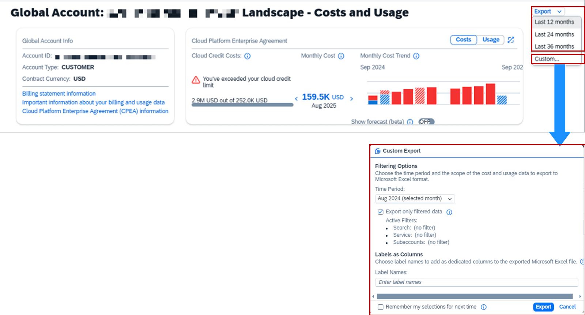

You can have all raw usage data exported as an XLS file, if you prefer to handle it by yourself in any other kind of reporting tool. The Export button is on the top right of the Cost and Usage view. By the drop down menu, you can choose the period of the data to export, or you can customize the time frame. You also need to select if you want to download the whole data or just the data based on your filter criteria.

Budgets and Alerts
Enhanced control of cost and consumption via budget management with alert notification. This feature empowers global admins with SAP BTP Enterprise agreement (BTPEA), Cloud Platform Enterprise Agreement (CPEA) or Pay-As-You-Go or a combination of those consumption-based models with subscription-based commercial model to monitor cost and services utilization.

Please note following important details for using budgets and alerting:

Costs and usage values between the last balance statement and the current date are estimates and may change at the end of the month when the actual overall global account usage is aggregated for billing purposes. SAP does not guarantee the accuracy or reliability of real-time alerts based on these estimates. It is your responsibility to review and validate alerts before you make any decisions based on them
The system doesn’t suspend cost and service usage, when the budget amount or threshold is exceeded. It’s in your responsibilities to take appropriate action to prevent overages.
There might be a delay between the time a budget threshold was exceeded and the time you get the notification due to delays in update cycles of cost and service usage as well as the periodic evaluation of budgets against global account cost and usage
If your account combines subscription and consumption based commercial models, then any usage that falls under your prepaid quota is not evaluated by your budget

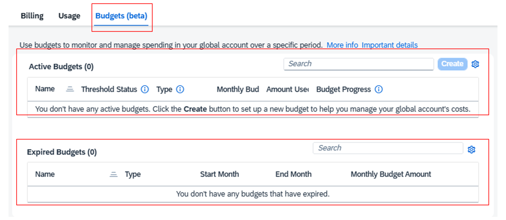

To access the Budgets, go to the Budgets tab. The view opens with 2 tables:

Active budgets: All currently active budgets.
Expired budgets: Budgets with an end date that has passed are considered expired. These budgets become inactive and, subsequently, no longer trigger any alerts or events.
Note

Before you defined any budget, all the views are empty. You can use the configure button to set the columns you want to view in each table

Create a Budget
Creating a budget allows you to monitor and manage spending in your global account. You can create a budget from scratch or from an existing budget that is active or has expired. Each global account is allowed up to 10 active budgets. Active budgets have an end date in the future or no end date. Budgets expire automatically when the current date surpasses the end date of the budget.

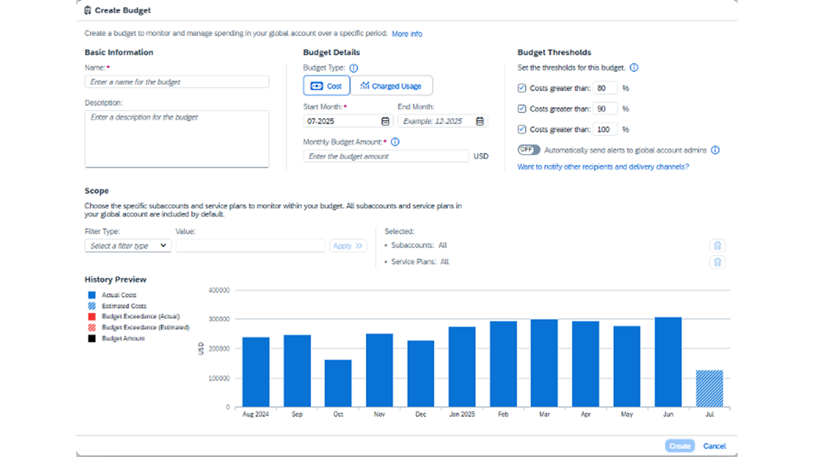

In the Budget tab, click on Create or you can duplicate an existing by choosing Create as new Budget. After you've started the creation you need to fill in the budget settings accordingly:

Budget name and description
Basic information as a unique display name and an optional short description for the budget

Budget type
Cost
The budget is based on list price data as shown in the Billing tab

Charged Usage
The budget is based on charged usage data as shown in the Billing tab.

Budget Amount
The amount allocated to the budget per month. If the Budget type is set to Cost, the specified amount represents a monetary value in the same currency as the Global Account. If the budget type is set to Charged Usage, the specified amount corresponds to the unit of the metric (for example: API Calls) of the selected service plan.

Time period
Setting the start month and optionally the end month for the budget being active.
There are also optional settings of an budget like the scope to define which Subaccounts and service plans in the global account are monitored by the budget. By default the budget monitors all Subaccounts. The service plans that are monitored by the budget depend on the budget's type: When the budget type is set to Cost, then by default all services and their plans are covered in the budget's scope, but you can choose specific plans to monitor. If budget type is set to Charged Usage you must specify a single service plan to be monitored by the budget. In case a service plan has multiple metrics, then you must select the specific metric you want to have in scope.

Setting Up Budget Thresholds and Alerts
When working with budgets, you can define thresholds and configure according alerts.

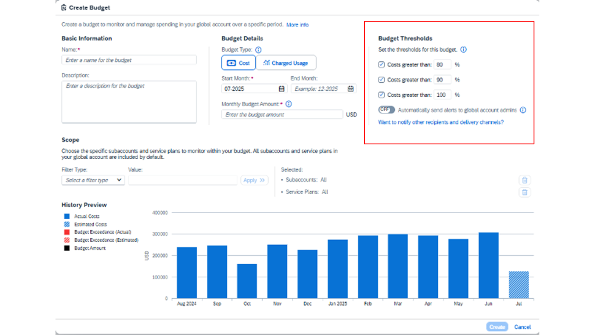

You can define up to three threshold percentages ranging from 1% to 120% relative to the monthly budget amount. When you configure a budget threshold and enable it, the threshold value is displayed over the History chart when you view a budget's details in the SAP BTP cockpit.

Additionally, you can opt-in to send automatic email notifications to all Global Account administrators when a threshold is exceeded. Alternatively you can use the SAP Alert Notification service for SAP BTP to set up customized alerts for your preferred recipients, communication channels, and monitoring solution. SAP Alert Notification service needs to get licensed via your SAP BTP contract separately.

When working with budget threshold alerts, please consider the following:

These alerts are independent. You can use either one or both.
When you enable a threshold, alerts are not sent for previous exceeds in the past months.
Automated emails and budget notifications are triggered only once when a budget threshold is exceeded. We do not send daily recurring emails or events while the budget continues to exceed its limit.
If the defined budget amount is exceeded, and you haven't set a 100% threshold value or chosen any of the available alert types, you will not receive automatic notifications about the budget overrun.

Caution

There may be a delay between the moment a budget threshold is exceeded and when you receive an alert. This delay occurs due to the time lag between cost and service usage update cycles, as well as the interval-based evaluations of budgets in relation to your Global Account’s overall costs and usage.

