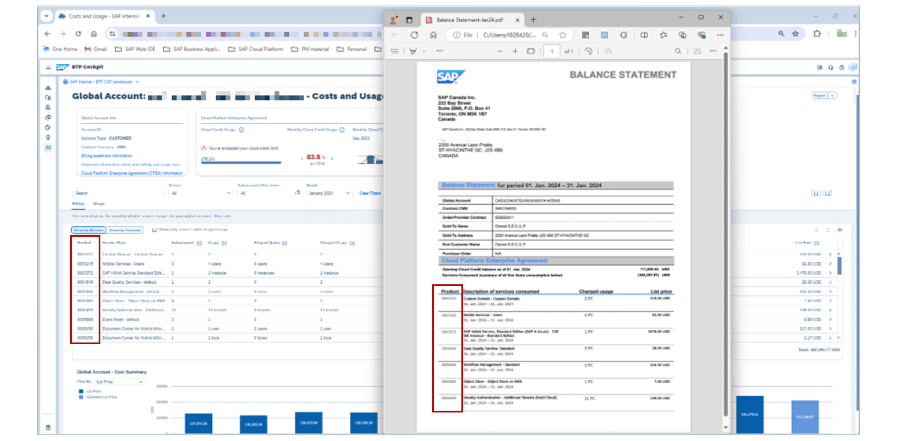
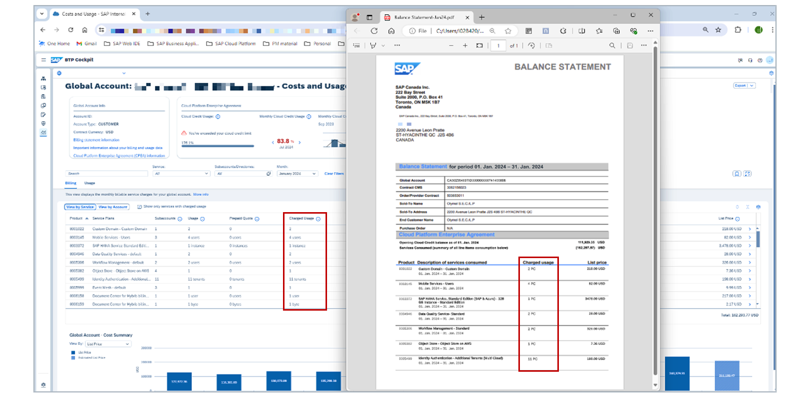
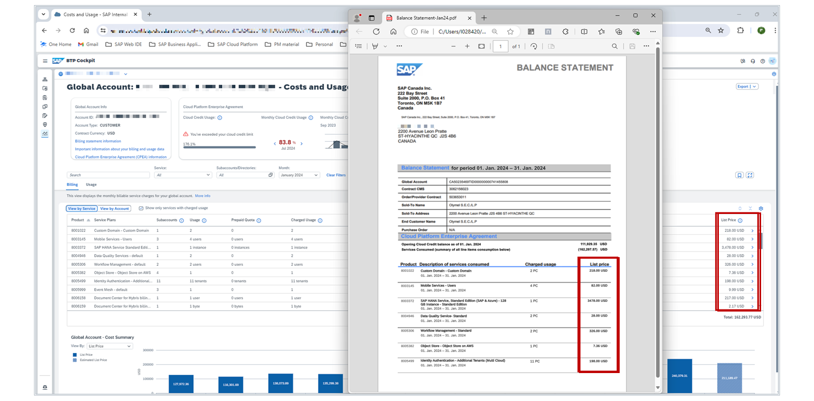

# Verifying the Balance Statement

Verifying the Billing
We improve the contract-to-bill traceability with the billing verification possibility. You can compare the balance statement with the actual resource usage in BTP.

Typically done on a monthly basis, you verify the balance statement and drill down into Subaccounts costs to see exceptional usage:

You can use the options button to configure the table columns you'd like to be shown.
You can use the (i) button next to the column name to find out what the column means / represents.
Note

The monthly balance statement, which is provided separately, contains legally binding information regarding your monthly costs. Details about costs on the Costs and Usage page in the SAP BTP cockpit are provided for informational purposes only. Any discrepancy between the information displayed in the SAP BTP cockpit and the information in your balance statement will be resolved in favor of the balance statement.
Costs are displayed according to your contract currency.
Global accounts are the only contractual billable entity for SAP BTP. Directories and Subaccounts are used as structural entities in Global Accounts. The usage and cost data displayed for Directories and Subaccounts are estimations and may differ from the actual Global Account metrics. Hence, you should use their data only for internal cost estimations.

The relative calculation per billable usage within each Subaccount is an estimation, as it is based on certain measures, which in some cases can either be different from the metrics that are presented on the Global Account level, or that use different formulas than the ones used for billing.

Cloud credit information and monthly costs apply to all regions used by the Subaccounts in your Global Account. Usage and cost data is updated after your monthly balance statement has been generated.
For new Global Accounts, data is updated with the first billing cycle.
In the Cost and Usage charts, estimated values are used for the period between the last balance statement and the current date. These are displayed as striped bars.
These estimates are based on resource usage values before computation for billing and might change after the next balance statement is issued. The estimated values are not projected or forecast values.

Like the balance statement, the leading column is Product (represented by Its SKU).

Note
You can sort the list in the UI ascending or descending.

Charged usage – as the name suggests – is the consumption-based usage. For the subscription accounts, it's always 0. For the Hybrid accounts, it's only the usage above the prepaid quota.

List Price column shows the cost for consumption-based usage.

