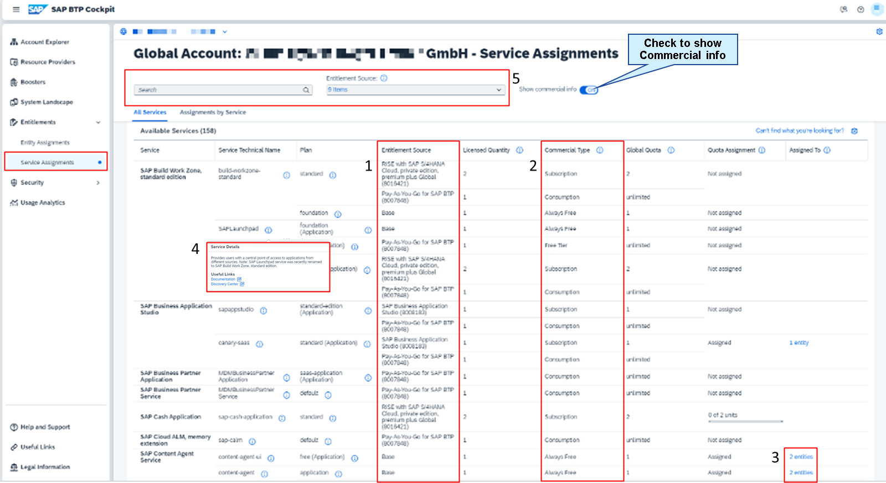

# Achieving Contract Entitlement Transparency

Achieving Contract Entitlement Transparency

Last but not least, the Entitlements pages have been improved incorporating new commercial information and additional capabilities. This increases the transparency and improve your understanding of entitlements, allowing you to take cost-cutting measures, where needed.

The Entitlements section of the SAP BTP cockpit has two main pages:

Service Assignments: View all services and quota assignments.
Entity Assignments: View services by Directories / Subaccounts and a dialog for configuring / adding service plans.
 

At the Service Assignment page you can view all the services and quota assignment. By using the show commercial info switch a new column named Entitlement Source appears, which gives you additional entitlement source information how each of the entitled plans have been added to your global account e.g. via a subscription to a product or bundle, a consumption model or free services This is important, because you might have same service plans existing and coming from different sources.

The second major improvement is the ability to see the commercial type of the plan. Is it Free Tier, Always free, or Consumption.

Another enhancement is the quick view of the total number of Directories and Subaccounts, where the service plan is assigned and you have the ability to drill down to see more details.

The next improvement is the access to service-related links by selecting the (i) button on the right side of the service technical name. It includes links to product documentation, and where available, links to SAP Discovery Center, commercial information.

The filter and search capabilities were improved as well. You can search for a service plan or entitlement source if you want to search by the commercial type.