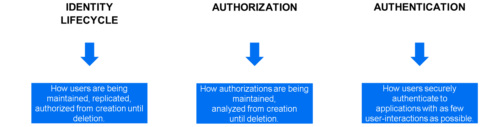
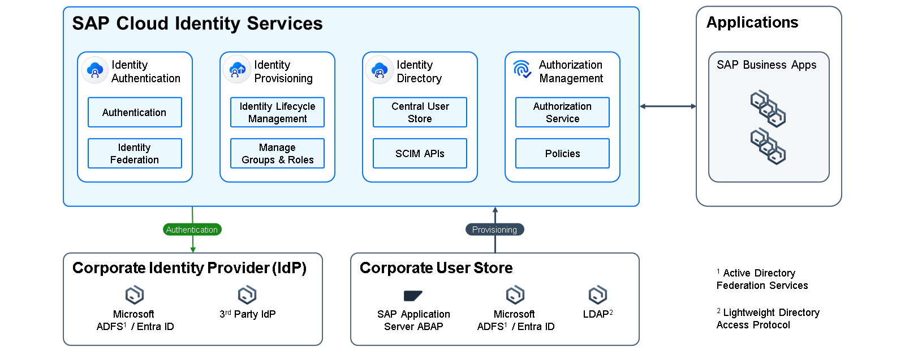

# Identity and Access Management for SAP landscapes

### Identity and Access Management Domains
Identity Access Management (IAM) is a foundational capability of the Business Technology Platform to control user access to applications and the platform itself. The right users shall have access to the right systems with the right authorizations.
The process of identity access management for a business user starts in the system of origin where the user record is created, continues with granting authorizations to that user record and making sure that the user authenticates in a secure way when accessing SAP BTP:

### SAP Cloud Identity Services
The SAP Cloud Identity Services play an essential role in the IAM reference architecture for SAP software.

By establishing the SAP Cloud Identity Services as a central IAM component it is ensured that all SAP Cloud Applications offer a harmonized set of integration capabilities for identity lifecycle management and single sign-on. SAP also supports continued use of your third-party or legacy components, for example, a central user store.

The SAP Cloud Identity Services are a default integration component for any SAP Cloud Solution and thus also for SAP BTP. Use them to protect access to the platform itself and to applications running on SAP BTP. Each SAP BTP customer is entitled for at least two tenants of SAP Cloud Identity services: One for testing, one for production. SAP BTP trial accounts are entitled for one trial tenant. SAP recommends using this tenant instead of the default identity provider. The SAP Cloud Identity Services are a group of services which consist of the following components: Identity Authentication, Identity Provisioning, Identity Directory and Authorization Management:

### Identity Authentication
Identity Authentication is a service that provides central capabilities for authentication and SSO (single-sign-on). It also offers convenient user self-services such as registration and password resetting for employees and partners. Security features include protecting access to applications, helping you define risk-based authentication rules, use two-factor authentication, and delegate authentication to other identity providers. Key features are:

Secure authentication for browser-based applications
SSO and single logout functionality from anywhere on any device
Strong authentication with configurable multi-factor authentication enforcement,
Risk-based authentication applied to applications, user group assignments, and Internet protocol ranges,
Support of SAP and third-party applications,
Password policies on the level of service-provider applications,
Customizable look and feel, including support for setting up company branding,
User self-services, including registration and password resetting,
Delegated authentication through integration with corporate identity providers and on-premises user stores,
Identity federation with corporate identity providers and applications based on SAML 2.0 and OpenID Connect.

### Identity Provisioning
The Identity Provisioning service within SAP Cloud Identity Services is a cloud service for managing identity lifecycle processes in the cloud. The service automates those processes and helps you provision identities and related authorization assignments to various cloud and on-premises business applications. Key features are:

Rapid scenario extensions using optimized connectors for provisioning users and groups among multiple supported SAP and non-SAP cloud and on-premise systems,
Connectors for source, target, or proxy systems in your provisioning scenario. This especially includes connectors for BTP Global Accounts, Directories, Subaccounts and for the Cloud Foundry and ABAP environments,
Flexible data transformations, in which connectors can be customized using either the graphical editor or the JSON editor,
Automatic delivery of default provisioning systems for specific SAP Cloud Solutions,
Real-time provisioning with dedicated source systems,
Consumability either directly through built-in APIs or from the user interface (UI), so the UI is integrated into the administration console in SAP Cloud Identity Services, together with the rest of its services,
SCIM-compliant integration with identity management solutions,
Ability to deal with cloud and on-premises user stores as sources, relying on dedicated integration with any local identity stores to ease adoption of the IAM reference architecture,
Comprehensive job scheduling for provisioning processes.

### Identity Directory
The Identity Directory in SAP Cloud Identity Services is the persistency layer inside the services. This component facilitates identity lifecycle flows and unlocks important new features, such as a central user store for newer SAP BTP applications to avoid replicating users to every single application.

The Identity Directory acts as the central point of truth regarding users of SAP Cloud Solutions. The users are typically replicated into the Identity Directory from your company’s user source and central point of truth, either an HR system or a corporate identity management solution. Key features are:

SCIM 2.0 REST API for management of users, groups, and custom schemas,
Accessibility from the SAP Cloud Identity Services admin console or through its SCIM 2.0 REST API or Identity Provisioning services,
Custom schema creation,
Generation of SAP global user IDs,
Ability to leverage the Authorization Management service and to adopt various SAP solutions that rely on user persistence in the Identity Directory.

### Authorization Management
The authorization management service (AMS) enables SAP Cloud Identity Services administrators to customize authorization policies of cloud applications and assign them to users.

Application developers declare the detailed authorization model of their application. They group related authorizations into predefined authorization policies ("base policies") which serve as foundation for administrators to design custom policies ("admin policies"). Key features are:

Authorization design and assignment in the same tool,
Powerful instance-based authorizations ("restrictions"),
Easy maintenance of restrictions thanks to value help based on application data,
Client libraries for Java and Node.js,
Tight integration into the Cloud Application Programming model (CAP), which supports fully declarative authorization enforcement in typical use cases.
The SAP Cloud Identity Services are a default integration component for any SAP Cloud Solution and also for the SAP BTP. They can be used to protect access to the platform, the SAP BTP cockpit itself or for the applications running on top of the platform.

Learn more about SAP Cloud Identity Services in the Product Documentation or the Learning Journey.

