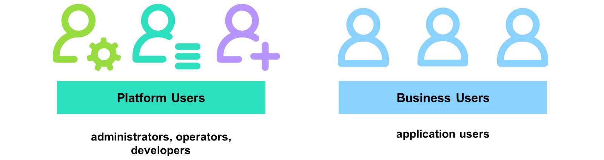
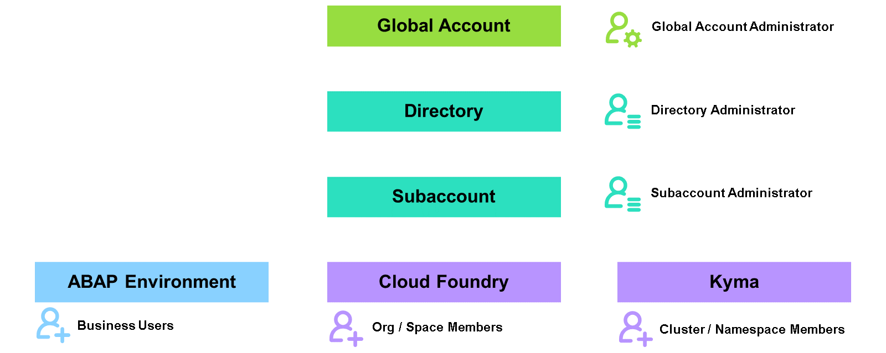
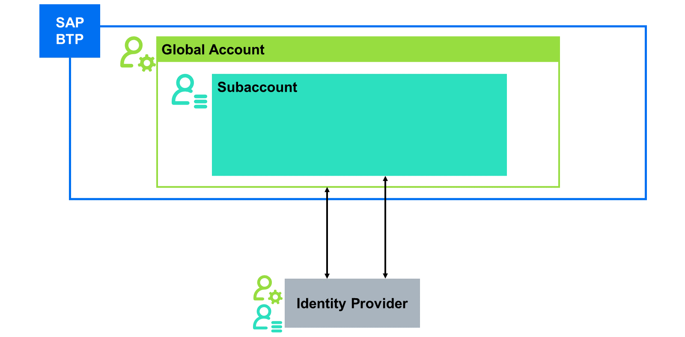

# Explaining Users and Identity Providers

### Types of Users on SAP BTP

SAP Business Technology Platform (SAP BTP) distinguishes between platform users and business users:

Platform Users
Platform users are usually administrators, developers or operators. Administrators manage accounts, entitlements, SaaS applications, services and environments. Developers and operators deploy, administer, and troubleshoot applications and services on SAP BTP. Platform users use platform management tools like SAP BTP cockpit, btp CLI, and environment-specific tools. Subaccount administrators also manage business users unless this is done centrally using SAP Cloud Identity services. All platform users of an account or environment are often also called "members" of the account/environment. This includes administrators/managers as well as users with more restricted authorizations (e.g. developers or auditors).
Business Users
Business users are end users of SaaS and custom applications on SAP BTP. They don’t use platform management tools and don’t need access to accounts and environments. Business users are managed by Subaccount administrators or administrators of the connected tenant of SAP Cloud Identity services.
BTP distinguishes these two user types to enable different authentication settings per user type. For example, due to their powerful authorizations, platform users often require strong authentication (e.g. a two-factor authentication). When working as business users (e.g. classical end user using an application or service), less strong authentication is often sufficient.

Despite this logical distinction, BTP uses the same concepts for user administration as much as possible. To manage platform users in Global Accounts, Directories, and Subaccounts ("Subaccount members"), you mostly deal with the same entities and tools as when managing business users in Subaccounts.

Caution

> There are some exceptions from the separation of platform and business users. Typical cases are the ABAP environment, which doesn’t distinguish between these two types, and SAP Build Code or SAP Build Apps, which developers currently access as business users.

### User Management on SAP BTP

User and authorization management on SAP BTP happens at all levels, from your Global Account over Directories and Subaccounts to your environments. Anyone who wants to use SAP BTP must be assigned corresponding authorizations in the specific account or environment. Authorization assignments are always specific to a single Global Account, Directory, Subaccount, or environment. There are no "full access" authorizations like a global account administrator automatically being authorized for all contained Subaccounts, or a Subaccount administrator automatically being authorized in the contained environments.

When a customer signs a contract for SAP BTP, a user specified in the contract is added at the Global Account level as the first Global Account administrator. Similarly, when you sign up for a trial account, you are set as the initial administrator of your trial SAP BTP Global Account. The Global Account administrator can log on to SAP BTP management tools and has full control over the account. For example, the Global Account admin can manage entitlements, such as entity and service assignments for the Global Account, as well as create Directories and Subaccounts. To ensure that there's more than one person who can administer the Global Account, the Global Account administrator also creates further admin users and assigns full or restricted administrator rights to them.

A Global Account consists of various Subaccounts, for instance to separate the different tiers, or separate work of different organizational units. The creator of a Subaccount or Directory automatically becomes its initial administrator and can add further members with different authorizations as required. In emergency situations, Global Account administrators can add themselves as administrators to Subaccounts and Directories.

The same pattern also applies to the environments. When a Subaccount administrator creates an environment, this user becomes or should be the initial administrator of this environment and can grant access to further users.

Note

> When creating a Kyma or ABAP environment, you need to explicitly specify who should be the initial administrator, usually yourself.

To manage members of all account levels, you typically use SAP BTP cockpit first. There are further options, like CLIs, Terraform providers, and integrations with SAP Cloud Identity services and corporate identity and access management (IAM) solutions. User and authorization management for the Cloud Foundry environment is very closely integrated into SAP BTP Cockpit and with SAP Cloud Identity services. For the other environments, it’s rather decoupled from SAP BTP cockpit and you need to maintain them in the Kyma dashboard or the Web Access as the administration launchpad of the ABAP environment.

All the environments offer further levels for user and authorizations administration for a better structuring and separation of work. Even though we’re naming the technical persona like administrators and developers platform users from a concept point of view, you cannot find this term within the whole platform and especially not within the environments of SAP BTP. Cloud Foundry environment is making use of specific Cloud Foundry Roles and users being a member of the respective level (org or space). Same applies to the Kyma environment, granting access to platform users via the Kubernetes RBAC system and so-called cluster roles. The ABAP environment breaks this a bit, there you use the so-called Business Users for both, the technical personas as well as the real end users of applications deployed within the environment.

### Identity Providers

To log on to SAP BTP, you require a user account with valid credentials. The original user account with its credentials is not managed in SAP BTP, but rather in an external identity provider. Most areas of SAP BTP use a copy of the user profile with basic information like name and email address, often referred to as "shadow users". This is mostly required to assign authorizations to users. When users log on to BTP tools and applications, SAP BTP delegates the authentication to the identity provider, which verifies the user’s identity and usually also provides certain information about the user.

By default, all SAP BTP accounts and environments trust SAP ID service as the default identity provider that SAP operates for customers to access tools like SAP for Me. SAP strongly recommends using a custom tenant of SAP Cloud Identity services instead, so that you fully control the lifecycle of your user accounts and all security settings. For example, you might automatically disable user accounts based on events from your HR system: You can do this with your custom tenant of SAP Cloud Identity services. With SAP ID service, this is not possible because you don’t control all user accounts there.

Note

> For the China region, a different default identity provider is used. For more information, see this blog post: Activate TOTP Two-Factor Authentication for Platform Users of SAP BTP in Alibaba Cloud regions.

#### SAP ID Service
SAP ID service is the default identity provider. The trust relationship with SAP ID service is configured by default, so it doesn't require any further configuration. This service is fully managed by SAP. Users then log on to SAP BTP tools and applications with their SAP ID Service user credentials. If the user doesn't have an SAP user account, it must first be created in the SAP ID service. Customers typically do this by creating "S user" accounts using SAP for Me. Alternatively, users can self-register to SAP ID service.

Users from the SAP ID service are identified by their email address and not their user ID. If you have multiple user accounts that share the same email address, they all get the same authorizations. When assigning authorization to users from SAP ID service, you can only assign them to individual users. With a custom identity provider, you can also assign certain authorizations to user groups. SAP ID service cannot be used for business users of certain newer applications, which rather require a custom tenant of SAP Cloud Identity services. Examples are SAP Build Work Zone, SAP Build Apps.

Hint

> Especially for productive usage, use your custom tenant of SAP Cloud Identity services. You may use SAP ID service in your prototyping scenarios or for testing.

#### SAP Cloud Identity Services – Identity Authentication
Instead of SAP ID Service, SAP strongly recommends you use a custom tenant of SAP Cloud Identity Services. This is possible and recommended for both platform and business users. You can either manage your own user base or connect your corporate identity provider, such as Microsoft Entra ID. For more details, see Initial Setup of SAP Cloud Identity Services.

To use SAP Cloud Identity services as the identity provider in BTP, you need to have a custom tenant. If you don’t have one yet, you can create a tenant using a self-service in SAP BTP cockpit. This is also possible in a trial account.

Note

> If your company has an existing tenant and you are not an administrator for it, you often need to involve an existing tenant administrator. In some cases, you can still establish trust, however you need a tenant administrator to further configure the trust, for example to delegate user authentication to a corporate identity provider or customize the login page.
In most cases, you can use SAP ID service and a custom identity provider at the same time. This allows a step-by-step transition to the custom identity provider: You can establish trust without locking yourself out, then authorize your user from the custom identity provider, log in using that one, and finally remove remaining users from the default identity provider.

SAP BTP uses separate trust configurations to SAP Cloud Identity Services for different purposes, e.g. business users vs. platform users and (for business users) between different Subaccounts. Even when using the same tenant for multiple purposes, this enables you to configure different settings for the different cases, for example multi-factor authentication for production but not for development and testing.

##### Central trust for platform users
You establish this trust on Global Account level.
The trust applies to all account levels in the Global Account, down to each Subaccount. It also applies to all Cloud Foundry environments in these Subaccounts.
When multiple Global Accounts trust the same tenant, the trust is shared between all global accounts. That means, when you access BTP management tools using the tenant, you can access all your BTP accounts, and thus same security settings in SAP Cloud Identity services apply to all these accounts.
##### Separate trust for platform users in the Kyma environment
The trust applies to an individual Kyma system, so it’s effectively Subaccount specific.
Kyma supports only one single identity provider, so when establishing a trust to a custom identity provider, this immediately replaces the default trust configuration. Make sure to either authorize at least one user from the custom identity provider before establishing the trust or retrospectively authorize it using the emergency process described later.
##### Separate trust for business users
The trust applies to business users in an individual Subaccount.
Newer applications, which directly use SAP Cloud Identity services instead of the traditional Authorization and Trust Management service of SAP BTP, appear with separate trust configurations in SAP Cloud Identity services, allowing for more fine-granular configuration. Nevertheless, all applications from a Subaccount always trust the tenant that is trusted by the Subaccount.
Only establish one custom trust per Subaccount, to a custom tenant of SAP Cloud Identity services and with the OpenID Connect protocol (OIDC). This works fine with all applications. SAP strongly discourages usage of additional trust configurations in a subaccount since they don’t work with newer applications.

### Concept of Shadow Users

When administrators grant authorizations to a user in some context, like in a Subaccount, in most cases this requires a basic user profile to exist in that context, to which the authorizations are assigned then. Usually this user profile, called "shadow user", is automatically created when the administrator assigns authorizations.

Note

> The feature for automatic shadow user creation is switched on by default for custom identity providers. SAP ID service as the default identity provider has it disabled as you do not want to have all SAP S or P users potentially existing in your SAP BTP accounts.

If you want shadow users to be created automatically, for example, when using the self-registration process, you can keep the automatic creation of shadow users enabled for the respective identity provider. This would mean that when a user exists in the identity provider and shadow user creation is allowed, the copy of the user is created once the user logs on to the SAP BTP cockpit or a respective SAP BTP application or service.

If, however, you want control over applications to which users can log on, you can switch off automatic creation of shadow users for an identity provider. This ensures that only those shadow users who have been manually created by the administrator, will be able to log on. Regardless of whether the shadow user was created manually or automatically, if the user exists, you can assign a role collection to the user.

Please be aware, shadow users cannot be automatically deleted again since SAP BTP cannot know whether a user is simple off work for some time and will get back or has permanently left the company / position.

Caution

> To comply with GDPR regulations, you need to delete personal data of users when no longer needed. SAP recommends you either set up an automated process to remove them based on reliable information like changes in your HR system or regularly review existing shadow users and delete those that are no longer required.

Note

> Shadow users typically exist per trust configuration. For example, a Subaccount member usually also consumes applications from the Subaccount as a business users and thus there are two shadow users: One associated to the trust configuration for business users and another one for the trust configuration for platform users.