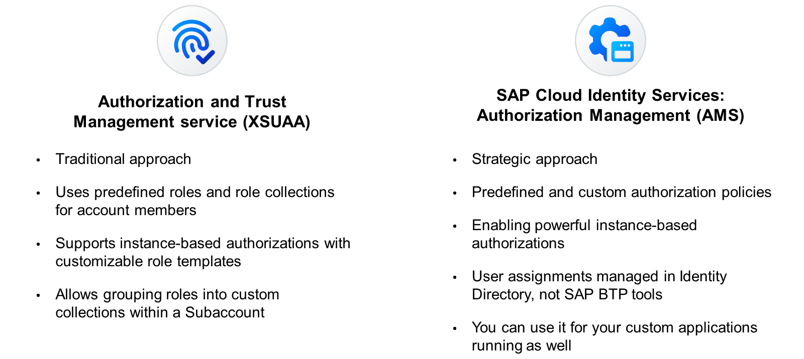
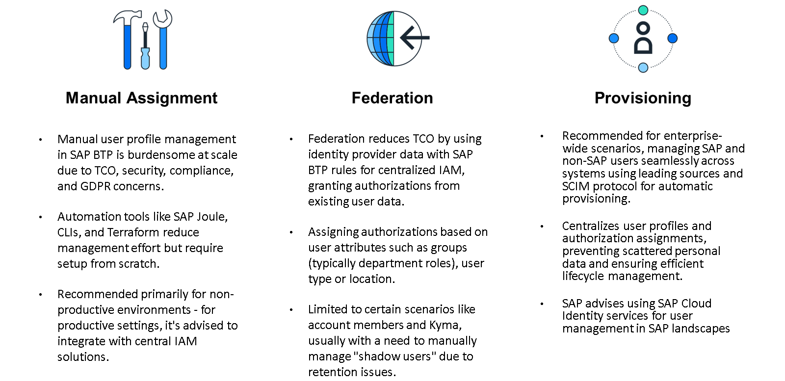

# Explaining Authorization Models and Assignment

### Authorization Models

To perform tasks on SAP BTP, platform users and business users need to be authorized accordingly. Across SAP BTP there are many predefined authorizations that are ready for immediate assignment to users. Usually there are at least roles that provide full access and others which provide read-only access (such as for auditors).

Apart from few exceptions, you also have the option to customize authorizations: You can group predefined authorizations into higher level roles. This helps authorize many users in a simple and consistent way, while also considering segregation of duties.

In some cases, there is an additional level of customizing: You can even restrict functional authorizations to certain subsets of your data. For example, a user might be allowed to view orders of all customers around the world but only manage orders for a certain market/region. Such restrictions are also called "instance-based authorizations".

#### Authorization models for platform users

##### Account members (Global Account, Directory, Subaccount)
You assign users to predefined and custom role collections to grant them authorizations. Role collections group roles from one or several services that are available in the same account context. All authorizations as well as user assignments are specific to the individual account context, such as a specific Subaccount. They are not available in other contexts, such as the corresponding global account, or other Subaccounts. Roles are predefined by application/service providers and are the finest granularity that administrators can work with. Administrators can group roles into custom role collections. For account members, there are only functional authorizations and no option for instance restrictions. This model is based on the Authorization and Trust Management service of SAP BTP which is also used for business users.
##### Members of Cloud Foundry organizations and spaces
For members of Cloud Foundry this approach differs: You assign users to predefined roles. Some apply to organizations, others apply to spaces. There is no option and need to customize the predefined authorizations. Role assignments are specific to an individual user and organization or space.
##### Members of Kyma systems:
For members of Kyma environment, you assign users to predefined and custom roles. You have fine-granular control on the individual authorizations in a role. They either apply to the complete system or individual namespaces.
##### Members of ABAP Environment
There is no separation between platform and business users in the ABAP environment. In SAP BTP ABAP Environment, you will use the business users and business roles from ABAP's own Identity Access Management, which has a lot in common with the Identity Access Management in SAP S/4HANA Cloud Public Edition.

#### Authorization models for business users

Authorizations of applications are only available after the application has been subscribed (SaaS application) or deployed (custom application) to the Subaccount. Respectively, authorizations for reuse services are only available after at least one instance of the service has been created in the Subaccount. We can differentiate two different authorization models for the business users:

##### Traditional model: Authorization and Trust Management service
Most of the existing applications and services apply to the traditional model using the Authorization and Trust Management service to grant authorizations to users. This is the same model as used for account members. Applications and services include predefined roles and usually also predefined role collections. Some applications support instance-based authorizations for certain criteria (e.g. markets). They provide role templates which define possible restrictions. You can create custom roles based on them, specifying restrictions as needed. You can group roles across all applications and services in a Subaccount into custom role collections.
##### New model: SAP Cloud Identity services – Authorization Management (AMS)
The new strategic model going forward is using the Authorization Management service. It is natively integrated into SAP Cloud Identity services and has much more powerful capabilities for instance-based authorizations. Some first SaaS applications use it already, such as SAP Ariba Buying and SAP Green Ledger. You can also use it for your custom applications running on SAP BTP. The applications include predefined authorization policies that are available for immediate user assignments. Some applications support instance-based authorizations for certain criteria. They provide base policies which define possible restrictions. You create custom policies ("admin policies") based on them, specifying restrictions as needed.

Note

> Currently, you assign policies to users and design custom policies directly in the Identity Directory of SAP Cloud Identity services and not using SAP BTP specific tools like SAP BTP cockpit. Assignment of policies to users requires user profiles to exist in the Identity Directory of SAP Cloud Identity services. You can still delegate user authentication to a corporate identity provider. Going forward, more and more scenarios across the SAP portfolio rely on the Identity Directory as central store for user profiles and as location to assign all kinds of authorizations to users.

### Authorization Assignment

When assigning authorizations to users within SAP BTP, we differentiate into three different approaches:

##### The manual assignment
When starting to use SAP BTP, you simply create user profiles manually and assign authorizations directly to them. You usually do this using a UI, like SAP BTP cockpit for account members, Cloud Foundry members, and most business users. Kyma and ABAP environments provide dedicated administration UIs along the SAP BTP cockpit.

However, when you roll out SAP BTP to a broader set of users, often you want to change this for several reasons:

Total cost of ownership (TCO): Manually managing individual user assignments is a lot of effort
Security and compliance: Strictly removing assignments that are no longer justified is very hard and likely there will be gaps. When removing assignments that should still be there, it’s "only" an issue that prevents users from working. Keeping them by mistake can cause even more trouble.
General Data Protection Regulation (GDPR): You must not store user profiles as personal data unless people need to use them. Especially when somebody leaves the company, beyond potential security and compliance issues, keeping such personal data violates GDPR laws.
That’s why SAP offers further ways to manage user profiles and authorization assignments, which also consider parts or even all these aspects. They all have their advantages and disadvantages, making them suitable for one or the other customer.

There are several tools for SAP BTP, which you can use to automate user management and thus reduce TCO to a certain extent. For smaller one-tasks, you might use SAP Joule’s integration into SAP BTP cockpit. To automate repeated processes like around user management using a scripting approach, you can use a set of command line interfaces (CLIs), specifically btp CLI for account members, Cloud Foundry CLI for members of organizations and spaces, and respectively kubectl for Kyma members. Finally, there are also Terraform providers for SAP BTP and Cloud Foundry which can be used in an infrastructure-as-code approach.

All these options help with automation in the context of SAP BTP. However, they require you to realize the complete identity and authorizations lifecycle from scratch. They don’t cover your complete SAP landscape and don’t integrate with company-wide IAM solutions. That’s why they are more useful in non-productive SAP BTP accounts and environments that are managed de-central by development teams. At least for productive accounts and environments, usually more central control is required and thus an integration into a central IAM solution.

##### Federation approach: Assignment based on user groups and other user attributes
An alternative option to address the TCO aspect and a first step towards central IAM administration is to grant authorizations based on user information that is already available in SAP Cloud Identity services or a corporate identity provider. Due to the combination of data from an identity provider (user information) and SAP BTP (rule granting authorizations), this is called a "federation" approach.

The most typical use case is to assign users to user groups within the identity provider, for example to reflect assignment to a specific department and in SAP BTP grant this group certain authorizations. Apart from user groups, you can also grant authorizations depending on any other user attribute, for example the user type or the user’s location.

Note

> Since reasonable user data for authorization assignments, such as group memberships and organizational data, is not available in SAP ID service, the federation approach is only usable with custom tenants of SAP Cloud Identity services.
Despite the obvious advantage of simplicity, this approach has the following restrictions:

It is only available in certain scenarios, but not across all of SAP BTP. Specifically, you can use it for account members on all levels of the account hierarchy (on directory level, configuration is currently not possible with SAP BTP cockpit), and in the Kyma environment. For platform users, it is not possible in the Cloud Foundry and ABAP environments. For business users, it is supported for the Authorization and Trust Management service (XSUAA), but it is not possible to grant AMS policies this way.
Where the federation approach is supported, usually it implies that basic user profiles are created automatically upon first access ("shadow users"). However, it is not possible to automatically delete them again. This leaves you with the permanent obligation to review this data and delete it as soon as no longer justified to be stored.

##### Provisioning approach: Lifecycle-aware replication via SAP Cloud Identity services
The most advanced approach for user management addresses the shortcomings of the previously mentioned options and is the recommendation for enterprise wide scenarios. It’s not SAP BTP specific and rather manages SAP BTP users and authorizations together with those for other SAP and non-SAP solutions in a customers system landscape. The principle is:

You have one or multiple "leading" systems that act as a source for users/identities and control their lifecycle until final deletion. Any changes are automatically provisioned to all relevant "target" systems, typically using the industry standard protocol "System for Cross-domain Identity Management" (SCIM). You also manage users authorization assignments in a central place for your system landscape. This aspect is like the federation approach but no longer leaves users personal data scattered in many places of your system landscape after they stopped working there.

For SAP solutions in your landscape, including SAP BTP, SAP recommends using your custom tenant of SAP Cloud Identity services as a hub to manage users and authorizations in your SAP landscape. The Identity Provisioning component has connectors for many SAP solutions and for most SAP BTP areas covered in this learning journey. The only exception are platform users in the Kyma environment, for which you can safely use the federation approach. Kyma does not permanently store user profile data and thus the mentioned GDPR issue does not apply in this case.

If you use a company-wide IAM solution, you can connect SAP Cloud Identity services to it. Find more details in the reference architectures in the SAP Discovery Center.