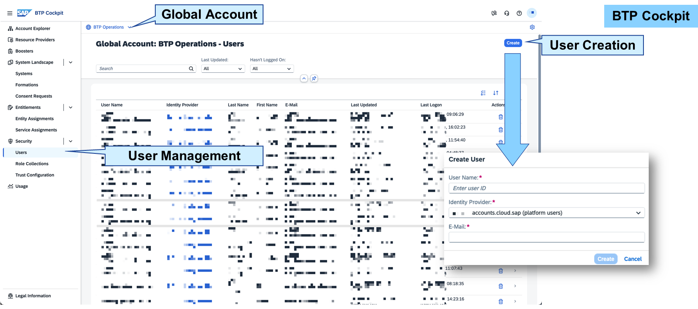
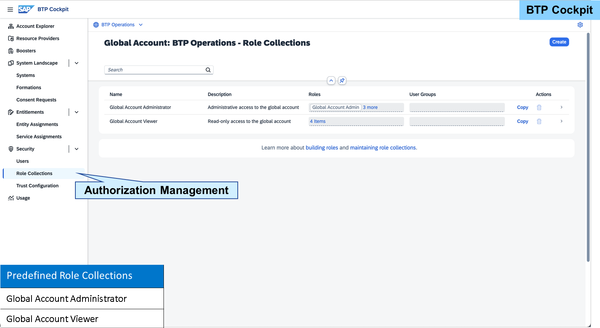
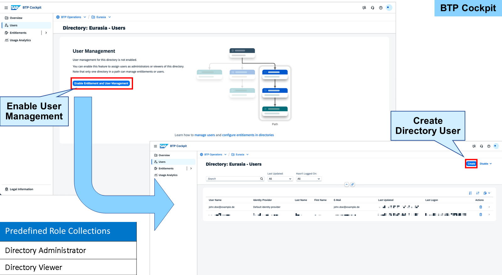
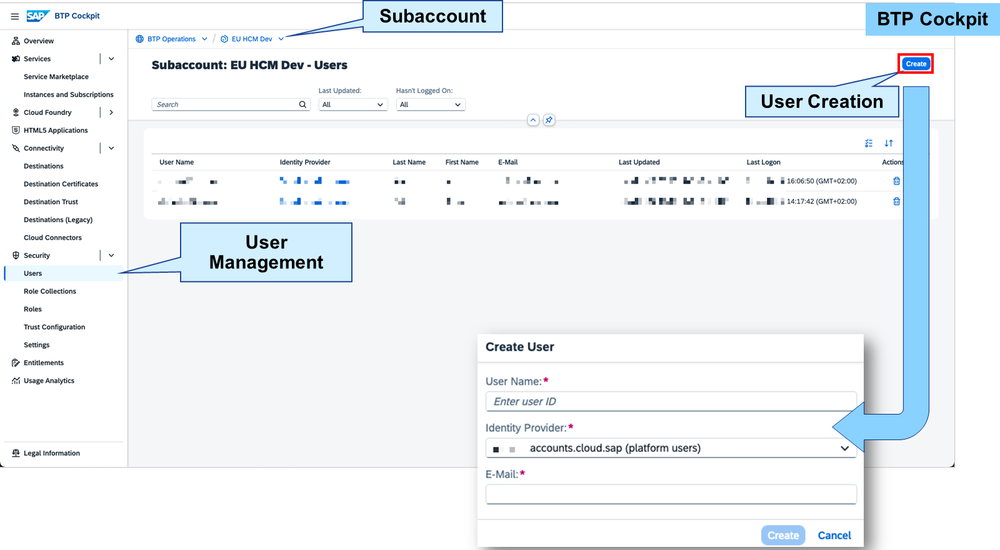
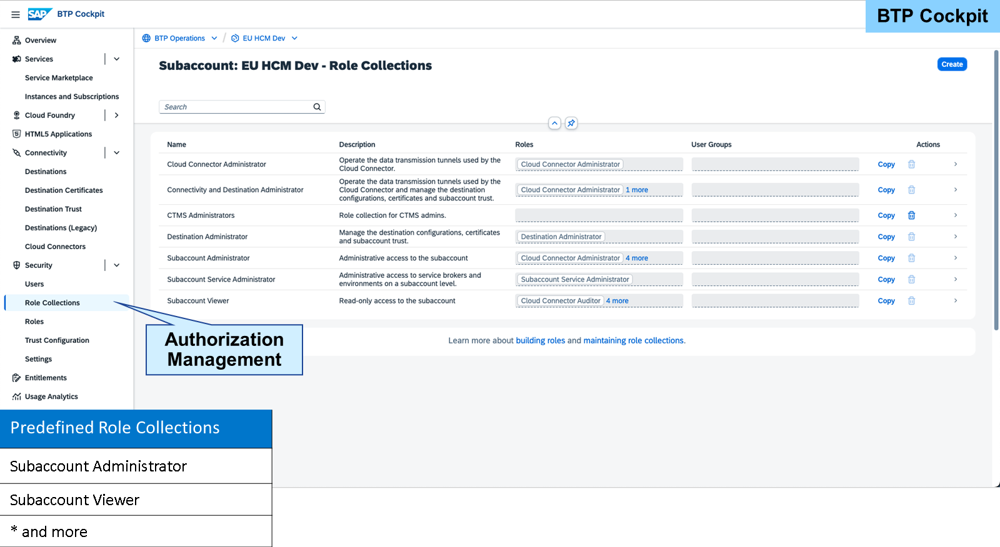
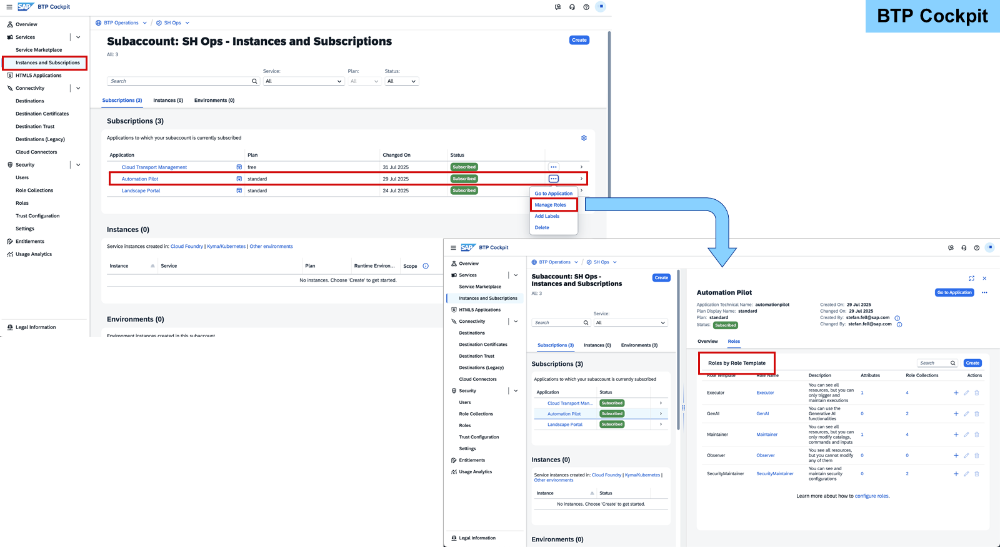
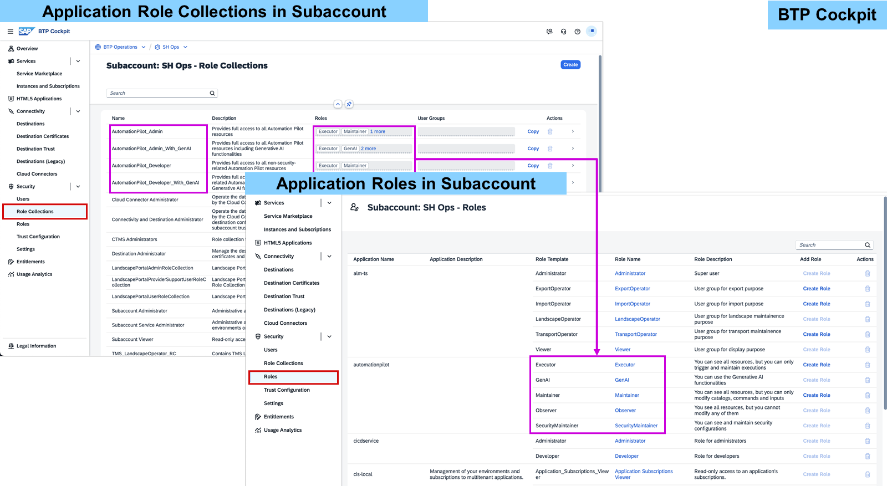
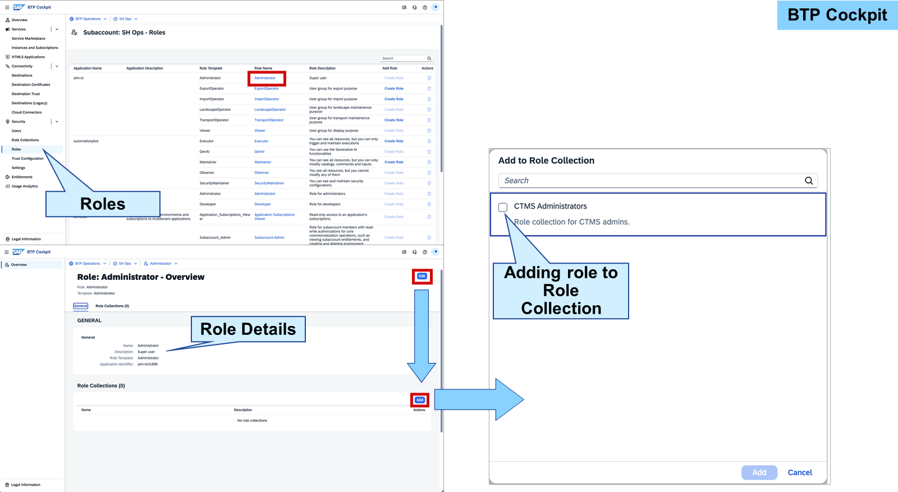
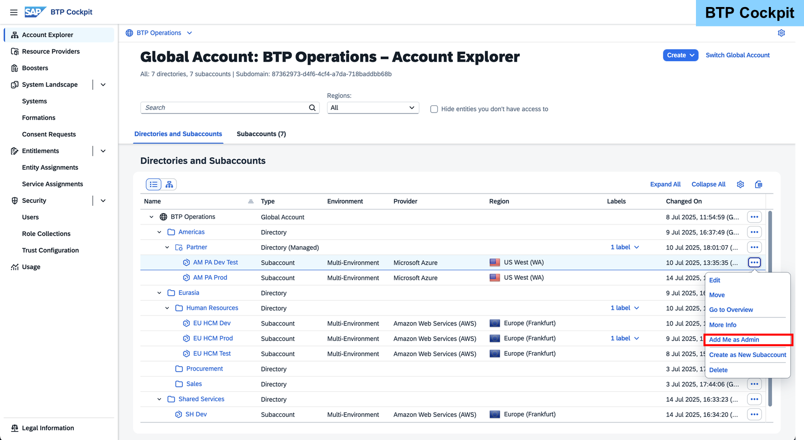

# Managing Users and Authorizations on SAP BTP

### User Management in a Global Account

The security recommendation is, before adding further platform users from the default identity provider to your global account, first get and connect your custom tenant of SAP Cloud Identity services to the account. Then either create users for yourself and other people in your tenant or connect it to your corporate identity provider. Finally add relevant users from your custom identity provider to your SAP BTP account and assign authorizations to them.

Note

> Typically you should already have a tenant of SAP Cloud Identity Services within your company. If not you can request one - further help you find in product documentation.
Note

> Within this lesson, we focus on assigning authorizations manually via SAP BTP Cockpit. Provisioning and federation approach are not further explained in this learning journey.

In a Global Account, you can create platform users and assign predefined role collections to them.

To create a user, you need to navigate to Security→Users, and choose the Create button in the top-right corner.

When creating a new user, you always must specify the identity provider. You can change the identity provider in the Identity Provider field.

There's one predefined role collection for administrative tasks and one for read-only access to the Global Account.

With the Global Account Administrator role collection, the user can perform the following tasks:

Create new and edit existing Subaccounts, within the Global Account
Manage entitlements
Manage users
Manage role collections
With the Global Account Viewer role, the user only gets read access to the mentioned items.

With the authorizations from predefined roles for Global Accounts, the user is not permitted to access any Subaccount that has been not created by them.

### User Management in a Directory

You can create Directories for better structuring. Furthermore, you can enable user management for the directories. You can create and maintain directory administrators and viewers. This is an optional step, and you can always disable it again if you need to.

If you want to have more directory administrators next to yourself, enable user management. If not, keep it disabled. If you’re using the entitlement management within the directories, it is highly recommended to have more than one directory administrator.

### User Management in a Subaccount

When adding a new user, you always must specify the identity provider. You can change the identity provider in the Identity Provider field.

If a user should be able to access a Subaccount, the user needs to be added under Security→Users on the Subaccount level.

To add a new user to the Subaccount, perform the following steps:

Open the SAP BTP cockpit.
Go to your Subaccount.
Choose Security→Users.
Choose Create. The SAP BTP Cockpit displays a dialog box where you can enter the user data.
Enter the user e-mail in the User Name and E-Mail fields.
Choose the identity provider where the user is stored. The dropdown list in the Identity Provider field displays the identity providers for which the trust connection has been configured in the Subaccount.
If you've configured a custom identity provider in a Global Account and you want to create a new platform user for the Subaccount, choose the IAS tenant in the Identity Provider field that's used for platform users.

Choose Create.
You can now proceed with assigning Role Collections to the new user.

Note

> Users from the SAP ID service are identified by their e-mail address and not their user ID. This is why, when using the default identity provider to create a new user, you need to enter the e-mail address as the user name. If you have multiple user accounts that share the same e-mail address in SAP ID service, they all get the same authorizations.

### Default Role Collections in a Subaccount

There are several predefined role collections that you can use when adding platform users to a Subaccount. These are the two most important ones:

Subaccount Administrator
Subaccount Viewer
If you assign the Subaccount Administrator role collection to a user, you grant the user administration permissions for the Subaccount. The user is then able to view and configure the entitlements for the Subaccount, create users, assign role collections, configure trust, create destinations, and so on.

The user who creates the Subaccount automatically gets the administrator permissions. All other users must explicitly be added as Subaccount users and have the corresponding role collections assigned.

After initially deploying your accounts, there are also other default role collections available in the cloud management tools. If you do not want to provide all administration rights to a user, but narrow it down to a specific task (for example, connectivity administration), you only assign the relevant role collection.

### Assigning Application-Specific Authorizations to Users

After the application is subscribed, it appears in the Instances and Subscriptions area. To review the roles that are delivered with the application, you can choose the three dots and select Manage Roles next to the subscribed application.

On the Details screen (which you can expand), you'll see a list of Role Templates, Role Names, and the Description delivered with the applications.

In the Attributes column, you can see if a role has been created from a role template and if any attributes have been defined for the role.

Caution

> This is only available to services which work without a trust to a custom identity provider. As alternative you need to consult the services product documentation and find the topic of authorizations or pre-delivered roles and role collections.
Note

If you inspect roles like this, not all of the application roles might be displayed. To view all roles within a Subaccount, navigate to Security→Roles.

In the SAP BTP cockpit, you can display information about the role collections that have been maintained as well as the roles available in a role collection by navigating to Security→Role Collections and Security→Roles.

In Security→Roles, you can find additional information, such as: which templates the roles are based on, and which applications the roles apply to.

In Security→Role Collections, you can display available role collections and see which roles they include. From here, you can assign role collections to users to grant them authorizations.

### Inspect and Assign Predefined Role Collections for Applications

Business Example
One of the key users in your company should do an implementation in SAP Build Work Zone, standard edition. For doing so, they need the corresponding access rights. As they do not need access rights on administrative or platform level, they can be identified as a business user. You're going to investigate which roles are needed and assign the according ones to the business user. In the second half of the exercise, you'll get in the shoes of this business user and test whether the new authorizations work correctly.

#### Creating Custom Role Collections

When assigning role collections, administrators can assign predefined role collections. However, predelivered role collections don't always exist, or they don't meet the business requirements. Therefore, administrators can create new role collections by copying the existing ones or creating them from scratch.

Administrators then add predelivered roles to their own role collection. These can be default roles that already exist and are used in other role collections, or these can be roles that are created from a template. Afterward, administrators can assign the role collection to the appropriate user. A user can have one or many role collections assigned. Roles and permissions contained in role collections are then automatically assigned to the user.

For more information, see Define a Role Collection.

In the navigation pane, under Security→Roles, you can see a complete list of all existing Roles, sorted by the application name the roles belong to. It also contains the role template, role names, and role description.

### Emergency Situations

ou might face the emergency that you urgently need to perform some operations in an account or environment while none of the existing administrators are available, for example because of sickness or because they left the company.

In most cases, you can help yourself, namely when there is an administrator of a higher level in the account hierarchy available. Global account administrators can add themselves as administrators to all contained Subaccounts using the "Add Me as Admin" option on the Subaccount in SAP BTP cockpit (details).

Hint

This feature isn't available if it has been disabled for your global account. To disable this feature, send an opt-out request using the software component BC-NEO-CIS-OPS. You create this request like other requests and incidents in SAP for Me.

Similarly, Subaccount administrators can update their environments to add further administrators. The exact steps depend on the environment:

Cloud Foundry
Kyma
ABAP: If managed using SAP Cloud Identity services (IPS), assign the required authorizations from there. Otherwise create a support ticket.
The only special case is when no global account administrator is available. In that case, there is no "parent" account in SAP BTP, so you need a different way to get access again. If you have got your global account based on a contract with SAP, you can add another administrator using SAP for Me (details: SAP Note 2669325).
