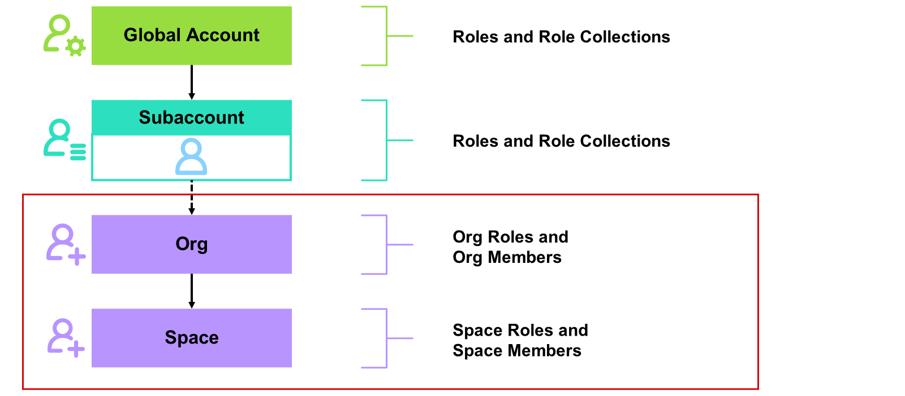
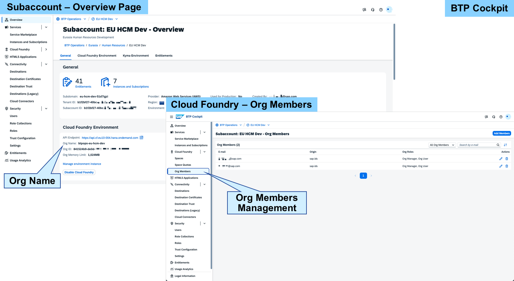
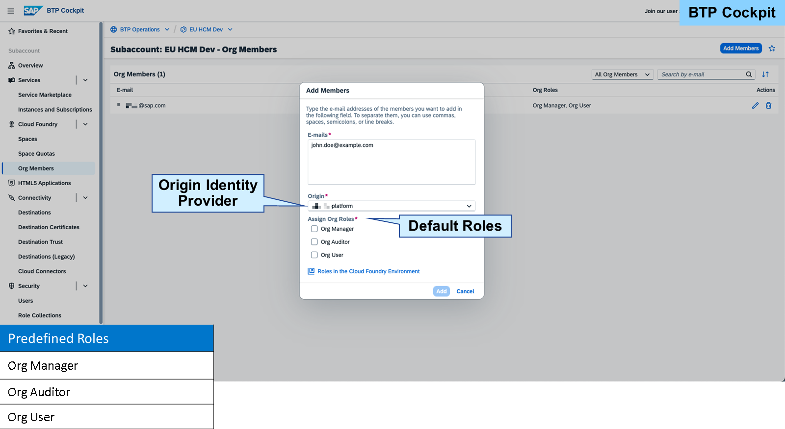
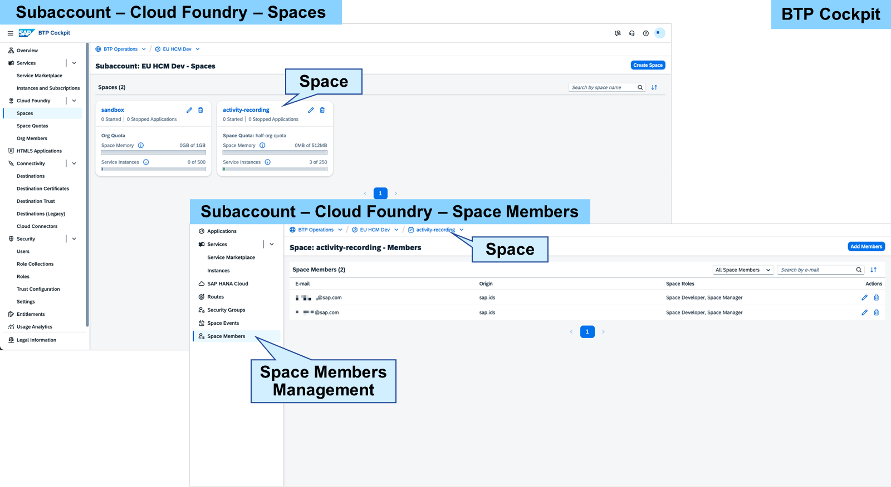
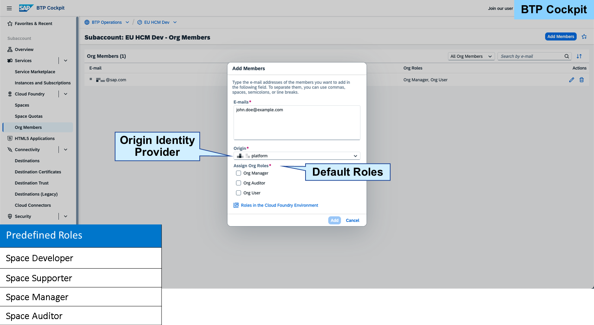

# Managing Users and Authorizations in Cloud Foundry

### Members in Cloud Foundry

Note

> Within this lesson, we focus on assigning authorizations manually via SAP BTP Cockpit. Provisioning and federation approach are not further explained in this learning journey.

If you've enabled Cloud Foundry in your Subaccount, you can use additional hierarchical levels, such as orgs and spaces.

In a Subaccount, you can create one single Cloud Foundry org. This, however, can contain several spaces. There's no limitation on how many spaces you create in the org.

Note

> The Cloud Foundry org is automatically created after activating the Cloud Foundry environment.
For both hierarchical levels, users must be maintained and authorizations must be assigned. Within orgs and spaces, the users are called members.

After you've activated the Cloud Foundry environment, you can find the name of the Cloud Foundry org on the Subaccount overview page.

In the navigation pane of the Subaccount, choose Cloud Foundry→Org Members to add or delete users in the Cloud Foundry org and to assign roles.

To add new org members, you need to provide the e-mail addresses of the users. You can assign two default roles to org members:

Org Manager: manages the cloud foundry organization, usually the creator
Org Auditor: read-only access to see user information or org quota usage information
Org User: read-only access to the list of org users and their roles - usually the default role, when adding a user to a cloud foundry space
If you're the one who creates the Subaccount, you're automatically assigned the Org Manager role. With the Org Manager role, you're able to create new org members. On adding a new user to the org, you also need to select the origin identity provider, which is SAP ID service by default.

Within Subaccounts, you can create spaces to create service instances. To enable users to work within the space, you need to add them as members.

You need to enter the e-mail addresses of the users. When you add members to a space, the following roles can be chosen to be automatically assigned to the user:

Space Developer: can deploy, manage, and scale applications and services within a space.
Space Supporter: has read-only access to applications, service instances, and logs, but cannot modify them.
Space Manager: manages user roles and permissions within the space.
Space Auditor: can view logs, reports, and configurations for auditing purposes without making changes.
While adding a new user to a space you also need to select the origin identity provider, which is SAP ID service by default.

When you add a user to a Cloud Foundry org or space and this user doesn't already exist as a shadow user in the Subaccount, it will be automatically added to the Subaccount but without any assigned role collection. This user will only be able to access parts of the SAP BTP cockpit that are needed for working with Cloud Foundry. If the user should be able to use all features within a Subaccount, it requires authorizations through further role collection assignments. The Cloud Foundry role assignments are not visible on the Subaccount level.