# Managing Users and Authorizations in Kyma

### Users and Authorizations in Kyma

Note

> Within this lesson, we focus on assigning authorizations manually via the Kyma Dashboard. Provisioning and federation approach are not further explained in this learning journey.

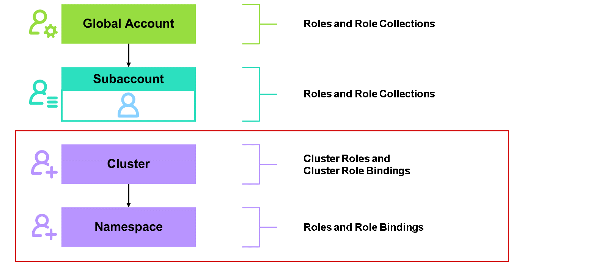

Kyma security is built on Kubernetes robust Role-Based Access Control (RBAC) system, which ensures that users and services have the necessary permissions to perform actions without compromising the platform's security. Through precise role assignments and API definitions, Kyma allows fine-grained access control over resources. The RBAC concept includes the use of roles and role bindings, cluster roles and cluster role bindings, and the definition of these roles based on API Groups and Verbs. The RBAC concept is completely decoupled and independent from the concept of roles and role collections on the account level of SAP BTP.

You can learn more about RBAC here: Using RBAC Authorization


If you're a more technical person like an administrator or a developer, you need to interact with the underlying cluster of Kyma. To do so, you need to log on to the Kyma dashboard. In order to log on to this dashboard, your user must be added to the Kyma environment. Users are still stored in identity providers and just linked to the Kyma environment. After you get the correct roles or cluster roles bound to your user through a role binding in RBAC, you are able to interact with attributes, objects, and elements from or executed in the underlying cluster.

If you are more of an end user or, as we call them on account level of SAP BTP, a business user, you interact with services and applications deployed and running in the Kyma environment. If the developers followed the recommendations making use of the XSUAA service, granting authorizations is done through roles and role collections on Subaccount level via the SAP BTP cockpit. For this scenario, everything can be used as you already learned in previous lessons.

Note

> The further concepts are only applicable to the so-called platform users using Cluster Roles based on RBAC system.

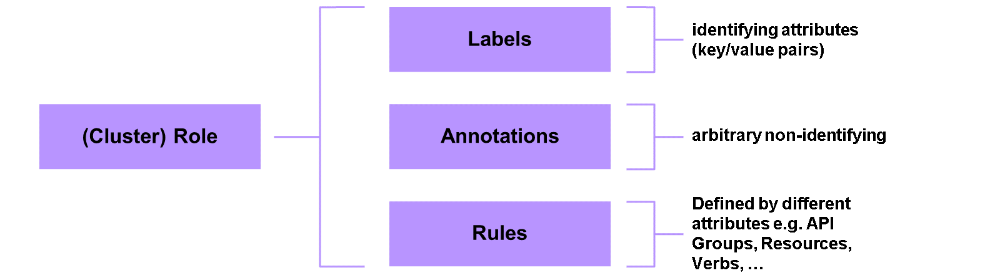

When you want to assign authorizations to users inside of Kyma, you need to work with roles and cluster roles. Both are quite similar but have small differences in detail.

##### Cluster Roles
These are sets of permissions that apply across the entire Kubernetes cluster. They are typically used for administrative tasks that need to manage resources at the cluster level. Example tasks include creating namespaces, managing nodes, or configuring cluster-wide policies.

##### Roles
Unlike cluster roles, roles are confined to a specific namespace. They define permissions for resources within that namespace, allowing for more granular control.

When creating cluster roles, you need to define rules and, optionally, labels and annotations. With these elements, you define the structure and authorizations the receiver of the role gets granted.

##### Labels
Labels are key-value pairs attached to objects such as pods and services. Labels help in identifying and organizing resources and are heavily used in selectors to group resources together for operations like deployments and services. Labels must be key-value pairs, where keys and values are strings.

##### Annotations
Annotations are key-value pairs similar to labels, but they're used to attach metadata to objects that are not used for selection purposes. They store non-identifying information that can be useful for external tools or for storing arbitrary metadata about the object.

##### Rules
Rules in the context of roles and cluster roles are the core components that define what actions can be performed on what resources. They define the set of permissions included in roles and cluster roles. They specify the actions (verbs) that can be performed on particular resources within specific API groups or resources.

###### API Groups
API groups in Kubernetes organize resources for better management and extension of the API. They are crucial in RBAC for defining precise permissions by specifying the appropriate API group for each resource. This ensures secure and efficient access control across different sets of resources within the Kubernetes cluster. We can differentiate into two types of API groups:

Core API Groups: Includes essential Kubernetes resources like pods, services, and nodes. Access these without specifying an API group.

Named API Groups: Extend the API with additional resources, each having its own versions and resources.

Common API Groups are:

apps: manages applications

batch: handles batch processing

networking.k8s.io: manages networking

rbac.authorization.k8s.io: manages RBAC resources

and more

###### Resources
Specifies the resources that these rules apply to. This can be any Kubernetes object like pods, services, nodes, and so on.
Verbs
Verbs represent the specific actions or operations that can be performed on resources. These verbs are critical in defining what permissions a user, group, or service account has within a Kubernetes cluster. Common verbs are:

get: retrieves details of a specific resource.

list: lists all resources of a specific type.

create: creates a new resource.

update: modifies an existing resource.

delete: removes a resource.

and more

Here's an example of a cluster role with full access to everything (not recommended):

```
apiVersion: rbac.authorization.k8s.io/v1
kind: ClusterRole
metadata:
  name: cluster-admin
rules:
- apiGroups: ["*"]
  resources: ["*"]
  verbs: ["*"]
```

Here's an example of a role with authorizations for managing pods and services in a namespace called my-namespace:

```
apiVersion: rbac.authorization.k8s.io/v1
kind: Role
metadata:
  name: developer
  namespace: my-namespace
rules:
- apiGroups: [""]
  resources: ["pods", "services"]
  verbs: ["get", "list", "create", "delete"]
```

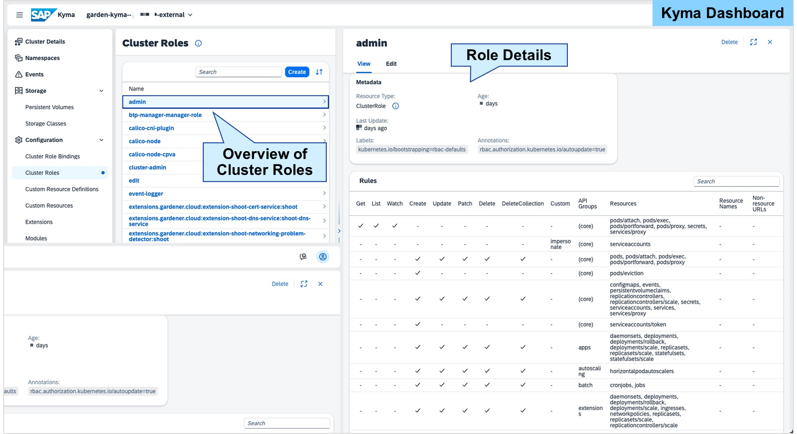

You want to determine the already created and existing cluster roles in your Kyma environment. To do so, you need to navigate to the Kyma dashboard and using the sidebar menu: Configuration → Cluster Roles. You can see all the existing cluster roles and select them to get the role details displayed. If you need to change an existing role, you simply choose Edit. If you want to determine or change a Role instead of a Cluster Role, the process is identical, except you need to first enter the corresponding namespace via the Kyma dashboard.

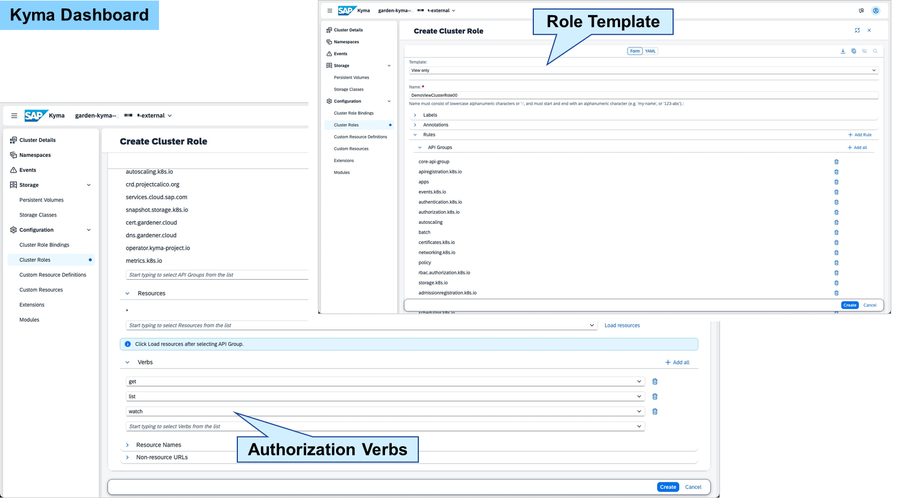

When you want to create a cluster role, you need to navigate to the Kyma dashboard and using the sidebar menu: Configuration → Cluster Roles. To create a new cluster role, select Create. You need to define all required attributes in the visual Form or within the YAML format. To accelerate the creation of the cluster role, you can make use of the predefined templates, for example, a template for read-only or a template for unlimited authorization and adjust according to your needs. To finish the creation of a cluster role, you need to save through selecting Create again. The cluster role itself does not have an immediate effect. You need to create a cluster role binding for granting authorizations. If you want to create a Role instead of a Cluster Role, the process is identical except you need to first enter the corresponding namespace via the Kyma dashboard.

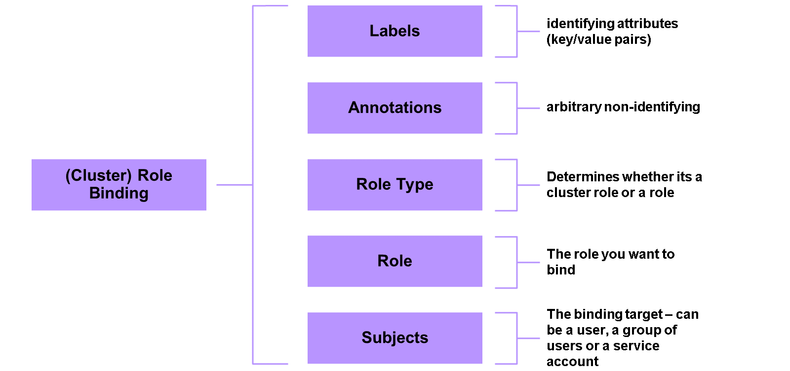

To assign the (cluster) roles to for example an administrator or developer, you need to create a (cluster) role binding. When creating (cluster) role bindings, you need to define several attributes: the role type, the role you want to bind and the subjects, so the receiver and optionally labels and annotations. Annotations and labels are used in exactly the same way as in the (cluster) role creation.

Role Binding
Role Binding is used to grant permissions defined in a Role to a user or set of users within a specific namespace.

Cluster Role Binding
Cluster Role Binding is used to grant permissions defined in a ClusterRole to a user, set of users, or service accounts across the entire cluster.

#### Role Type

This can be a cluster role or a normal role at namespace level.

Hint

> When you're creating a cluster role binding, the type is fixed as cluster role.

Role
The (cluster) role you've created and want to assign to someone. Selection is based on the name of the role.

Subjects
Subjects are the receivers of the (cluster) role binding. Through the binding, they get the corresponding authorizations granted. There are three types of subjects in Kyma:

User
A user is an individual who can log in and interact with the system. Users are authenticated, typically through SAP Identity Authentication Service or any other supported identity provider. Their roles and permissions are managed to ensure they have the appropriate access to perform their duties within the Kyma environment. Typically, users in Kyma belong to employees with very technical focus. Example: Developers and administrators logging in to deploy and manage services.

User Groups
User groups are collections of users that share common roles and permissions. By grouping users together, it becomes more efficient to manage and assign permissions. Instead of assigning roles to each user individually, you can assign roles to a user group, and all the users within the group will inherit those roles. Example: A Developers group with deployment privileges and an Admins group with administrative privileges.

Service Accounts
A service account is a special type of account intended for use by applications and services rather than individual users. Service accounts are typically used for machine-to-machine communication, running automated tasks, or integrating different services within the Kyma environment. Example: Used by CI/CD pipeline tools to automate the deployment of microservices and applications.

Here's an example of a role binding:

```
apiVersion: rbac.authorization.k8s.io/v1
kind: RoleBinding
metadata:
  name: read-configmaps
  namespace: dev
subjects:
- kind: User
  name: johndoe
  apiGroup: rbac.authorization.k8s.io
roleRef:
  kind: Role
  name: read-configmaps
  apiGroup: rbac.authorization.k8s.io
```

Here's an example of a cluster role binding:

```
apiVersion: rbac.authorization.k8s.io/v1
kind: ClusterRoleBinding
metadata:
  name: read-secrets
subjects:
- kind: Group
  name: dev-team
  apiGroup: rbac.authorization.k8s.io
roleRef:
  kind: ClusterRole
  name: read-secrets
  apiGroup: rbac.authorization.k8s.io
```

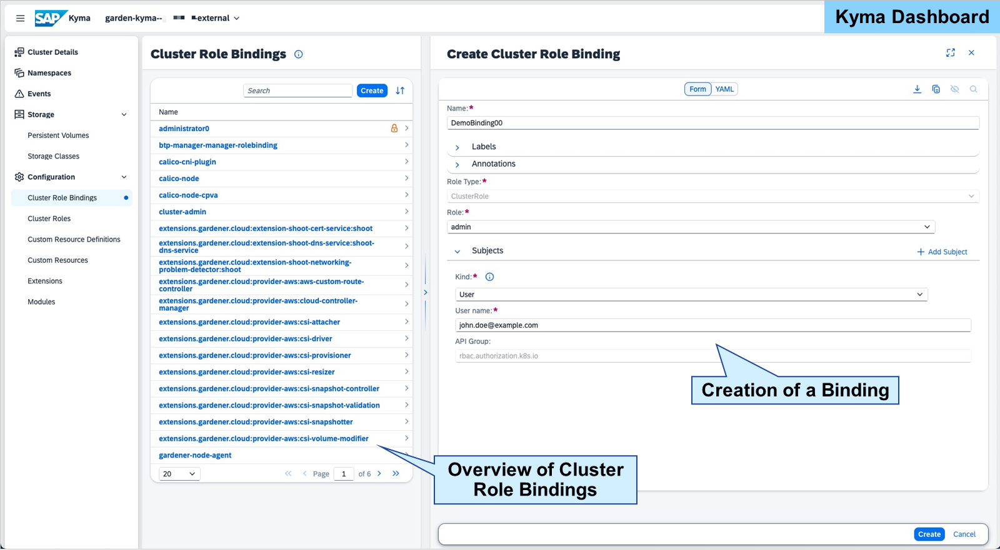

When you want to create a cluster role binding, you need to navigate to the Kyma dashboard and use the sidebar menu: Configuration → Cluster Role Bindings. To create a new Cluster Role Binding, select Create. You can define all required attributes in the visual Form or within the YAML format. To finish the creation of a cluster role binding and activating the binding, you need to save through clicking again on Create. If you want to create a Role Binding instead of a Cluster Role Binding, the process is identical except you need to first enter the corresponding namespace via the Kyma dashboard.

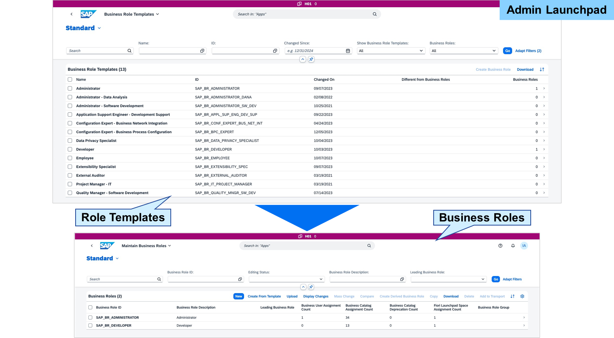

#### Business Role Templates
Business role templates in the SAP BTP ABAP environment are predefined sets of roles that align with common job functions or business needs. These templates provide a basis for creating customized roles that can be assigned to users, thereby streamlining the process of role management and ensuring consistency in access rights across the organization. Business role templates themselves cannot get directly assigned to users. Whenever you create a role to grant permissions to a user, it's worth checking whether a suitable business role template already exists.

#### Business Roles
A business role defines a set of applications and the necessary authorizations (permissions) required to perform specific job functions, such as those of a Warehouse Manager, Sales Manager, Developer, or System Administrator. A business role encompasses all the tasks a user needs to execute as part of their job responsibilities.

As previously mentioned, there's no inherent distinction at the user level between technical employees, such as developers or administrators, and end-users who interact with the software. This differentiation is achieved solely through the assignment of business roles, which come with the appropriate authorizations for various features and functions.

In practice, administrators or developers may also have end-user authorizations in addition to their technical permissions. This assignment is made possible through the flexible concept of business roles, ensuring that each user has the exact access needed to perform their duties efficiently and securely within the SAP BTP environment.

Business roles are assigned to business users. Multiple business roles might be assigned to a single user. And a role might, of course, be assigned to different users.

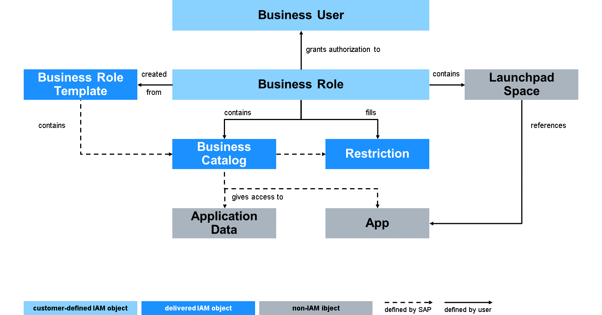

As you've already learned about Business Role Templates, Business Roles, and Business Users, let's focus on the remaining objects within this authorization concept of IAM.

Business Catalog
The ABAP environment organizes business functionality into semantically meaningful business catalogs, each representing specific tasks or sub processes within a larger business process. These catalogs are the most granular units for structuring work and assigning authorizations. By using business catalogs, you can grant access to an individual app, a set of apps, or specific features within an app. Certain business catalogs come with restrictions, allowing you to fine-tune how users interact with the app. For instance, you can specify whether a user has read-only access or full write permissions. Business Catalogs can only be maintained by SAP and your developers with the right development tools.

Restriction
At the role level, restriction values for the included business catalogs are established to enforce access controls. These restrictions enable the segregation of duties and responsibilities, ensuring that each business user accesses only the necessary resources. This is achieved by adding specific authorization values to the restriction fields. Each business catalog delineates the available access categories for maintenance and outlines the applicable field restrictions. Consequently, the business role consolidates the authorizations derived from the assigned catalogs.

Launchpad Space
Launchpad spaces define the organizational structure of the launchpad interface. By assigning specific launchpad spaces to distinct business roles, you ensure that the relevant launchpad space is accessible to all users associated with the corresponding business role. With the administration tools for the launchpad, administrators can adjust or create the launchpad and it's spaces if needed.

If you want to learn more about launchpad spaces, check out this learning journey about SAP Fiori: Learning the Basics of SAP Fiori
App and Application Data
Apps refer to the various software applications that users access and interact with within an organization. In this case, the applications deployed and running in the ABAP environment. The business catalog gives access to the app and it's application data. Application data typically refers to the user-related information, business data or access policies managed within the IAM system.

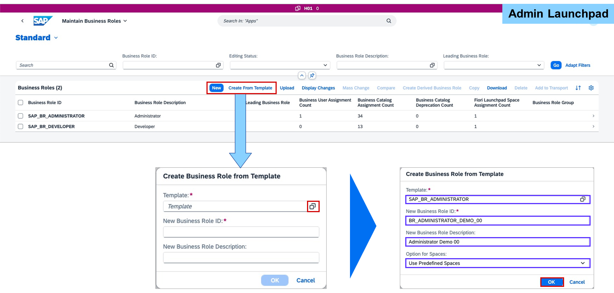

To create or adjust a business role, use the Maintain Business Roles app. You have the option to start a new business role from scratch or based on a business role template. When you start based on a business role template, you first need to select the template and afterward adjust the business role ID, the description, and if you want to also reuse the predefined launchpad spaces or not. After choosing OK, you'll be forwarded to the detail screens of the business role maintenance.

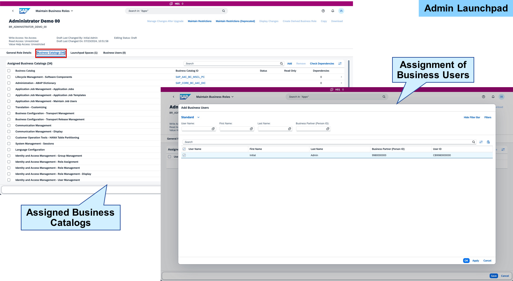

When you're maintaining a business role, you can maintain:

General Role Details: General information, for example, ID, description, long text, and so on.
Business Catalogs: The business catalogs that should be part of the business role. You also maintain the restrictions here.
Launchpad Space: The launchpad spaces that will be displayed to the end user who has this business role assigned.
Business Users: The business users that the business role gets assigned to.
When you've defined all the role details and assigned users to the role, you choose Save to save the role. You can change the role anytime via the same app.

Caution

> Your system is upgraded regularly to deliver new features and improvements. These changes may include changes or deprecation of apps, business catalogs, and business role templates. To adjust your business roles after an upgrade, use the app Manage Business Role Changes after Upgrade. For more information, check the documentation: Manage Changes and Deprecations After Upgrade

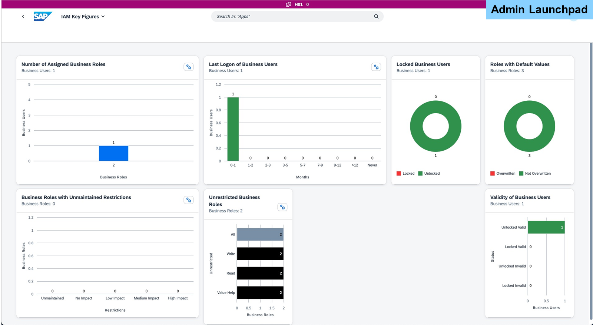

The Key Figures app in the SAP BTP ABAP environment's IAM framework is a powerful tool for monitoring and managing user access and security metrics. By providing insights into user activities, role assignments, and compliance metrics, the app empowers administrators to make informed decisions, enhance security, and ensure compliance. Regular use of the Key Figures app helps in maintaining a robust and efficient IAM system that supports organizational goals while safeguarding critical assets. The overview displays:

User metrics
Role and permission metrics
User activities
And more