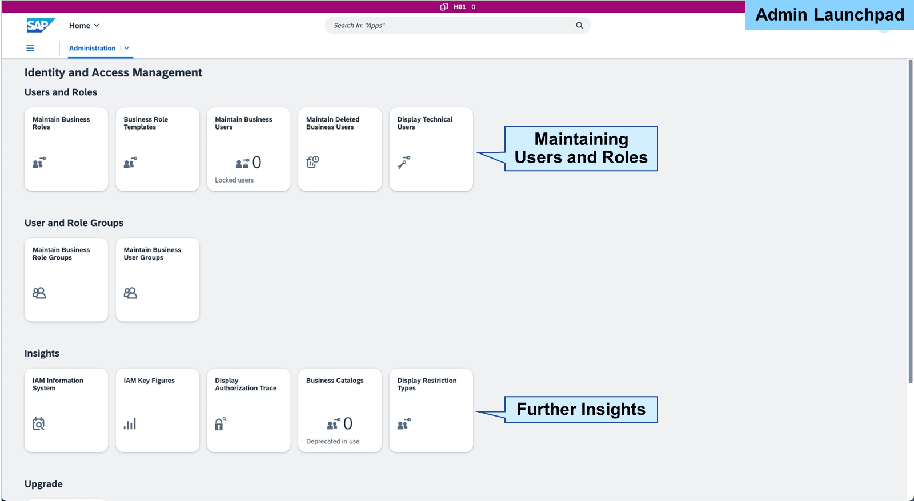
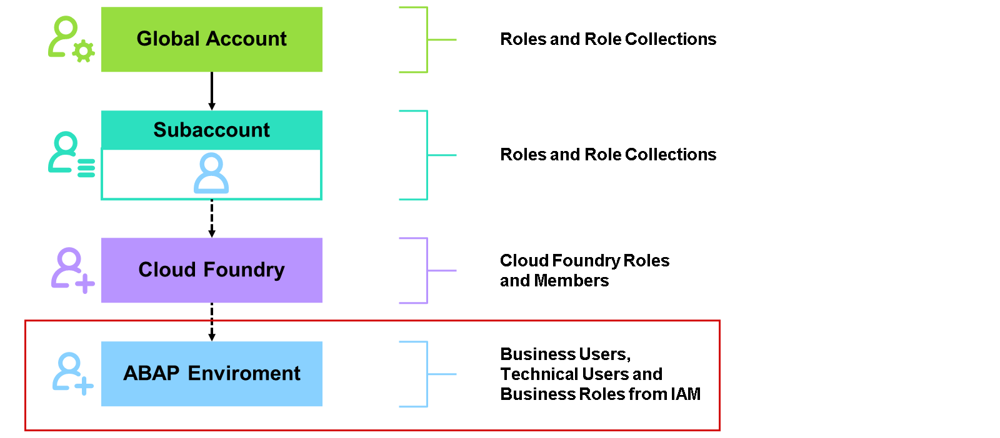
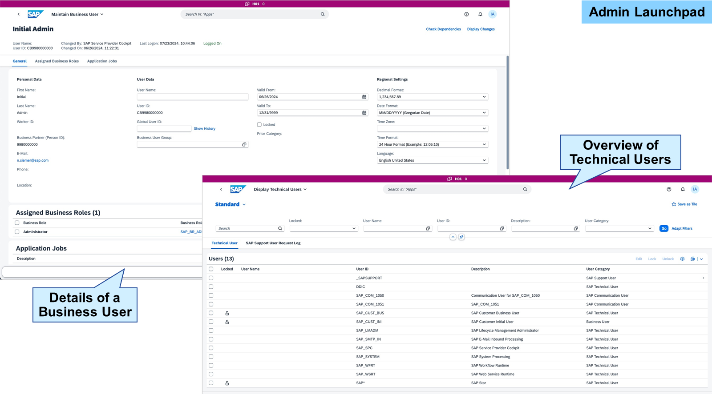

# Managing Users and Authorizations in SAP BTP ABAP Environment

### Users and Authorizations in ABAP Environment

Note

> Within this lesson, we focus on assigning authorizations manually via the ABAP environment admin UI. Provisioning and federation approach are not further explained in this learning journey. As the Identity Access Management (IAM) of the SAP BTP, ABAP environment has a lot in common with the Identity Access Management in SAP S/4HANA Cloud Public Edition, we're just giving a first introduction and overview here. If you want to learn more in detail about the Identity Access Management, check out the corresponding learning journey: Managing User Identity and Access in SAP S/4HANA Cloud Public Edition. Next to this you can consult the official documentation: Identity and Access Management in SAP BTP, ABAP environment

Identity Access Management in the SAP BTP ABAP environment is essential for securing applications and data by managing who has access to what. By integrating with identity providers, defining roles and permissions, organizations can ensure robust security and streamlined access management. Continuous monitoring, regular audits, and adherence to best practices are critical to maintaining an effective IAM strategy.

Understanding and implementing these IAM principles, you can ensure that your SAP BTP ABAP environment remains secure, compliant, and aligned with your organizational objectives. As an administrator of the ABAP environment, you work with the corresponding admin tool. Part of this admin tool is the Identity Access Management with all applications needed to maintain users and roles, and getting further insights through traces.

The user and authorization concept used in the ABAP environment is completely decoupled and independent from the concept of roles and role collections on the account level of SAP BTP or within Cloud Foundry. The ABAP environment runs on top of the Cloud Foundry environment. Therefore, administrators or developers may also need the right authorizations inside of Cloud Foundry to create the ABAP environment or other services, which get consumed in an application running in the ABAP environment.

User and authorization management within the ABAP environment is based on the Identity Access Management. This consists of several objects like Business Users, Technical Users, Business Roles, Business Catalogs, and more.

User management within the ABAP environment operates independently from the platform user and business user concepts intrinsic to SAP BTP. Although business users exist within the ABAP environment, their utilization diverges significantly. In this context, different categories of users are designated for distinct purposes, each possessing unique capabilities.

#### Technical Users
Technical users are associated with local or remote processes and are essential for cloud management activities such as system provisioning and support. These users can belong to either the software or service provider, or to the customer.

##### Communication Users
A communication user is a specialized technical user assigned to a communication system for inbound communication purposes. They can be assigned credentials like a password or an X.509 certificate. An administrator in the ABAP environment uses the Maintain Communication Users app in the SAP Fiori launchpad to create these users locally, as they are not transported between systems. Credentials for technical users may vary across different systems.

##### Support Users
Support users represent a distinct category of technical users designated for temporary access. These users are specifically intended for SAP employees, who utilize them to access the system in response to a customer-initiated support ticket. They can also get used by Partners which are vendors of SaaS solutions running in ABAP environment.

#### Business Users
A business user refers to an individual who interacts with the system directly. These users are created to grant personnel access to the system for operational purposes.

In the ABAP environment, user master data is stored locally, and similar to other environments within SAP BTP, the ABAP environment can also leverage identity providers for user management.

Maintaining users and user groups is also a task of administrators. The IAM offers several apps to make this. To create or maintain business users, you can use the app Maintain Business Users. For displaying technical users, you can use the app Display Technical Users. There's also an app for maintaining business user groups available.

